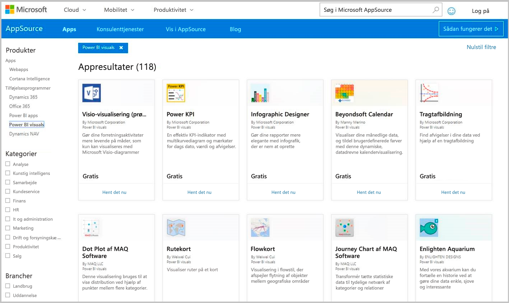
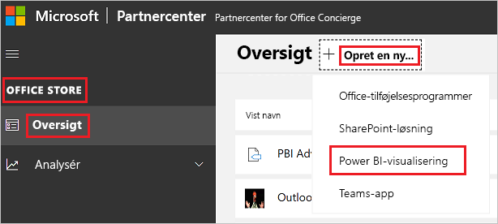

# Publicer Power BI-visualiseringer i Partnercenter

Når du har oprettet en Power BI-visualisering, kan du publicere den i AppSource, så andre kan finde og bruge den. Du kan finde flere oplysninger om, hvordan du opretter en Power BI-visualisering, under [Udvikling af en Power BI-visualisering](custom-visual-develop-tutorial.md).

## Hvad er AppSource?

[AppSource](https://appsource.microsoft.com/marketplace/apps?product=power-bi-visuals) er det sted, hvor du finder SaaS-programmer og -tilføjelsesprogrammer til dine Microsoft-produkter og -tjenester.

## Forberedelse til indsendelse af Power BI-visualisering

Før du indsender en Power BI-visualisering til AppSource, skal du sørge for, at du har læst [retningslinjerne for Power BI-visualiseringer](guidelines-powerbi-visuals.md) og [testet din brugerdefinerede visualisering](https://github.com/Microsoft/PowerBI-visuals/blob/master/Tutorial/SubmissionTesting.md).

Når du er klar til at indsende din Power BI-visualisering, skal du bekræfte, at visualiseringen overholder alle de krav, der er angivet nedenfor.

| Element | Påkrævet | Beskrivelse |
| --- | --- | --- |
| Pbiviz-pakke |Ja |Pak din Power BI-visualisering i en Pbiviz-pakke, der indeholder alle de påkrævede metadata. Navn på visualisering Vist navn GUID Version Beskrivelse Forfatternavn og mailadresse |
| .pbix-eksempelrapportfil |Ja |Når du fremviser din visualisering, bør du hjælpe brugerne med at blive bekendte med visualiseringen. Fremhæv den værdi, som visualiseringen kan tilføre brugerne, og giv eksempler på brug og formateringsmuligheder. Du kan også tilføje en side med *"tip"* i slutningen, f.eks. tip og tricks samt ting, der bør undgås. .pbix-eksempelrapportfilen skal fungere offline uden nogen eksterne forbindelser. |
| Ikon |Ja |Du bør medtage logoet for den brugerdefinerede visualisering, som vil blive vist i appbutikken. Formatet kan være .png, .jpg, .jpeg eller .gif. Den skal være nøjagtigt 300 pixel (bredde) x 300 pixel (højde). **Vigtigt!** Gennemse [vejledningen til AppSource-lageret for billeder](https://docs.microsoft.com/office/dev/store/craft-effective-appsource-store-images) omhyggeligt, inden du indsender ikonet. |
| Skærmbilleder |Ja |Angiv mindst ét skærmbillede. Formatet kan være .png, .jpg, .jpeg eller .gif. Dimensionerne skal være nøjagtigt 1366 px (bredde) gange 768 px (højde). Filens størrelse må ikke være større end 1024 kb. Effekten vil være større, hvis du tilføjer tekstbobler for at fremhæve fordelene ved de vigtigste funktioner, som vises på hvert skærmbillede. |
| Supportlink |Ja |Angiv en URL-adresse til support til dine kunder. Dette link angives som en del af din Partnercenter-oversigt og er synligt for brugerne, når de få adgang til dine visualiseringer i AppSource. URL-adressen skal indeholde https:// eller https://. |
| Link til dokument om beskyttelse af personlige oplysninger |Ja |Angiv et link til politikken for beskyttelse af personlige oplysninger for visualiseringen. Dette link angives som en del af din Partnercenter-oversigt og er synligt for brugerne, når de får adgang til oversigten over dine visualiseringer i AppSource. Linket skal indeholde https:// eller https://. |
| Slutbrugerlicensaftale (EULA) |Ja |Du skal angive en EULA-fil til din Power BI-visualisering. Du kan bruge [standardkontrakten](https://go.microsoft.com/fwlink/?linkid=2041178), [Power BI-visuals-kontrakten](https://visuals.azureedge.net/app-store/Power%20BI%20-%20Default%20Custom%20Visual%20EULA.pdf) eller din egen slutbrugerlicensaftale. |
| Videolink |Nej |Du kan øge brugernes interesse for din brugerdefinerede visualisering ved at angive et link til en video om visualiseringen. URL-adressen skal indeholde https:// eller https://. |
| GitHub-lager |Nej |Del et offentligt link til et [GitHub](https://www.github.com)-lager med kilder til dine Power BI-visualiseringer og eksempeldata. Det giver andre udviklere mulighed for at angive feedback og foreslå forbedringer af din kode. |

## Sådan får du en XML-programpakke

Du skal bruge en XML-programpakke fra Power BI-teamet for at indsende en Power BI-visualisering. Du få en XML-programpakke ved at sende en mail til indsendelsesteamet for Power BI-visualiseringer ([pbivizsubmit@microsoft.com](mailto:pbivizsubmit@microsoft.com)).

Før du opretter **pbiviz**-pakken, skal du udfylde følgende felter i **pbiviz.json**-filen:
* beskrivelse
* supportUrl
* forfatter
* name
* mail

Vedhæft **pbiviz-filen** og **pbix-eksempelrapportfilen** i din mail. Power BI-teamet sender instruktioner og en XML-fil til app-pakken, som du skal overføre. Du skal bruge denne XML-app-pakke for at kunne indsende visualiseringen via Office Developer Center.

> [!NOTE]
> Det vil tage yderligere to uger, før en opdatering til eksisterende visuals når produktionsmiljøet, efter at den er blevet godkendt i butikken. Det forbedrer kvaliteten og sikrer, at eksisterende rapporter ikke ødelægges.

## Indsend til AppSource

Hvis du vil indsende din Power BI visualisering til AppSource, skal du have en programpakke fra Power BI-teamet og derefter indsende den til Partnercenter. 

### Sådan får du programpakken

Du skal sende en mail med **pbiviz**-filen og **pbix**-filen til Power BI-teamet, før du indsender til AppSource. Power BI-teamet overfører så filerne til den offentlige shareserver. Ellers vil filerne ikke kunne hentes i butikken. 

Power BI-teamet skal kontrollere filerne for nye Power BI-visualiseringer, opdateringer til eksisterende Power BI-visualiseringer og rettelser til afviste indsendelser.

### Indsendelse til Partnercenter

Hvis du vil indsende din Power BI-visualisering til Partnercenter, skal du være tilmeldt Partnercenter. Hvis du endnu ikke er tilmeldt, kan du [åbne en udviklerkonto i Partnercenter](https://docs.microsoft.com/office/dev/store/open-a-developer-account).

Følg nedenstående trin for at indsende din Power BI-visualisering til Partnercenter. Du kan finde flere oplysninger om indsendelsesprocessen under [Indsend din Office-løsning til AppSource via Partnercenter](https://docs.microsoft.com/office/dev/store/use-partner-center-to-submit-to-appsource).

1. Log på **Partnercenter**.

2. Vælg **OFFICE STORE** i ruden til venstre.

3. Vælg **Oversigt**.

4. Vælg **Opret en ny**, og vælg **Power BI-visualisering** i rullemenuen.

    

5. I vinduet **Opret en ny Power BI-visualisering** skal du angive navnet på din Power BI-visualisering og vælge **Opret**.

6. Vælg **Pakker**, og upload din XML-programpakke for Power BI-visualiseringen.

7. Vælg **Egenskaber**, og angiv de nødvendige oplysninger.

8. Hvis dit produkt kræver yderligere køb, skal du vælge **Produktkonfiguration** og derefter markere afkrydsningsfeltet **Køb af tilknyttet tjeneste**.

9. (Valgfri) Hvis du vil [certificere](power-bi-custom-visuals-certified.md) visualiseringen, skal du vælge **Produktkonfiguration** og markere afkrydsningsfeltet **Power BI-certificering**.
    >[!TIP]
    >Power BI-certificeringsprocessen kan tage lidt tid. Hvis du opretter en ny Power BI-visualisering, anbefales det, at du publicerer Power BI-visualiseringen via Partnercenter, før du anmoder om Power BI-certificering. Dette sikrer, at publiceringen af din visualisering ikke forsinkes.

10. Vælg **Produktkonfiguration**, og klik på **Gennemse og publicer**.

## Se statussen for indsendelsen og brugsdata

Du kan gennemse [valideringspolitikkerne](https://dev.office.com/officestore/docs/validation-policies#13-power-bi-custom-visuals).

Når du har indsendt visualiseringen, vil du kunne se statussen for den i [appdashboardet](https://sellerdashboard.microsoft.com/Application/Summary/).

## Certificer din visualisering

Når du har oprettet din visualisering, kan du vælge at få den [certificeret](power-bi-custom-visuals-certified.md), hvis du vil.

## Næste trin

* [Udvikling af en brugerdefineret visualisering i Power BI](custom-visual-develop-tutorial.md)

* [Visualiseringer i Power BI](../../visuals/power-bi-report-visualizations.md)  

* [Visuals i Power BI](power-bi-custom-visuals.md)  

* [Sådan får du en Power BI-visualisering certificeret](power-bi-custom-visuals-certified.md)

* Har du flere spørgsmål? [Prøv at spørge Power BI-community'et](https://community.powerbi.com/)
