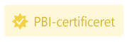

# Få en Power BI-visualisering certificeret

Certificerede Power BI-visualiseringer er Power BI-visualiseringer i [AppSource](https://appsource.microsoft.com/en-us/marketplace/apps?page=1&product=power-bi-visuals), der opfylder [kodekrav](#certification-requirements) for Microsoft Power BI-teamet. Disse visualiseringer testes for at bekræfte, at de ikke har adgang til eksterne tjenester, og at de følger sikre kodemønstre og retningslinjer.

Når en Power BI-visualisering er blevet certificeret, indeholder den flere funktioner. Du kan f.eks. [eksportere til PowerPoint](../../consumer/end-user-powerpoint.md) eller få vist visualiseringen i modtagne mails, når en bruger [abonnerer på rapportsider](../../consumer/end-user-subscribe.md).

Certificeringsprocessen er valgfri. Visualiseringer i Power BI, der ikke er certificeret, er ikke nødvendigvis usikre Power BI-visualiseringer. Nogle Power BI-visualiseringer er ikke certificeret, fordi de ikke er i overensstemmelse med et eller flere af [certificeringskravene](power-bi-custom-visuals-certified.md#certification-requirements). Det kunne f.eks. være en kortvisualisering i Power BI, der opretter forbindelse til en ekstern tjeneste, eller en Power BI-visualisering, der benytter kommercielle biblioteker.

> [!NOTE]
> Microsoft er ikke forfatteren af Power BI-visualiseringer fra tredjepart. Kontakt forfatteren af visualiseringen direkte for at få bekræftet funktionaliteten af visualiseringer fra tredjepart.

## Certificeringskrav

Hvis du vil have din Power BI-visualisering [certificeret](#get-a-power-bi-visual-certified), skal Power BI-visualiseringen overholde de krav, der er angivet i dette afsnit. 

### Generelle krav

Dit Power BI-visual skal godkendes af Partnercenter. Vi anbefaler, at din Power BI-visualisering allerede er i [AppSource](https://appsource.microsoft.com/marketplace/apps?page=1&product=power-bi-visuals). Du kan få mere at vide om, hvordan du publicerer en Power BI-visualisering i AppSource i [Publicer Power BI-visualiseringer i Partnercenter](office-store.md).

Før du indsender din Power BI-visualisering til certificering, skal du kontrollere, at den overholder [retningslinjerne for Power BI-visualiseringer](guidelines-powerbi-visuals.md).

Når du indsender Power BI-visualiseringen, skal du sørge for, at den kompilerede pakke nøjagtigt svarer til den sendte pakke.

### Krav til kodelager

Selvom du ikke behøver at dele din kode i GitHub, skal kodelageret være tilgængeligt, så Power BI-teamet kan gennemgå det. Den bedste måde at gøre det på er ved at levere kildekoden (JavaScript eller type) til GitHub.

Lageret skal indeholde følgende:
* Kode for kun én Power BI-visualisering. Det må ikke indeholde kode for flere Power BI-visualiseringer eller ikke-relateret kode.
* En forgrening ved navn **certificering** (skal skrives med små bogstaver). Kildekoden i denne forgrening skal matche den sendte pakke. Denne kode kan kun opdateres under den næste afsendelsesproces, hvis du sender din Power BI-visualisering igen.

Hvis din Power BI-visualisering bruger private NPM-pakker eller git-undermoduler, skal du give adgang til de ekstra lagre, der indeholder denne kode.

Hvis du vil vide, hvordan et lager med Power BI-visualiseringer ser ud, skal du gennemse GitHub-lageret for at finde [søjlediagrammet med eksempler på Power BI-visualiseringer](https://github.com/microsoft/PowerBI-visuals-sampleBarChart).

### Filkrav

Brug den nyeste version af API'en til at skrive Power BI-visualiseringen.

Lageret skal indeholde følgende filer:
* **.gitignore** – Føj `node_modules`, `.tmp` og `dist` til denne fil. Koden må ikke indeholde mapperne *node_modules*, *.tmp* eller *dist*.
* **capabilities.json** – hvis du sender en nyere version af din Power BI-visualisering med ændringer af egenskaberne i denne fil, skal du bekræfte, at de ikke ødelægger rapporter for eksisterende brugere.
* **pbiviz.json** 
* **package.json**. Følgende pakke skal være installeret for visualiseringen:
   * ["tslint"](https://www.npmjs.com/package/tslint) – version 5.18.0 eller nyere
   * ["typescript"](https://www.npmjs.com/package/typescript) – version 3.0.0 eller nyere
   * ["tslint-microsoftcontrib"-](https://www.npmjs.com/package/tslint-microsoft-contrib) – version 6.2.0 eller nyere
   * Filen skal indeholde en kommando for at køre Linter – `"lint": "tslint -c tslint.json -p tsconfig.json"`
* **package-lock.json**
* **tsconfig.json**

### Kommandokrav

Sørg for, at følgende kommandoer ikke returnerer nogen fejl.

* `npm install`
* `pbiviz package`
* `npm audit` – må ikke returnere nogen advarsler med et højt eller moderat niveau.
* [TSlint fra Microsoft](https://www.npmjs.com/package/tslint-microsoft-contrib) med [den påkrævede konfiguration](https://github.com/microsoft/PowerBI-visuals-sampleBarChart/blob/master/tslint.json). Denne kommando må ikke returnere nogen lint-fejl.

### Krav til kompilering

Brug den nyeste version af [powerbi-visuals-tools](https://www.npmjs.com/package/powerbi-visuals-tools) til at skrive Power BI-visualiseringen.

Du skal kompilere din Power BI-visualisering med `pbiviz package`. Hvis du bruger dine egne buildscripts, skal du angive en `npm run package` brugerdefineret buildkommando.

### Kildekodekrav

Kontrollér, at du følger politiklisten med [ekstra certificering for Power BI-visualiseringer](https://docs.microsoft.com/legal/marketplace/certification-policies#1200-power-bi-visuals-additional-certification). Hvis din udgivelse ikke følger disse retningslinjer, vil mailen med afvisningen fra Partnercenter indeholde numrene på de politikker, der er angivet i dette link.

Følg nedenstående kodekrav for at sikre dig, at din kode er i overensstemmelse med Power BI-certificeringspolitikkerne.  

**Påkrævet**
* Du kan kun bruge OSS-komponenter, der kan gennemses offentligt, f.eks. offentlige Javascript- eller TypeScript-biblioteker.
* Koden skal understøtte [API'en til gengivelse af hændelser](event-service.md).
* Sørg for, at DOM er sikkert manipuleret. Brug sanering til brugerinput eller brugerdata, før du føjer det til DOM.
* Brug denne [eksempelrapport](https://github.com/Microsoft/PowerBI-visuals/raw/gh-pages/assets/reports/large_data.pbix) som et testdatasæt.

**Ikke tilladt**
* Adgang til eksterne tjenester eller ressourcer. Der må f.eks. ikke sendes nogen HTTP/S- eller WebSocket-anmodninger fra Power BI til nogen tjeneste.
* Brug af `innerHTML` eller `D3.html(user data or user input)`.
* Javascript-fejl eller -undtagelser i browserkonsollen for inputdata.
* Arbitrær eller dynamisk kode, f.eks. `eval()`, usikker brug af `settimeout()`, `requestAnimationFrame()`, `setinterval(user input function)` og brugerinput eller brugerdata.
* Formindskede JavaScript-filer eller -projekter.

## Indsendelse af en Power BI-visualisering til certificering

Du kan anmode om at få din Power BI-visualisering certificeret af Power BI-teamet via Partnercenter.

>[!TIP]
>Power BI-certificeringsprocessen kan tage lidt tid. Hvis du opretter en ny Power BI-visualisering, anbefales det, at du publicerer Power BI-visualiseringen via Partnercenter, før du anmoder om Power BI-certificering. Dette sikrer, at publiceringen af din visualisering ikke forsinkes.

Sådan anmoder du om Power BI-certificering:

1. Log på Partnercenter.
2. På **siden Oversigt** skal du vælge din Power BI-visualisering og gå til siden **Produktkonfiguration**.
3. Markér afkrydsningsfeltet **Anmod om Power BI-certificering**.
4. På siden **Gennemse og publicer** i tekstfeltet **Noter til certificering** skal du angive et link til kildekoden og de legitimationsoplysninger, der kræves for at få adgang.

### Processen til indsendelse af privat lager

Hvis du bruger et privat lager, f.eks. GitHub, til at sende din Power BI-visualisering til certificering, skal du følge vejledningen i dette afsnit.
1. Opret en ny konto til valideringsteamet.
2. Konfigurer [tofaktorgodkendelse](https://help.github.com/github/authenticating-to-github/securing-your-account-with-two-factor-authentication-2fa) til din konto.
3. [Generer et nyt sæt genoprettelseskoder](https://help.github.com/github/authenticating-to-github/configuring-two-factor-authentication-recovery-methods#generating-a-new-set-of-recovery-codes).
4. Når du indsender din Power BI-visualisering, skal du angive følgende:
    * Et link til lageret
    * Legitimationsoplysninger til logon (inklusive en adgangskode)
    * Genoprettelseskoder
    * Skrivebeskyttede tilladelser til vores konto ([pbicvsupport](https://github.com/pbicvsupport))

## Badges til certificerede Power BI-visualiseringer

Når en Power BI-visualisering er certificeret, får den et badge, der angiver, at visualiseringen er certificeret.

### Certificerede Power BI-visualiseringer i AppSource

* Når du søger online efter [Power BI-visualiseringer i AppSource](https://appsource.microsoft.com/marketplace/apps?product=power-bi-visuals), indikerer et lille gult badge på visualiseringens kort, at der er tale om en certificeret Power BI-visualisering.

    

* Når du har klikket på kortet for Power BI-visualiseringen i AppSource, angiver et gult badge med titlen *PBI-certificeret*, at denne Power BI-visualisering er certificeret.

    

### Certificerede Power BI-visualiseringer på Power BI-grænsefladen

* Når du importerer en Power BI-visualisering fra Power BI (Desktop eller Power BI-tjenesten), angiver et blåt badge, at Power BI-visualiseringen er certificeret.

    

* Du kan kun få vist certificerede Power BI-visualiseringer ved at vælge filterindstillingen *Power BI-certificeret*.

## Næste trin

* Hvis du er webudvikler, der er interesseret i at oprette dine egne Power BI-visualiseringer og føje dem til  [Microsoft AppSource](https://appsource.microsoft.com), kan du starte med selvstudiet  [Udvikling af en Power BI-visualisering](custom-visual-develop-tutorial.md).

* Du kan finde flere oplysninger om visualiseringer under [Ofte stillede spørgsmål om certificerede visualiseringer](power-bi-custom-visuals-faq.md#certified-power-bi-visuals).

* [Udvikling af en Power BI-visualisering](custom-visual-develop-tutorial.md)

* [Microsofts afspilningsliste for Power BI-visuals på YouTube](https://www.youtube.com/playlist?list=PL1N57mwBHtN1vIjfvuBIzZllrmKo-Vz6x)

* [Visuals i Power BI](power-bi-custom-visuals.md)

* [Publicer Power BI-visualiseringer i Microsoft AppSource](office-store.md)

* Har du flere spørgsmål? [Prøv at spørge Power BI-community'et](https://community.powerbi.com/)