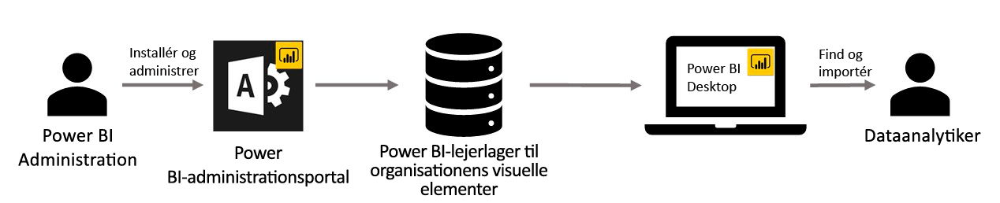

# Visualiseringer til virksomheder i Power BI

Du kan bruge Power BI-visuals i Power BI til at oprette en unik type visuals, der er skræddersyet til dig. Power BI-visuals oprettes af udviklere, og de oprettes ofte, når mængden af visuals, der er inkluderet i Power BI, ikke opfylder deres behov.

I nogle organisationer er Power BI-visualiseringer endnu vigtigere. De kan være nødvendige for at gengive bestemte data eller bestemt indsigt, der er unikke for organisationen, de kan have særlige datakrav, eller de kan fremhæve private forretningsmetoder. Sådanne organisationer har brug for at udvikle Power BI-visuals, dele dem i hele organisationen og sikre, at de bliver vedligeholdt korrekt. Med Power BI-visualiseringer kan organisationer gøre lige præcis det.

På følgende billede vises processen for, hvordan Power BI-visualiseringer til organisationen i Power BI kommer fra administratoren, fortsætter via udvikling og vedligeholdelse og ender hos dataanalytikeren.

Visualiseringer til virksomheder udrulles og administreres af Power BI-administratoren via Administrationsportalen. Når visualiseringerne er udrullet i organisationens lager, kan brugerne nemt finde dem og importere Power BI-visualiseringer til organisationer i deres rapporter direkte fra Power BI Desktop.

I følgende artikel kan du få mere at vide om, hvordan du bruger Power BI-visualiseringer til organisationer i de rapporter, du har oprettet: [Få mere at vide om import af visualiseringer til virksomheder i dine rapporter](power-bi-custom-visuals.md).

## Administrer Power BI-visualisering til organisationer

I følgende artikel kan du få mere at vide om, hvordan du administrerer, udruller og håndterer Power BI-visualiseringer til organisationer i din organisation: [Få mere at vide om udrulning og administration af Power BI-visualiseringer til organisationer](../../admin/organizational-visuals.md).

> [!WARNING]
> Et Power BI-visual, der er installeret fra en fil, kan indeholde kode, der kan udgøre en risiko for sikkerheden eller beskyttelsen af personlige oplysninger. Sørg for, at du har tillid til forfatteren af og kilden til filen med Power BI-visual'et, før du udruller den til virksomhedens lager.

## Overvejelser og begrænsninger

Der er adskillige overvejelser og begrænsninger, som du skal være opmærksom på.

Administrator:

* Hvis et Power BI-visual fra ApSource eller en fil slettes fra lageret, gengives eventuelle eksisterende rapporter, som bruger det slettede visual, ikke. Sletning fra lageret kan ikke fortrydes. Hvis du midlertidig vil deaktivere et Power BI-visual fra ApSource eller en fil, skal du bruge funktionen "Deaktiver".

* Organisatoriske Power BI-visuals understøttes ikke på Power BI-rapportserveren.

Slutbruger:

* Power BI-visualiseringer er private visualiseringer, der er importeret fra organisationens lager. På samme måde som andre private visuals kan de ikke [eksporteres til PowerPoint](https://docs.microsoft.com/power-bi/consumer/end-user-powerpoint) eller vises i mails, der modtages, når en bruger [abonnerer på rapportsider](https://docs.microsoft.com/power-bi/consumer/end-user-subscribe). Det er kun [certificerede Power BI-visualiseringer](power-bi-custom-visuals-certified.md), der er importeret direkte fra markedspladsen, som understøtter disse funktioner.

* Visio-visualiseringen, PowerApps-visualiseringen, Mapbox-visualiseringen og GlobeMap-visualiseringen fra AppSource-markedspladsen gengives ikke, hvis de udrulles via organisationens lager.

## Fejlfind

Du kan finde oplysninger om fejlfinding under [Fejlfinding af dine Power BI-visualiseringer](power-bi-custom-visuals-troubleshoot.md).

## Ofte stillede spørgsmål

Du kan finde flere oplysninger og få svar på spørgsmål under [Ofte stillede spørgsmål om Power BI-visualiseringer](power-bi-custom-visuals-faq.md#organizational-power-bi-visuals).

Har du flere spørgsmål? [Prøv at spørge Power BI-community'et](https://community.powerbi.com/).
