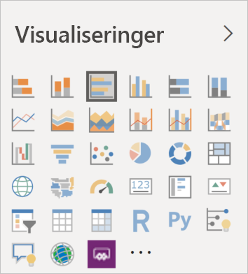

# Visualiseringer i Power BI

Power BI leveres med mange af de køreklare Power BI-visualiseringer. Disse visualiseringer er tilgængelige i visualiseringsruden i både [Power BI Desktop](https://powerbi.microsoft.com/desktop/) og [Power BI-tjenesten](https://app.powerbi.com) og kan bruges til at oprette og redigere Power BI-indhold.

Mange andre Power BI-visualiseringer er tilgængelige fra Microsoft [AppSource](https://nam06.safelinks.protection.outlook.com/?url=https%3A%2F%2Fappsource.microsoft.com%2Fen-us%2Fmarketplace%2Fapps%3Fpage%3D1%26product%3Dpower-bi-visuals&data=02%7C01%7CKesem.Sharabi%40microsoft.com%7C6d9286afacb3468d4cde08d740b76694%7C72f988bf86f141af91ab2d7cd011db47%7C1%7C0%7C637049028749147718&sdata=igWm0e1vXdgGcbyvngQBrHQVAkahPnxPC1ZhUPntGI8%3D&reserved=0) eller via Power BI. Disse visualiseringer er oprettet af Microsoft og Microsoft-partnere og testes og valideres af AppSource-valideringsteamet.

Du kan også udvikle din egen Power BI-visualisering, der skal bruges af dig, din organisation eller hele Power BI-community'et.

## Standard Power BI-visualiseringer

Disse er de indbyggede Power BI-visualiseringer, der er tilgængelige i visualiseringsruden i *Power BI Desktop* og *Power BI-tjeneste*.

Hvis du vil frigøre en Power BI-visualisering fra visualiseringsruden, skal du højreklikke på den og vælge **frigør**.

Hvis du vil gendanne standard Power BI-visualiseringen i visualiseringsruden, skal du klikke på **Importér en brugerdefineret visualisering** og vælge **Gendan standardvisualiseringer**. 

## AppSource Power BI-visualiseringer

Microsoft og medlemmer af community'et bidrager med deres Power BI-visualiseringer til offentlig brug og publicerer dem på [AppSource](https://appsource.microsoft.com/marketplace/apps?product=power-bi-visuals). Du kan downloade disse visualiseringer og føje dem til dine Power BI-rapporter. Microsoft har testet og godkendt disse Power BI-visualiseringer i forhold til funktionalitet og kvalitet.

### Hvad er AppSource?

[AppSource](office-store.md) er det sted, hvor du finder apps, tilføjelsesprogrammer og udvidelser til din Microsoft-software. AppSource forbinder millioner af brugere af produkter som Office 365, Azure, Dynamics 365, Cortana og Power BI med løsninger, der kan hjælpe dem med at arbejde mere effektivt og med større indsigt end før.

### Certificerede Power BI-visualiseringer

Certificerede Power BI-visualiseringer er visualiseringer på [AppSource](https://nam06.safelinks.protection.outlook.com/?url=https%3A%2F%2Fappsource.microsoft.com%2Fen-us%2Fmarketplace%2Fapps%3Fpage%3D1%26product%3Dpower-bi-visuals&data=02%7C01%7CKesem.Sharabi%40microsoft.com%7C6d9286afacb3468d4cde08d740b76694%7C72f988bf86f141af91ab2d7cd011db47%7C1%7C0%7C637049028749147718&sdata=igWm0e1vXdgGcbyvngQBrHQVAkahPnxPC1ZhUPntGI8%3D&reserved=0), der opfylder visse angivne kodekrav, som Microsoft Power BI-teamet har testet og godkendt. Testene er designet til at kontrollere, at visualiseringen ikke tilgår eksterne tjenester eller ressourcer.

Hvis du vil se en liste over certificerede Power BI-visualiseringer eller indsende dine egne, skal du se [Certificerede Power BI-visualiseringer](power-bi-custom-visuals-certified.md).

### Eksempler til Power BI-visualiseringer

Hver Power BI-visualisering på AppSource har et dataeksempel, der illustrerer, hvordan visualiseringen fungerer. Hvis du vil downloade eksemplet, skal du i [AppSource](https://nam06.safelinks.protection.outlook.com/?url=https%3A%2F%2Fappsource.microsoft.com%2Fen-us%2Fmarketplace%2Fapps%3Fpage%3D1%26product%3Dpower-bi-visuals&data=02%7C01%7CKesem.Sharabi%40microsoft.com%7C6d9286afacb3468d4cde08d740b76694%7C72f988bf86f141af91ab2d7cd011db47%7C1%7C0%7C637049028749147718&sdata=igWm0e1vXdgGcbyvngQBrHQVAkahPnxPC1ZhUPntGI8%3D&reserved=0) vælge en Power BI-visualisering, og fra afsnittet *Prøv et eksempel* skal du klikke på linket **eksempelrapport**.

## Organisationslager

Power BI-administratorer godkender og udruller Power BI-visualiseringer i deres organisation. Det betyder, at forfattere af rapporter nemt kan finde, opdatere og bruge disse Power BI-visualiseringer. Administratorer kan nemt administrere disse visualiseringer med handlinger som f.eks. opdatering af versioner, deaktivering og aktivering af Power BI-visualiseringer.

Hvis du vil have adgang til en organisations lager, skal du i ruden *Visualisering* klikke på **Importér en brugerdefineret visualisering**, vælge **Importér fra Marketplace** og i øverste vindue *Power BI-visualisering* vælge fanen **Min organisation**.

[Læs mere om visualiseringer til organisationer](power-bi-custom-visuals-organization.md).

## Visualiseringsfiler

Power BI-visualiseringer er pakker, der indeholder kode til gengivelse af de data, de fodres med. Alle kan oprette en brugerdefineret visualisering og pakke den som en enkelt `.pbiviz`-fil, som derefter kan importeres i en Power BI-rapport.

Hvis du vil importere en Power BI-visualisering, skal du i ruden *Visualisering* klikke på **Importér en brugerdefineret visualisering** og vælge **Importér fra fil**.

Hvis du er webudvikler og er interesseret i at oprette din egen visualisering og vil føje den til AppSource, kan du få mere at vide om, hvordan du [udvikler en Power BI-visualisering](custom-visual-develop-tutorial.md) og [udgiver en Power BI-visualisering til AppSource](office-store.md).

> [!WARNING]
> En Power BI-visualisering kan indeholde kode, der kan udgøre en risiko for sikkerheden eller beskyttelsen af personlige oplysninger. Vær sikker på, at du har tillid til forfatteren og kilden til Power BI-visualiseringen, før du importerer den i din rapport.

## Næste trin

* Hvis du er udvikler, skal du starte med selvstudiet [Udvikling af en Power BI-visualisering](custom-visual-develop-tutorial.md).

* Få mere at vide om, hvordan [Power BI-visualiseringsprojekter er struktureret](visual-project-structure.md).

* Udforsk [Retningslinjer for Power BI-visualiseringer](guidelines-powerbi-visuals.md).

Har du flere spørgsmål? Prøv siden [Ofte stillede spørgsmål om Power BI-visuals](power-bi-custom-visuals-faq.md) eller [Power BI-community'et](https://community.powerbi.com/).