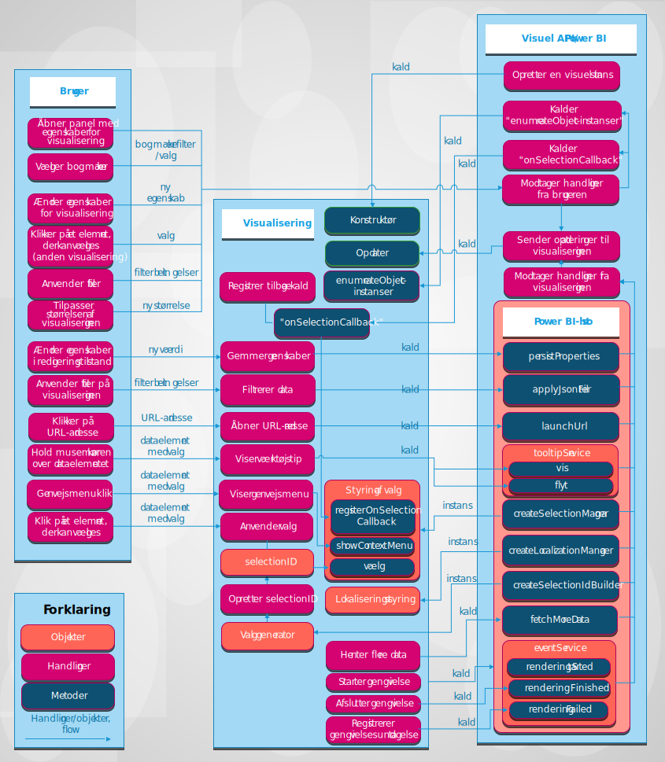

# Visualiseringer i Power BI

I artiklen beskrives det, hvordan visualiseringer integreres med Power BI, og hvordan en bruger kan interagere med en visualisering i Power BI. 

Følgende figur viser, hvordan almindelige visualiseringsbaserede handlinger, som en bruger benytter, f.eks. ved at vælge et bogmærke, behandles i Power BI.

## Visualiseringer henter opdateringer fra Power BI

En visualisering kalder en `update`-metode for at få opdateringer fra Power BI. Metoden `update` indeholder normalt den primære logik for visualiseringen og er ansvarlig for at gengive et diagram eller visualisere dataene.

Opdateringer udløses, når visualiseringen kalder metoden `update`.

## Handlings- og opdateringsmønstre

Handlinger og efterfølgende opdateringer i Power BI-visualiseringer optræder i et af disse tre mønstre:

* Brugeren interagerer med visualiseringen via Power BI.
* Brugeren interagerer direkte med visualiseringen.
* Visualiseringen interagerer med Power BI.

### Brugeren interagerer med visualiseringen via Power BI.

* En bruger åbner panelet med egenskaber for visualiseringer.

    Når en bruger åbner panelet med egenskaber for visualiseringen, henter Power BI de understøttede objekter og egenskaber fra visualiseringens *capabilities.json*-fil. Hvis du vil modtage faktiske værdier for egenskaber, kalder Power BI metoden `enumerateObjectInstances` for visualiseringen. Visualiseringen returnerer de faktiske værdier for egenskaber.

    Du kan finde flere oplysninger i [Egenskaber for Power BI-visualiseringer](capabilities.md).

* En bruger [ændrer egenskaberne for visualiseringen](../../visuals/power-bi-visualization-customize-title-background-and-legend.md) i formatpanelet.

    Når en bruger ændrer værdien af en egenskab i formatpanelet, kalder Power BI metoden `update` for visualiseringen. Power BI overfører det nye `options`-objekt til metoden `update`. Objekterne indeholder de nye værdier.

    Du kan finde flere oplysninger i [Objekter og egenskaber for Power BI-visualiseringer](objects-properties.md).

* En bruger tilpasser visualiseringens størrelse.

    Når en bruger ændrer størrelsen af visualiseringen, kalder Power BI metoden `update` med det nye `options`-objekt. `options`-objekterne har indlejrede `viewport`-objekter, der indeholder den nye bredde og højde for visualiseringen.

* En bruger anvender et filter på rapport-, side- eller visualiseringsniveau.

    Power BI filtrerer data baseret på filterbetingelser. Power BI kalder metoden `update` for visualiseringen for at opdatere visualiseringen med nye data.

    Visualiseringen får en ny opdatering af `options`-objekterne, når der er nye data i et af de indlejrede objekter. Hvordan opdateringen finder sted, afhænger af konfigurationen af tilknytning af datavisninger for visualiseringen.

    Du kan finde flere oplysninger under [Forstå tilknytning af datavisning i Power BI-visualiseringer](dataview-mappings.md).

* En bruger vælger datapunkter i en anden visualisering i rapporten.

    Når en bruger vælger et datapunkt i en anden visualisering i rapporten, filtrerer eller fremhæver Power BI de valgte datapunkter og kalder visualiseringens metode `update`. Visualiseringen henter nye filtrerede data eller de samme data med en fremhævningsmatrix.

    Du kan finde flere oplysninger under [Fremhæv datapunkter i Power BI-visualiseringer](highlight.md).

* En bruger vælger bogmærker i bogmærkepanelet i rapporten.

    Når en bruger vælger et bogmærke i rapportens bogmærkepanel, kan der opstå en af to handlinger:

    * Power BI kalder en funktion, der overføres og registreres af metoden `registerOnSelectionCallback`. Tilbagekaldsfunktionen henter matricer med markeringer for det tilsvarende bogmærke.

    * Power BI kalder metoden `update` med et tilsvarende `filter`-objekt i `options`-objektet.

    I begge tilfælde skal visualiseringen ændre sin tilstand i henhold til de modtagne valg eller `filter`-objektet.

    Du kan finde flere oplysninger om bogmærker og filtre under [API til visuelle filtre i Power BI-visualiseringer](filter-api.md).

### Brugeren interagerer direkte med visualiseringen

* En bruger placerer musemarkøren over et dataelement.

    Visualiseringen kan vise flere oplysninger om et datapunkt via værktøjstip-API'en i Power BI. Når en bruger holder musen over en visualisering, kan visualiseringen håndtere hændelsen og vise data om det tilknyttede værktøjstip. Visualiseringen kan vise standardværktøjstip eller rapportsideværktøjstip.

    Du kan finde flere oplysninger under [Værktøjstip til visualiseringer i Power BI](add-tooltips.md).

* En bruger ændrer egenskaber for visualiseringer. (Brugeren udvider f.eks. et træ, og visualiseringen gemmer tilstanden i egenskaberne).

    En visualisering kan gemme egenskabsværdier via Power BI-API'en. Hvis en bruger f.eks. interagerer med visualiseringen, og visualiseringen skal gemme eller opdatere egenskabsværdier, kan visualiseringen kalde metoden `presistProperties`.

* En bruger vælger en URL-adresse.

    En visualisering kan som standard ikke åbne en URL-adresse direkte. Hvis du i stedet vil åbne en URL-adresse i en ny fane, kan visualiseringen kalde metoden `launchUrl` og sende URL-adressen som en parameter.

    Du kan finde flere oplysninger under [Opret en URL-adresse til start](launch-url.md).

* En bruger anvender et filter via visualiseringen.

    En visualisering kan kalde metoden `applyJsonFilter` og overføre betingelser for at filtrere efter data i andre visualiseringer. Der er flere tilgængelige filtertyper, herunder basisfiltre, avancerede filtre og tuplefiltre.

    Du kan finde flere oplysninger i [API til visualisering af filtre i Power BI](filter-api.md).

* En bruger vælger elementer i visualiseringen.

    Du kan finde flere oplysninger om valg i en Power BI-visualisering under [Tilføj interaktivitet ved hjælp af valg af visualiseringer i Power BI](selection-api.md).

### Visualiseringen interagerer med Power BI

* En visualisering anmoder om flere data fra Power BI.

    En visualisering behandler data del for del. API-metoden `fetchMoreData` anmoder om det næste fragment af data i datasættet.

    Du kan få flere oplysninger i [Hent flere data fra Power BI](fetch-more-data.md).

* Hændelsestjenesten udløses.

    Power BI kan eksportere en rapport til PDF eller sende en rapport via mail (gælder kun for certificerede visualiseringer). Hvis du vil give Power BI besked om, at gengivelsen er fuldført, og at visualiseringen er klar til at blive registreret som PDF eller mail, skal visualiseringen kalde API'en for gengivelse af hændelser.

    Du kan finde flere oplysninger i [Eksport af rapporter fra Power BI til PDF](../../consumer/end-user-pdf.md).

    Hvis du vil vide mere om hændelsestjenesten, skal du se [Gengiv hændelser i visualiseringer i Power BI](event-service.md).

## Næste trin

Er du interesseret i at oprette dine egne visualiseringer og føje dem til Microsoft AppSource? Se følgende artikler:

* [Udvikling af en Power BI-visualisering](./custom-visual-develop-tutorial.md)
* [Publicer Power BI-visualiseringer i Partnercenter](office-store.md)
