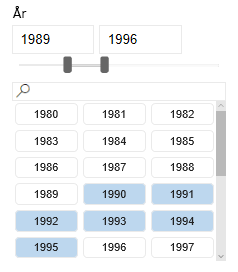
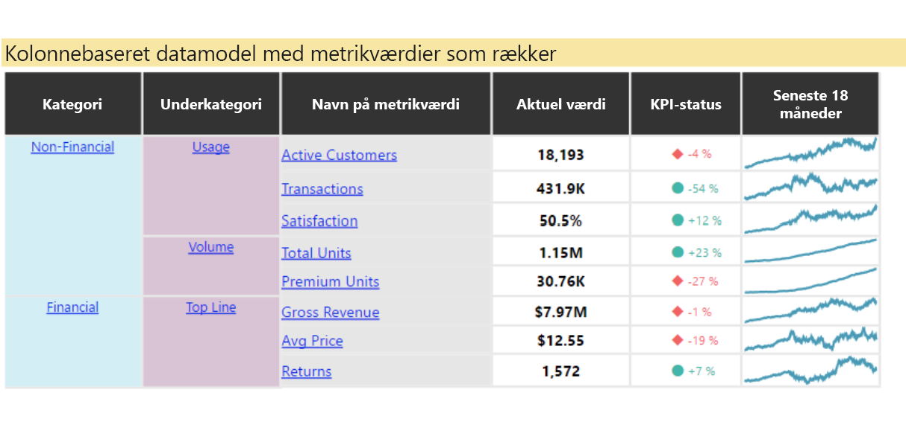
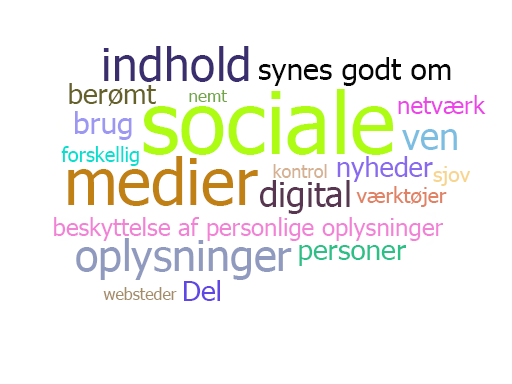
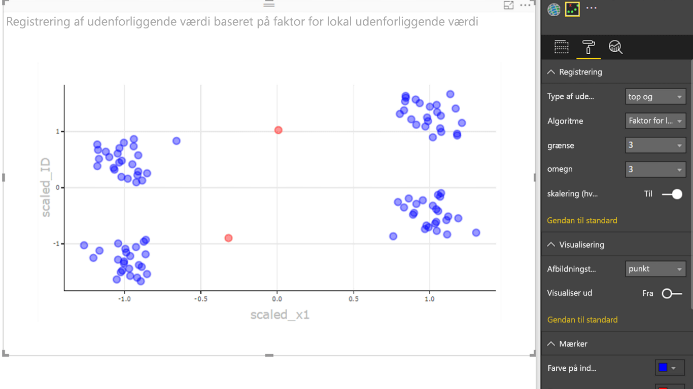

# Eksempler på Power BI-visualiseringer

Du kan downloade, bruge og ændre disse Power BI-visualiseringer fra GitHub. Disse eksempler illustrerer, hvordan du kan håndtere almindelige situationer, når du udvikler med Power BI.

## Udsnit

Et udsnit begrænser den del af data, der vises i andre visualiseringer i en rapport. Udsnit er en af flere måder at filtrere data på i Power BI.

|   |  | |
| ------------- | ------------- | -------------|
| [Firkantudsnitsværktøj](https://github.com/Microsoft/powerbi-visuals-chicletslicer/)   Vis billede og/eller tekstknapper, der fungerer som et lærredsfilter på andre visualiseringer | [Tidslinjeudsnitsværktøj](https://github.com/Microsoft/powerbi-visuals-timeline/)  Valg af grafisk datoområde, der filtrerer efter dato | [Eksempel på udsnit](https://github.com/Microsoft/powerbi-visuals-sampleslicer/)  Demonstrerer brugen af API'en til avanceret filtrering

## Diagrammer

Hent inspiration i vores galleri, herunder søjlediagrammer, cirkeldiagrammer, Word Cloud med flere.

|   |  | |
| ------------- | ------------- | -------------|
| [Aster-diagram](https://github.com/Microsoft/powerbi-visuals-asterplot/)   En ny vinkel på et standardkransediagram med en anden værdi til at køre udfaldsvinklen | [Punktdiagram](https://github.com/Microsoft/powerbi-visuals-bulletchart/)  Et søjlediagram med ekstra visualiseringer, der tilfører yderligere nyttige sammenhænge til at spore mål | [Korde](https://github.com/Microsoft/powerbi-visuals-chord/)  En grafisk metode til at vise de indbyrdes relationer mellem data i en matrix
|  | |  
| [Punktvisning](https://github.com/Microsoft/powerbi-visuals-dotplot/)  Vis hyppighedsfordelingen på en flot måde | [Dobbelt-KPI](https://github.com/Microsoft/powerbi-visuals-dualkpi/)  Visualiserer effektivt to målinger over tid og viser deres tendens på en fælles tidslinje | [Forbedret punktdiagram](https://github.com/Microsoft/powerbi-visuals-enhancedscatter/)  Forbedringer af det eksisterende punktdiagram
| | | 
| [Force-graf](https://github.com/Microsoft/powerbi-visuals-forcegraph/)  Force-layoutdiagram med kurvet sti, der er velegnet til at vise forbindelser mellem enheder | [Gantt](https://github.com/Microsoft/powerbi-visuals-gantt/)  En type søjlediagram, som illustrerer et projekts tidslinje eller tidsplan med ressourcer | [Heatmaptabel](https://github.com/Microsoft/powerbi-visuals-heatmap/)  Sammenlign data let og intuitivt ved hjælp af farver i en tabel
|  |  |  
| [Histogram](https://github.com/Microsoft/powerbi-visuals-histogram/)  Visualiserer distribution af data over et fortløbende interval eller en bestemt tidsperiode | [LineDot-diagram](https://github.com/Microsoft/powerbi-visuals-linedotchart/)  Et animeret kurvediagram med animerede punkter, der er velegnet til at engagere en målgruppe med data | [Mekko-diagram](https://github.com/Microsoft/powerbi-visuals-mekkochart/)  En blanding af 100 % stablet søjlediagram og 100 % stablet liggende søjlediagram kombineret i én visning
|  |  |  
| [Multi-KPI](https://github.com/microsoft/PowerBI-visuals-MultiKPI/)   En effektiv visualisering med flere KPI'er med en vigtig KPI sammen med flere minidiagrammer med understøttende data | [Power-KPI](https://github.com/microsoft/PowerBI-visuals-PowerKPI/)  En effektiv KPI-indikator med flerkurvediagram og mærkater for dags dato, værdi og afvigelser | [Power-KPI-matrix](https://github.com/microsoft/PowerBI-visuals-PowerKPIMatrix/)  Overvåg videnregnskaber og et ubegrænset antal målepunkter og KPI'er på en kompakt og letlæselig liste
| |  |  
| [Impulsdiagram](https://github.com/Microsoft/powerbi-visuals-pulsechart/)  Dette kurvediagram med vigtige begivenheder er perfekt til at fortælle historier med data| [Radardiagram](https://github.com/Microsoft/powerbi-visuals-radarchart/)  Repræsenterer flere målinger, der er afbildet over en kategoriakse, og er nyttigt til at sammenligne attributter | [Sankey-diagram](https://github.com/Microsoft/powerbi-visuals-sankey/)  Rutediagram, hvor bredden på serien er proportional med mængden af strømmen
|  | | 
| [Stream-graf](https://github.com/Microsoft/powerbi-visuals-streamgraph/)  Et stablet områdediagram med jævn interpolering, som ofte bruges til at vise værdier over tid | [Solstrålediagram](https://github.com/Microsoft/powerbi-visuals-sunburst/)  Kransediagram med flere niveauer til effektiv visualisering af hierarkiske data| [Tornadodiagram](https://github.com/Microsoft/powerbi-visuals-tornado/)  Sammenlign den relative vigtighed af variabler mellem to grupper
 | 
 | [Ordcloud](https://github.com/Microsoft/powerbi-visuals-wordcloud/)  Opret en sjov visualisering fra hyppig tekst i dine data

## WebGL

WebGL gør det muligt at bruge en API på webindhold, der er baseret på OpenGL ES 2.0, til at foretage gengivelse i 2D og 3D på et HTML-lærred.

| |
| ------------- |
| [Globuskort](https://github.com/Microsoft/powerbi-visuals-globemap/)  Afbild placeringer på et interaktivt 3D-kort

## R-visualiseringer

Disse eksempler viser, hvordan du kan udnytte den analytiske og visuelle styrke af R-visualiseringer og R-scripts.

| | | |
|------------- |------------- |------------- |------------- |
| [Tilknytningsregler](https://github.com/Microsoft/powerbi-visuals-assorules/)  Afdæk relationer mellem tilsyneladende ikke-relaterede data ved hjælp af if-then-sætninger | [Clustering](https://github.com/Microsoft/powerbi-visuals-clustering-kmeans/)  Find lighedsgrupper i dine data ved hjælp af k-means-algoritmen | [Clustering med udenforliggende værdier](https://github.com/microsoft/PowerBI-visuals-dbscan/)  Find lighedsgrupper og udenforliggende værdier i dine data
|  |  |  
| [Korrelationsdiagram](https://github.com/Microsoft/powerbi-visuals-corrplot/)  Fremhæv de mest korrelerede variabler i en datatabel | [Beslutningstrædiagram](https://github.com/Microsoft/powerbi-visuals-decision-tree/)  Skematisk træformet diagram til bestemmelse af statistisk sandsynlighed ved hjælp af rekursiv partitionering | [Prognose-TBATS](https://github.com/Microsoft/powerbi-visuals-forcasting-tbats/)  Tidsserieprognose for serier, der har flere sæsonudsving, ved hjælp af TBATS-modellen
|  |  |  
| [Prognose med ARIMA](https://github.com/Microsoft/powerbi-visuals-forcastingarima/)  Forudsig fremtidige værdier på baggrund af historiske data ved hjælp af ARIMA (Autoregressive Integrated Moving Avg) | [Tragtafbildning](https://github.com/Microsoft/powerbi-visuals-funnel/)  Find udenforliggende værdier i dine data ved hjælp af en tragtafbildning | [Registrering af udenforliggende værdier](https://github.com/Microsoft/powerbi-visuals-outliers-det/)  Find udenforliggende værdier i dine data ved hjælp af den mest passende metode og afbildning
|  |  | 
| [Sløjfediagram](https://github.com/Microsoft/powerbi-visuals-spline/)  Visualiser og forstå støjende data | [Diagram med tidsserieopdeling](https://github.com/Microsoft/powerbi-visuals-timeseriesdecomposition/)  Forstå tidsseriekomponenterne ved hjælp af "Seasonal and Trend decomposition using Loess" | [Diagram med tidsserieprognose](https://github.com/Microsoft/powerbi-visuals-forcasting-exp/)  Brug af en eksponentiel udjævningsmodel til at forudsige fremtidige værdier, der er baseret på tidligere observerede værdier

## Næste trin

Hvis du vil prøve at oprette Power BI-visualiseringer, kan du se [Selvstudium: Udvikling af en Power BI-visualisering](custom-visual-develop-tutorial.md).
