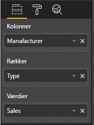

# <a name="add-interactivity-into-visual-by-power-bi-visuals-selections"></a>Føj interaktivitet til visuals efter valg af Power BI-visuals

Power BI giver mulighed for to måder at foretage interaktioner på mellem visuals – valg og filtrering. I eksemplet nedenfor kan du se, hvordan du vælger elementer i ét visual og underretter andre visuals i rapporten om den nye valgtilstand.

`Selection`-objekt svarer til grænsefladen:

```typescript
export interface ISelectionId {
    equals(other: ISelectionId): boolean;
    includes(other: ISelectionId, ignoreHighlight?: boolean): boolean;
    getKey(): string;
    getSelector(): Selector;
    getSelectorsByColumn(): SelectorsByColumn;
    hasIdentity(): boolean;
}
```

## <a name="how-to-use-selectionmanager-to-select-data-points"></a>Sådan bruger du valgstyringen til at vælge datapunkter

Visualværtsobjektet omfatter metoden til oprettelse af en forekomst af valgstyringen. Valgstyringen er ansvarlig for at vælge, fjerne valg, vise genvejsmenuen, gemme de aktuelle valg og kontrollere valgtilstanden. Og valgstyringen har tilsvarende metoder til disse handlinger.

### <a name="create-an-instance-of-the-selection-manager"></a>Opret en forekomst af valgstyringen

Hvis du vil bruge valgstyringen, skal du oprette en forekomst af valgstyringen. Visuals opretter normalt en forekomst af valgstyringen i `constructor` for visualobjektet.

```typescript
export class Visual implements IVisual {
    private target: HTMLElement;
    private host: IVisualHost;
    private selectionManager: ISelectionManager;
    // ...
    constructor(options: VisualConstructorOptions) {
        this.host = options.host;
        // ...
        this.selectionManager = this.host.createSelectionManager();
    }
    // ...
}
```

### <a name="create-an-instance-of-the-selection-builder"></a>Opret en forekomst af valggeneratoren

Når der oprettes en forekomst af valgstyringen, skal du oprette `selections` for hvert datapunkt i visual'et. Visualværtsobjektet omfatter metoden `createSelectionIdBuilder` til generering af valg for hvert datapunkt. Denne metode returnerer en forekomst af objektet med grænsefladen `powerbi.visuals.ISelectionIdBuilder`:

```typescript
export interface ISelectionIdBuilder {
    withCategory(categoryColumn: DataViewCategoryColumn, index: number): this;
    withSeries(seriesColumn: DataViewValueColumns, valueColumn: DataViewValueColumn | DataViewValueColumnGroup): this;
    withMeasure(measureId: string): this;
    withMatrixNode(matrixNode: DataViewMatrixNode, levels: DataViewHierarchyLevel[]): this;
    withTable(table: DataViewTable, rowIndex: number): this;
    createSelectionId(): ISelectionId;
}
```

Dette objekt har tilsvarende metoder til oprettelse af `selections` for forskellige typer tilknytninger af datavisninger.

> [!NOTE]
> Metoderne `withTable` og `withMatrixNode` blev introduceret i API 2.5.0 til Power BI-visuals.
> Hvis du har brug for at bruge valg til tilknytninger af tabel- eller matrixdatavisninger, skal du opdatere API-versionen til 2.5.0 eller højere.

### <a name="create-selections-for-categorical-data-view-mapping"></a>Opret valg for tilknytning af datavisning efter kategori

Lad os gennemgå, hvordan valg repræsenteres i tilknytning af kategoriske datavisninger i eksempeldatasæt:

| Producent | Type | Værdi |
| - | - | - |
| Chrysler | Indenlandsk bil | 28883 |
| Chrysler | Indenlandsk lastbil | 117131 |
| Chrysler | Importeret bil | 0 |
| Chrysler | Importeret lastbil | 6362 |
| Ford | Indenlandsk bil | 50032 |
| Ford | Indenlandsk lastbil | 122446 |
| Ford | Importeret bil | 0 |
| Ford | Importeret lastbil | 0 |
| GM | Indenlandsk bil | 65426 |
| GM | Indenlandsk lastbil | 138122 |
| GM | Importeret bil | 197 |
| GM | Importeret lastbil | 0 |
| Honda | Indenlandsk bil | 51450 |
| Honda | Indenlandsk lastbil | 46115 |
| Honda | Importeret bil | 2932 |
| Honda | Importeret lastbil | 0 |
| Nissan | Indenlandsk bil | 51476 |
| Nissan | Indenlandsk lastbil | 47343 |
| Nissan | Importeret bil | 5485 |
| Nissan | Importeret lastbil | 1430 |
| Toyota | Indenlandsk bil | 55643 |
| Toyota | Indenlandsk lastbil | 61227 |
| Toyota | Importeret bil | 20799 |
| Toyota | Importeret lastbil | 23614 |

Og visual'et bruger følgende tilknytning af datavisninger:

```json
{
    "dataRoles": [
        {
            "displayName": "Columns",
            "name": "columns",
            "kind": "Grouping"
        },
        {
            "displayName": "Rows",
            "name": "rows",
            "kind": "Grouping"
        },
        {
            "displayName": "Values",
            "name": "values",
            "kind": "Measure"
        }
    ],
    "dataViewMappings": [
        {
            "categorical": {
                "categories": {
                    "for": {
                        "in": "columns"
                    }
                },
                "values": {
                    "group": {
                        "by": "rows",
                        "select": [
                            {
                                "for": {
                                    "in": "values"
                                }
                            }
                        ]
                    }
                }
            }
        }
    ]
}
```

I eksemplet er `Manufacturer``columns`, og `Type``rows`. Der er en serie, der er oprettet af grupperingsværdier, efter `rows` (`Type`).

Og visual'et skal også kunne oprette dataudsnit efter `Manufacturer` og `Type`.

Hvis en bruger f. eks. vælger `Chrysler` efter `Manufacturer`, skal andre visuals vise følgende data:

| Producent | Type | Værdi |
| - | - | - |
| **Chrysler** | Indenlandsk bil | 28883 |
| **Chrysler** | Indenlandsk lastbil | 117131 |
| **Chrysler** | Importeret bil | 0 |
| **Chrysler** | Importeret lastbil | 6362 |

Hvis en bruger vælger `Import Car` efter `Type` (vælger data efter serie), skal andre visuals vise følgende data:

| Producent | Type | Værdi |
| - | - | - |
| Chrysler | **Importeret bil** | 0 |
| Ford | **Importeret bil** | 0 |
| GM | **Importeret bil** | 197 |
| Honda | **Importeret bil** | 2932 |
| Nissan | **Importeret bil** | 5485 |
| Toyota | **Importeret bil** | 20799 |


Du skal udfylde visualdatakurvene.



Der er `Manufacturer` som kategori (kolonner), `Type` som serier (rækker) og `Value` som `Values` for serierne.

> [!NOTE]
> `Values` er påkrævet til serier, da visual'et i henhold til tilknytningen af datavisningen forventer, at `Values` grupperes efter `Rows` data.

#### <a name="create-selections-for-categories"></a>Opret valg til kategorier

```typescript
// categories
const categories = dataView.categorical.categories;

// create label for 'Manufacturer' column
const p = document.createElement("p") as HTMLParagraphElement;
p.innerText = categories[0].source.displayName.toString();
this.target.appendChild(p);

// get count of category elements
const categoriesCount = categories[0].values.length;

// iterate all categories to generate selection and create button elements to use selections
for (let categoryIndex = 0; categoryIndex < categoriesCount; categoryIndex++) {
    const categoryValue: powerbi.PrimitiveValue = categories[0].values[categoryIndex];

    const categorySelectionId = this.host.createSelectionIdBuilder()
        .withCategory(categories[0], categoryIndex) // we have only one category (only one `Manufacturer` column)
        .createSelectionId();
    this.dataPoints.push({
        value: categoryValue,
        selection: categorySelectionId
    });
    console.log(categorySelectionId);

    // create button element to apply selection on click
    const button = document.createElement("button") as HTMLButtonElement;
    button.value = categoryValue.toString();
    button.innerText = categoryValue.toString();
    button.addEventListener("click", () => {
        // handle click event to apply correspond selection
        this.selectionManager.select(categorySelectionId);
    });
    this.target.appendChild(button);
}
```

I eksempelkoden kan du se, at vi gentager alle kategorier. Og i hver gentagelse kalder vi `createSelectionIdBuilder` for at oprette det næste valg for hver kategori ved at kalde metoden `withCategory` for valggeneratoren. Metoden `createSelectionId` bruges som en slutmetode til at returnere det oprettede `selection`-objekt.

I metoden `withCategory` overfører vi kolonnen for `category`, i eksemplet er det `Manufacturer` og indekset for kategorielementet.

#### <a name="create-selections-for-series"></a>Opret valg for serier

```typescript
// get groupped values for series
const series: powerbi.DataViewValueColumnGroup[] = dataView.categorical.values.grouped();

// create label for 'Type' column
const p2 = document.createElement("p") as HTMLParagraphElement;
p2.innerText = dataView.categorical.values.source.displayName;
this.target.appendChild(p2);

// iterate all series to generate selection and create button elements to use selections
series.forEach( (ser: powerbi.DataViewValueColumnGroup) => {
    // create selection id for series
    const seriesSelectionId = this.host.createSelectionIdBuilder()
        .withSeries(dataView.categorical.values, ser)
        .createSelectionId();

    this.dataPoints.push({
        value: ser.name,
        selection: seriesSelectionId
    });

    // create button element to apply selection on click
    const button = document.createElement("button") as HTMLButtonElement;
    button.value =ser.name.toString();
    button.innerText = ser.name.toString();
    button.addEventListener("click", () => {
        // handle click event to apply correspond selection
        this.selectionManager.select(seriesSelectionId);
    });
    this.target.appendChild(button);
});
```

### <a name="create-selections-for-table-data-view-mapping"></a>Opret valg for tilknytning af tabeldatavisninger

Eksempel på tilknytning af tabeldatavisninger

```json
{
    "dataRoles": [
        {
            "displayName": "Values",
            "name": "values",
            "kind": "GroupingOrMeasure"
        }
    ],
    "dataViewMappings": [
        {
            "table": {
                "rows": {
                    "for": {
                        "in": "values"
                    }
                }
            }
        }
    ]
}
```

Hvis du vil oprette et valg for hver række i tilknytningen af tabeldatavisninger, skal du kalde metoden `withTable` for valggeneratoren.

```typescript
public update(options: VisualUpdateOptions) {
    const dataView = options.dataViews[0];
    dataView.table.rows.forEach((row: DataViewTableRow, rowIndex: number) => {
        this.target.appendChild(rowDiv);
        const selection: ISelectionId = this.host.createSelectionIdBuilder()
            .withTable(dataView.table, rowIndex)
            .createSelectionId();
    }
}
```

Den visuelle kode gentager rækkerne i tabellen, og hver række kalder tabelmetoden `withTable`. Parametrene for metoden `withTable` er `table`-objektet og indekset for tabelrækken.

### <a name="create-selections-for-matrix-data-view-mapping"></a>Opret valg for tilknytning af matrixdatavisninger

```typescript
public update(options: VisualUpdateOptions) {
    const host = this.host;
    const rowLevels: powerbi.DataViewHierarchyLevel[] = dataView.matrix.rows.levels;
    const columnLevels: powerbi.DataViewHierarchyLevel[] = dataView.matrix.rows.levels;

    // iterate rows hierarchy
    nodeWalker(dataView.matrix.rows.root, rowLevels);
    // iterate columns hierarchy
    nodeWalker(dataView.matrix.columns.root, columnLevels);

    function nodeWalker(node: powerbi.DataViewMatrixNode, levels: powerbi.DataViewHierarchyLevel[]) {
        const nodeSelection = host.createSelectionIdBuilder().withMatrixNode(node, levels);

        if (node.children && node.children.length) {
            node.children.forEach(child => {
                nodeWalker(child, levels);
            });
        }
    }
}
```

I eksemplet kalder `nodeWalker` rekursivt for hver node og underordnede noder.

`nodeWalker` opretter objektet `nodeSelection` i hvert kald. Og hver `nodeSelection` repræsenterer `selection` for de tilsvarende noder.

## <a name="select-datapoints-to-slice-other-visuals"></a>Vælg datapunkter for at opdele andre visuals

I eksempelkoderne for valg for tilknytning af datavisning efter kategori så du, at vi har oprettet en klikhandler til knapelementer. Handleren kalder metoden `select` for valgstyringen og overfører valgobjektet.

```typescript
button.addEventListener("click", () => {
    // handle click event to apply correspond selection
    this.selectionManager.select(categorySelectionId);
});
```

Grænsefladen for metoden `select` er

```typescript
interface ISelectionManager {
    // ...
    select(selectionId: ISelectionId | ISelectionId[], multiSelect?: boolean): IPromise<ISelectionId[]>;
    // ...
}
```

Du kan se, at `select` accepterer en række valg. Det betyder, at visual'et kan vælge flere datapunkter. Den anden parameter `multiSelect` er ansvarlig for valg af flere. Hvis værdien er true, rydder Power BI ikke den tidligere valgtilstand og anvender det aktuelle valg, da det forrige valg ellers nulstilles.

Det typiske scenarie for brugen af `multiSelect`-håndtering af CTRL-knappens tilstand ved klikhændelser.

```typescript
button.addEventListener("click", (mouseEvent) => {
    const multiSelect = (mouseEvent as MouseEvent).ctrlKey;
    this.selectionManager.select(seriesSelectionId, multiSelect);
});
```

## <a name="next-steps"></a>De næste trin

* [Læs om, hvordan du kan bruge valg til at forbinde visualegenskaber og datapunkter](objects-properties.md#objects-selector)

* [Læs om, hvordan du kan håndtere valg ved skift af bogmærker](bookmarks-support.md#visuals-with-selection)

* [Læs om, hvordan du tilføjer en genvejsmenu for visualdatapunkter](context-menu.md)

* [Læs om, hvordan du bruger interaktivitetsutils til at føje valg til Power BI-visuals](utils-interactivity-selections.md)
