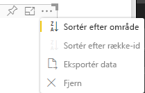

# <a name="sorting-options-for-power-bi-visuals"></a>Sorteringsmuligheder for Power BI-visualiseringer

I denne artikel beskrives det, hvordan *sorteringsindstillinger* angiver sorteringen af visualiseringer i Power BI. 

Sorteringsfunktionen kræver en af følgende parametre.

## <a name="default-sorting"></a>Standardsortering

Indstillingen `default` er den enkleste form. Den muliggør sortering af de data, der præsenteres i afsnittet "DataMappings". Denne indstilling gør det muligt for brugeren at sortere datatilknytninger og angiver sorteringsretningen.

```json
    "sorting": {
        "default": {   }
    }
```



## <a name="implicit-sorting"></a>Implicit sortering

Implicit sortering sorterer med en matrixparameteren `clauses`, der beskriver, hvordan der sorteres efter hver datarolle. `implicit` betyder, at visualiseringens bruger ikke kan ændre sorteringsrækkefølgen. Der vises ikke sorteringsindstillinger i visualiseringens menu i Power BI. Men Power BI sorterer data i henhold til de angivne indstillinger.

Parametrene `clauses` kan indeholde flere objekter med to parametre:

- `role`: Bestemmer `DataMapping` for sortering
- `direction`: Bestemmer sorteringsretningen (1 = stigende, 2 = faldende)

```json
    "sorting": {
        "implicit": {
            "clauses": [
                {
                    "role": "category",
                    "direction": 1
                },
                {
                    "role": "measure",
                    "direction": 2
                }
            ]
        }
    }
```

## <a name="custom-sorting"></a>Brugerdefineret sortering

Brugerdefineret sortering betyder, at sorteringen administreres af udvikleren i visualiseringens kode.
