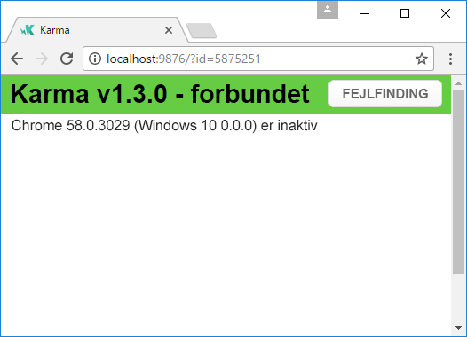
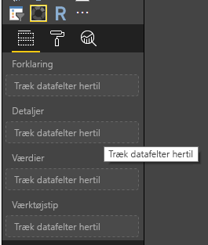
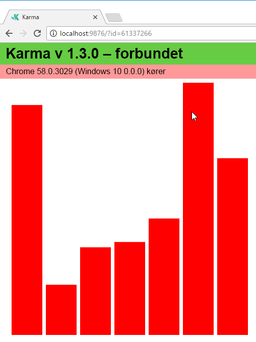
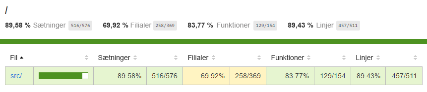

# <a name="tutorial-add-unit-tests-for-power-bi-visual-projects"></a>Selvstudium: Tilføj enhedstests i visuelle projekter i Power BI

Denne artikel beskriver det grundlæggende ved at skrive enhedstest til dine Power BI-visualiseringer, herunder hvordan du:

* Konfigurerer Jasmine – teststrukturen til kørsel af Karma JavaScript.
* Bruger pakken powerbi-visuals-utils-testutils.
* Bruger sæt med modeller og uægte elementer til at forenkle enhedstest af Power BI-visualiseringer.

## <a name="prerequisites"></a>Forudsætninger

* Et installeret visuelt projekt i Power BI
* Et konfigureret Node.js-miljø

## <a name="install-and-configure-the-karma-javascript-test-runner-and-jasmine"></a>Installér og konfigurer Karma JavaScript-testkørsel og Jasmine

Tilføj de obligatoriske biblioteker til filen *package.json* i afsnittet `devDependencies`:

```json
"@babel/polyfill": "^7.2.5",
"@types/d3": "5.5.0",
"@types/jasmine": "2.5.37",
"@types/jasmine-jquery": "1.5.28",
"@types/jquery": "2.0.41",
"@types/karma": "3.0.0",
"@types/lodash-es": "4.17.1",
"coveralls": "3.0.2",
"istanbul-instrumenter-loader": "^3.0.1",
"jasmine": "2.5.2",
"jasmine-core": "2.5.2",
"jasmine-jquery": "2.1.1",
"jquery": "3.1.1",
"karma": "3.1.1",
"karma-chrome-launcher": "2.2.0",
"karma-coverage": "1.1.2",
"karma-coverage-istanbul-reporter": "^2.0.4",
"karma-jasmine": "2.0.1",
"karma-junit-reporter": "^1.2.0",
"karma-sourcemap-loader": "^0.3.7",
"karma-typescript": "^3.0.13",
"karma-typescript-preprocessor": "0.4.0",
"karma-webpack": "3.0.5",
"puppeteer": "1.17.0",
"style-loader": "0.23.1",
"ts-loader": "5.3.0",
"ts-node": "7.0.1",
"tslint": "^5.12.0",
"webpack": "4.26.0"
```

Hvis du vil vide mere om *package.json*, skal du se beskrivelsen under [npm-package.json](https://docs.npmjs.com/files/package.json).

Gem filen *package.json*, og kør følgende kommando på placeringen `package.json`:

```cmd
npm install
```

Pakkestyringen installer alle nye pakker, som føjes til *package.json*.

Hvis du vil køre enhedstests, skal du køre testkørslen og konfigurationen `webpack`.

Følgende kode er et eksempel på filen *test.webpack.config.js*:

```typescript
const path = require('path');
const webpack = require("webpack");

module.exports = {
    devtool: 'source-map',
    mode: 'development',
    optimization : {
        concatenateModules: false,
        minimize: false
    },
    module: {
        rules: [
            {
                test: /\.tsx?$/,
                use: 'ts-loader',
                exclude: /node_modules/
            },
            {
                test: /\.json$/,
                loader: 'json-loader'
            },
            {
                test: /\.tsx?$/i,
                enforce: 'post',
                include: /(src)/,
                exclude: /(node_modules|resources\/js\/vendor)/,
                loader: 'istanbul-instrumenter-loader',
                options: { esModules: true }
            },
            {
                test: /\.less$/,
                use: [
                    {
                        loader: 'style-loader'
                    },
                    {
                        loader: 'css-loader'
                    },
                    {
                        loader: 'less-loader',
                        options: {
                            paths: [path.resolve(__dirname, 'node_modules')]
                        }
                    }
                ]
            }
        ]
    },
    externals: {
        "powerbi-visuals-api": '{}'
    },
    resolve: {
        extensions: ['.tsx', '.ts', '.js', '.css']
    },
    output: {
        path: path.resolve(__dirname, ".tmp/test")
    },
    plugins: [
        new webpack.ProvidePlugin({
            'powerbi-visuals-api': null
        })
    ]
};
```

Følgende kode er et eksempel på filen *karma.conf.ts*:

```typescript
"use strict";

const webpackConfig = require("./test.webpack.config.js");
const tsconfig = require("./test.tsconfig.json");
const path = require("path");

const testRecursivePath = "test/visualTest.ts";
const srcOriginalRecursivePath = "src/**/*.ts";
const coverageFolder = "coverage";

process.env.CHROME_BIN = require("puppeteer").executablePath();

import { Config, ConfigOptions } from "karma";

module.exports = (config: Config) => {
    config.set(<ConfigOptions>{
        mode: "development",
        browserNoActivityTimeout: 100000,
        browsers: ["ChromeHeadless"], // or Chrome to use locally installed Chrome browser
        colors: true,
        frameworks: ["jasmine"],
        reporters: [
            "progress",
            "junit",
            "coverage-istanbul"
        ],
        junitReporter: {
            outputDir: path.join(__dirname, coverageFolder),
            outputFile: "TESTS-report.xml",
            useBrowserName: false
        },
        singleRun: true,
        plugins: [
            "karma-coverage",
            "karma-typescript",
            "karma-webpack",
            "karma-jasmine",
            "karma-sourcemap-loader",
            "karma-chrome-launcher",
            "karma-junit-reporter",
            "karma-coverage-istanbul-reporter"
        ],
        files: [
            "node_modules/jquery/dist/jquery.min.js",
            "node_modules/jasmine-jquery/lib/jasmine-jquery.js",
            {
                pattern: './capabilities.json',
                watched: false,
                served: true,
                included: false
            },
            testRecursivePath,
            {
                pattern: srcOriginalRecursivePath,
                included: false,
                served: true
            }
        ],
        preprocessors: {
            [testRecursivePath]: ["webpack", "coverage"]
        },
        typescriptPreprocessor: {
            options: tsconfig.compilerOptions
        },
        coverageIstanbulReporter: {
            reports: ["html", "lcovonly", "text-summary", "cobertura"],
            dir: path.join(__dirname, coverageFolder),
            'report-config': {
                html: {
                    subdir: 'html-report'
                }
            },
            combineBrowserReports: true,
            fixWebpackSourcePaths: true,
            verbose: false
        },
        coverageReporter: {
            dir: path.join(__dirname, coverageFolder),
            reporters: [
                // reporters not supporting the `file` property
                { type: 'html', subdir: 'html-report' },
                { type: 'lcov', subdir: 'lcov' },
                // reporters supporting the `file` property, use `subdir` to directly
                // output them in the `dir` directory
                { type: 'cobertura', subdir: '.', file: 'cobertura-coverage.xml' },
                { type: 'lcovonly', subdir: '.', file: 'report-lcovonly.txt' },
                { type: 'text-summary', subdir: '.', file: 'text-summary.txt' },
            ]
        },
        mime: {
            "text/x-typescript": ["ts", "tsx"]
        },
        webpack: webpackConfig,
        webpackMiddleware: {
            stats: "errors-only"
        }
    });
};
```

Du kan ændre denne konfiguration, hvis det er nødvendigt.

Koden i *karma.conf.js* indeholder følgende variabel:

* `recursivePathToTests`: Angiver testkoden

* `srcRecursivePath`: Angiver JavaScript-output-koden efter kompilering

* `srcCssRecursivePath`: Angiver output-CSS efter kompilering af Less-filen med typografier

* `srcOriginalRecursivePath`: Angiver kildekoden for din visualisering

* `coverageFolder`: Bestemmer, hvor dækningsrapporten skal oprettes

Konfigurationsfilen har følgende egenskaber:

* `singleRun: true`: Tests køres på et system med løbende integration (CI), eller de kan køres på én gang. Indstillingen kan ændres til *false* for at foretage fejlfinding på dine tests. Karma holder browseren kørende, så du kan bruge konsollen til fejlfinding.

* `files: [...]`: I denne matrix kan du angive de filer, der skal indlæses i browseren. Normalt er det kildefiler, testcases og biblioteker (Jasmine, testprogrammer). Du kan føje flere filer til listen, hvis det er nødvendigt.

* `preprocessors`: I dette afsnit kan du konfigurere de handlinger, der skal køre før testkørsel af en enhed. De forudkompilerer typescript til JavaScript til forberedelse af kildetilknytningsfiler og genererer en rapport om kodedækning. Du kan deaktivere `coverage`, når du foretager fejlfinding af dine test. Dækning genererer ekstra kode til kontrol af testens dækning, hvilket vil komplicere fejlfinding af tests.

Du kan finde beskrivelser af alle Karma-konfigurationer ved at gå til siden med [Karma-konfigurationsfilen](https://karma-runner.github.io/1.0/config/configuration-file.html).

Du kan nemt gøre dette ved at tilføje en testkommando i `scripts`:

```json
{
    "scripts": {
        "pbiviz": "pbiviz",
        "start": "pbiviz start",
        "typings":"node node_modules/typings/dist/bin.js i",
        "lint": "tslint -r \"node_modules/tslint-microsoft-contrib\"  \"+(src|test)/**/*.ts\"",
        "pretest": "pbiviz package --resources --no-minify --no-pbiviz --no-plugin",
        "test": "karma start"
    }
    ...
}
```

Nu er du klar til at begynde at skrive dine enhedstests.

## <a name="check-the-dom-element-of-the-visual"></a>Kontrollér DOM-elementet i en visualisering

For at teste en visualisering skal du oprette en forekomst af den.

### <a name="create-a-visual-instance-builder"></a>Opret en generator til forekomsten af en visualisering

Føj en *visualBuilder.ts*-fil til *testmappen* ved hjælp af følgende kode:

```typescript
import {
    VisualBuilderBase
} from "powerbi-visuals-utils-testutils";

import {
    BarChart as VisualClass
} from "../src/visual";

import  powerbi from "powerbi-visuals-api";
import VisualConstructorOptions = powerbi.extensibility.visual.VisualConstructorOptions;

export class BarChartBuilder extends VisualBuilderBase<VisualClass> {
    constructor(width: number, height: number) {
        super(width, height);
    }

    protected build(options: VisualConstructorOptions) {
        return new VisualClass(options);
    }

    public get mainElement() {
        return this.element.children("svg.barChart");
    }
}
```

Metoden `build` anvendes til at oprette en forekomst af din visualisering. `mainElement` er en get-metode, der returnerer en forekomst af DOM-elementet "root" i din visualisering. Hentningsfunktionen er valgfri, men den gør det nemmere at skrive enhedstests.

Nu har du et build af en forekomst af dit visuelle element. Lad os gå videre med at skrive selve testcasen. Testcasen kontrollerer de SVG-elementer, der oprettes, når din visualisering vises.

### <a name="create-a-typescript-file-to-write-test-cases"></a>Opret en typescript-fil til skrivning af testcases

Føj en *visualTest.ts*-fil til testcases ved hjælp af følgende kode:

```typescript
import powerbi from "powerbi-visuals-api";

import { BarChartBuilder } from "./VisualBuilder";

import {
    BarChart as VisualClass
} from "../src/visual";

import VisualBuilder = powerbi.extensibility.visual.test.BarChartBuilder;

describe("BarChart", () => {
    let visualBuilder: VisualBuilder;
    let dataView: DataView;

    beforeEach(() => {
        visualBuilder = new VisualBuilder(500, 500);
    });

    it("root DOM element is created", () => {
        expect(visualBuilder.mainElement).toBeInDOM();
    });
});
```

Der kaldes flere metoder:

* [`describe`](https://jasmine.github.io/api/2.6/global.html#describe): Beskriver en testcase. I Jasmine-strukturens kontekst beskriver den ofte en suite eller en gruppe af specifikationer.

* `beforeEach`: Den kaldes før hvert kald til `it`-metoden, som er defineret i metoden [`describe`](https://jasmine.github.io/api/2.6/global.html#beforeEach).

* [`it`](https://jasmine.github.io/api/2.6/global.html#it): Definerer en enkelt specifikation. Metoden `it` skal indeholde en eller flere `expectations`.

* [`expect`](https://jasmine.github.io/api/2.6/global.html#expect): Opretter en forventning til en specifikation. En specifikation lykkes, hvis alle forventninger opfyldes uden fejl.

* `toBeInDOM`: En af *matchers*-metoderne. Du kan finde flere oplysninger om matchere i [Navneområdet Jasmine: matchere](https://jasmine.github.io/api/2.6/matchers.html).

Du kan finde flere oplysninger om Jasmine på siden med [dokumentation til Jasmine Framework](https://jasmine.github.io/).

### <a name="launch-unit-tests"></a>Kørsel af enhedstests

Denne test kontrollerer, at der oprettes et rod-SVG-element til visualiseringerne. Hvis du vil køre enhedstesten, skal du indtaste følgende kommando i kommandolinjeværktøjet:

```cmd
npm run test
```

`karma.js` kører testcasen i Chrome-browseren.



> [!NOTE]
> Google Chrome skal installeres lokalt.

Du får følgende output i vinduet med kommandolinjen:

```cmd
> karma start

23 05 2017 12:24:26.842:WARN [watcher]: Pattern "E:/WORKSPACE/PowerBI/PowerBI-visuals-sampleBarChart/data/*.csv" does not match any file.
23 05 2017 12:24:30.836:WARN [karma]: No captured browser, open http://localhost:9876/
23 05 2017 12:24:30.849:INFO [karma]: Karma v1.3.0 server started at http://localhost:9876/
23 05 2017 12:24:30.850:INFO [launcher]: Launching browser Chrome with unlimited concurrency
23 05 2017 12:24:31.059:INFO [launcher]: Starting browser Chrome
23 05 2017 12:24:33.160:INFO [Chrome 58.0.3029 (Windows 10 0.0.0)]: Connected on socket /#2meR6hjXFmsE_fjiAAAA with id 5875251
Chrome 58.0.3029 (Windows 10 0.0.0): Executed 1 of 1 SUCCESS (0.194 secs / 0.011 secs)

=============================== Coverage summary ===============================
Statements   : 27.43% ( 65/237 )
Branches     : 19.84% ( 25/126 )
Functions    : 43.86% ( 25/57 )
Lines        : 20.85% ( 44/211 )
================================================================================
```

### <a name="how-to-add-static-data-for-unit-tests"></a>Sådan tilføjer du statiske data til enhedstests

Opret en *visualData.ts*-fil i *testmappen* ved hjælp af følgende kode:

```typescript
import powerbi from "powerbi-visuals-api";
import DataView = powerbi.DataView;

import {
    testDataViewBuilder,
    getRandomNumbers
} from "powerbi-visuals-utils-testutils";

export class SampleBarChartDataBuilder extends TestDataViewBuilder {
    public static CategoryColumn: string = "category";
    public static MeasureColumn: string = "measure";

    public constructor() {
        super();
        ...
    }

    public getDataView(columnNames?: string[]): DataView {
        let dateView: any = this.createCategoricalDataViewBuilder([
            ...
        ],
        [
            ...
        ], columnNames).build();

        // there's client side computed maxValue
        let maxLocal = 0;
        this.valuesMeasure.forEach((item) => {
                if (item > maxLocal) {
                    maxLocal = item;
                }
        });
        (<any>dataView).categorical.values[0].maxLocal = maxLocal;
    }
}
```

Klassen `SampleBarChartDataBuilder` udvides `TestDataViewBuilder` og implementerer den abstrakte metode `getDataView`.

Når du placerer data i datafelt-buckets, opretter Power BI et `dataview`-kategoriobjekt, som er baseret på dine data.



I enhedstests har du ikke Power BI-kernefunktioner til at genskabe dataene. Du skal dog knytte dine statiske data til `dataview`-kategorien. Klassen `TestDataViewBuilder` kan hjælpe dig med at tilknytte den.

Du kan finde flere oplysninger om tilknytning af datavisning i [DataViewMappings](https://github.com/Microsoft/PowerBI-visuals/blob/master/Capabilities/DataViewMappings.md).

I metoden `getDataView` kan du kalde metoden `createCategoricalDataViewBuilder` med dine data.

I `sampleBarChart`-visualiseringens [capabilities.json](https://github.com/Microsoft/PowerBI-visuals-sampleBarChart/blob/master/capabilities.json#L2)-fil har vi dataRoles- og dataViewMapping-objekter:

```json
"dataRoles": [
    {
        "displayName": "Category Data",
        "name": "category",
        "kind": "Grouping"
    },
    {
        "displayName": "Measure Data",
        "name": "measure",
        "kind": "Measure"
    }
],
"dataViewMappings": [
    {
        "conditions": [
            {
                "category": {
                    "max": 1
                },
                "measure": {
                    "max": 1
                }
            }
        ],
        "categorical": {
            "categories": {
                "for": {
                    "in": "category"
                }
            },
            "values": {
                "select": [
                    {
                        "bind": {
                            "to": "measure"
                        }
                    }
                ]
            }
        }
    }
],
```

Hvis du vil oprette den samme tilknytning, skal du angive følgende parametre til metoden `createCategoricalDataViewBuilder`:

```typescript
([
    {
        source: {
            displayName: "Category",
            queryName: SampleBarChartData.ColumnCategory,
            type: ValueType.fromDescriptor({ text: true }),
            roles: {
                Category: true
            },
        },
        values: this.valuesCategory
    }
],
[
    {
        source: {
            displayName: "Measure",
            isMeasure: true,
            queryName: SampleBarChartData.MeasureColumn,
            type: ValueType.fromDescriptor({ numeric: true }),
            roles: {
                Measure: true
            },
        },
        values: this.valuesMeasure
    },
], columnNames)
```

Hvor `this.valuesCategory` er en matrix af kategorier:

```ts
public valuesCategory: string[] = ["Monday", "Tuesday", "Wednesday", "Thursday", "Friday", "Saturday", "Sunday"];
```

Og `this.valuesMeasure` er en matrix af målinger for hver kategori:

```ts
public valuesMeasure: number[] = [742731.43, 162066.43, 283085.78, 300263.49, 376074.57, 814724.34, 570921.34];
```

Nu kan du bruge klassen `SampleBarChartDataBuilder` i din enhedstest.

Klassen `ValueType` er defineret i pakken powerbi-visuals-utils-testutils. Og metoden `createCategoricalDataViewBuilder` kræver biblioteket `lodash`.

Tilføj disse pakker af hensyn til afhængigheder.

I `package.json` i afsnittet `devDependencies`

```json
"lodash-es": "4.17.1",
"powerbi-visuals-utils-testutils": "2.2.0"
```

Kald

```cmd
npm install
```

for at installere biblioteket `lodash-es`.

Nu kan du køre enhedstesten igen. Følgende output skal vises:

```cmd
> karma start

23 05 2017 16:19:54.318:WARN [watcher]: Pattern "E:/WORKSPACE/PowerBI/PowerBI-visuals-sampleBarChart/data/*.csv" does not match any file.
23 05 2017 16:19:58.333:WARN [karma]: No captured browser, open http://localhost:9876/
23 05 2017 16:19:58.346:INFO [karma]: Karma v1.3.0 server started at http://localhost:9876/
23 05 2017 16:19:58.346:INFO [launcher]: Launching browser Chrome with unlimited concurrency
23 05 2017 16:19:58.394:INFO [launcher]: Starting browser Chrome
23 05 2017 16:19:59.873:INFO [Chrome 58.0.3029 (Windows 10 0.0.0)]: Connected on socket /#NcNTAGH9hWfGMCuEAAAA with id 3551106
Chrome 58.0.3029 (Windows 10 0.0.0): Executed 1 of 1 SUCCESS (1.266 secs / 1.052 secs)

=============================== Coverage summary ===============================
Statements   : 56.72% ( 135/238 )
Branches     : 32.54% ( 41/126 )
Functions    : 66.67% ( 38/57 )
Lines        : 52.83% ( 112/212 )
================================================================================
```

Det visuelle element åbnes i Chrome-browseren som vist:



Oversigten viser, at dækningen er steget. Åbn `coverage\index.html` for at få mere at vide om den aktuelle kodedækning.



Eller se på området for mappen `src` :


I filområdet kan du se på kildekoden. Hvis der ikke udføres en bestemt kode under enhedstesten, fremhæver hjælpeprogrammerne `Coverage` rækken med rødt.


> [!IMPORTANT]
> Kodedækning betyder ikke nødvendigvis, at du har god funktionalitetsdækning af en visualisering. En enkel enhedstest leverede over 96 % dækning i `src\visual.ts`.

## <a name="next-steps"></a>Næste trin

Når din visualisering er klar, kan du sende den til publicering. Du kan få flere oplysninger under [Publicer Power BI-visualiseringer i AppSource](../office-store.md).
