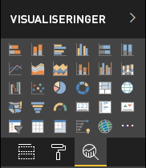

# <a name="power-bi-visual-project-structure"></a>Struktur for visual-projekter i Power BI

Den bedste måde at komme i gang med at oprette en ny Power BI-visualisering på er ved at bruge Power BI-værktøjet til visualiseringer [pbiviz](https://www.npmjs.com/package/powerbi-visuals-tools).

Hvis du vil oprette et nyt visuelt element, skal du gå til den mappe, som Power BI-visualiseringen skal placeres i, og køre kommandoen:

`pbiviz new <visual project name>`

Når du kører denne kommando, oprettes en Power BI-visualiseringsmappe, der indeholder følgende filer:

```markdown
project
├───.vscode
│   ├───launch.json
│   └───settings.json
├───assets
│   └───icon.png
├───node_modules
├───src
│   ├───settings.ts
│   └───visual.ts
├───style
│   └───visual.less
├───capabilities.json
├───package-lock.json
├───package.json
├───pbiviz.json
├───tsconfig.json
└───tslint.json
```

## <a name="folder-and-file-description"></a>Beskrivelse af mappe og fil

Dette afsnit indeholder oplysninger om hver mappe og fil i mappen, som værktøjet **pbiciz** til visualiseringer i Power BI opretter.  

### <a name="vscode"></a>.vscode

Denne mappe indeholder VS-kodeprojektindstillingerne.

Hvis du vil konfigurere dit arbejdsområde, skal du redigere filen `.vscode/settings.json`.

Du kan finde flere oplysninger under [Indstillinger for bruger og arbejdsområde](https://code.visualstudio.com/docs/getstarted/settings)

### <a name="assets"></a>assets

Denne mappe indeholder filen `icon.png`.

Power BI-visualiseringsværktøjet bruger denne fil som det nye Power BI-visualiseringsikon i ruden Visualiseringer i Power BI.

<!---  --->

### <a name="src"></a>src

Denne mappe indeholder kildekoden til visualiseringen.

I denne mappe opretter Power BI-visualiseringsværktøjet følgende filer:
* `visual.ts` – visualiseringens hovedkildekode.
* `settings.ts` – visualiseringens indstillingskode. Klasserne i filen indeholder en grænseflade til definition af [egenskaber for visualiseringen](./objects-properties.md#properties).

### <a name="style"></a>typografi

Denne mappe indeholder filen `visual.less`, som indeholder typografierne i visualiseringen.

### <a name="capabilitiesjson"></a>capabilities.json

Denne fil indeholder de primære egenskaber og indstillinger (eller [funktioner](./capabilities.md)) for visualiseringen. Den gør det muligt for visualiseringen at deklarere understøttede funktioner, objekter, egenskaber og [tilknytning af datavisning](./dataview-mappings.md).

### <a name="package-lockjson"></a>package-lock.json

Denne fil genereres automatisk for alle handlinger, hvor *npm* ændrer enten træet `node_modules` eller filen `package.json`.

Du kan finde flere oplysninger om denne fil i den officielle dokumentation til [npm-package-lock.json](https://docs.npmjs.com/files/package-lock.json).

### <a name="packagejson"></a>package.json

Denne fil beskriver projektpakken. Den indeholder normalt oplysninger om projektet, f.eks. forfatterne, beskrivelsen af og afhængighederne i projektet.

Du kan få flere oplysninger om denne fil i den officielle dokumentation til [npm-package.json](https://docs.npmjs.com/files/package.json.html).

### <a name="pbivizjson"></a>pbiviz.json

Denne fil indeholder metadata om visualiseringen.

Hvis du vil have vist et eksempel på filen `pbiviz.json` med kommentarer, der beskriver metadataposterne, skal du se afsnittet [metadataposter](#metadata-entries).

### <a name="tsconfigjson"></a>tsconfig.json

Er en konfigurationsfil til [TypeScript](https://www.typescriptlang.org/docs/handbook/tsconfig-json.html).

Denne fil skal indeholde en sti til **\*.ts**-filen, hvor visualiseringens primære klasse er placeret som angivet i egenskaben `visualClassName` i filen `pbiviz.json`.

### <a name="tslintjson"></a>tslint.json

Denne fil indeholder [TSLint-konfigurationen](https://palantir.github.io/tslint/usage/configuration/).

## <a name="metadata-entries"></a>Metadataposter

Kommentarerne i den følgende kodetekst fra `pbiviz.json`-filen beskriver metadataposterne.

> [!NOTE]
> * Fra version 3.x.x af **pbiviz**-værktøjet understøttes `externalJS` ikke.
> * Hvis du vil have hjælp til lokaliseringen, skal du [føje landestandarden for Power BI til visualiseringen](./localization.md).

```json
{
  "visual": {
     // The visual's internal name.
    "name": "<visual project name>",

    // The visual's display name.
    "displayName": "<visual project name>",

    // The visual's unique ID.
    "guid": "<visual project name>23D8B823CF134D3AA7CC0A5D63B20B7F",

    // The name of the visual's main class. Power BI creates the instance of this class to start using the visual in a Power BI report.
    "visualClassName": "Visual",

    // The visual's version number.
    "version": "1.0.0",
    
    // The visual's description (optional)
    "description": "",

    // A URL linking to the visual's support page (optional).
    "supportUrl": "",

    // A link to the source code available from GitHub (optional).
    "gitHubUrl": ""
  },
  // The version of the Power BI API the visual is using.
  "apiVersion": "2.6.0",

  // The name of the visual's author and email.
  "author": { "name": "", "email": "" },

  // 'icon' holds the path to the icon file in the assets folder; the visual's display icon.
  "assets": { "icon": "assets/icon.png" },

  // Contains the paths for JS libraries used in the visual.
  // Note: externalJS' isn't used in the Power BI visuals tool version 3.x.x or higher.
  "externalJS": null,

  // The path to the 'visual.less' style file.
  "style": "style/visual.less",

  // The path to the `capabilities.json` file.
  "capabilities": "capabilities.json",

  // The path to the `dependencies.json` file which contains information about R packages used in R based visuals.
  "dependencies": null,

  // An array of paths to files with localizations.
  "stringResources": []
}
```

## <a name="next-steps"></a>Næste trin

* Hvis du vil vide mere om interaktionerne mellem en visualisering, en bruger og Power BI, kan du se [Visuelle koncepter i Power BI](./power-bi-visuals-concept.md).

* Begynd at udvikle dine egne Power BI-visualiseringer fra bunden [med en trinvis vejledning](./custom-visual-develop-tutorial.md).
