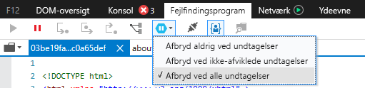
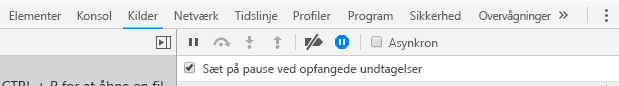

# <a name="how-to-debug-power-bi-visuals"></a>Sådan foretager du fejlfinding af Power BI-visualiseringer

På denne side vises nogle tip til fejlfinding under oprettelse af en visualisering. Den indeholder grundlæggende trin og viser forskellene mellem fejlfinding af front end-standardprogrammer og Power BI-visualiseringer.
Når du har læst artiklen, kan du foretage fejlfinding af Power BI-visuals ved hjælp af pausepunkter, logføring af undtagelser og indfangning af undtagelser i Chrome og Edge.

## <a name="using-breakpoints"></a>Brug af pausepunkter

Da visual'ets JavaScript genindlæses fuldt ud, hver gang visual'et opdateres, går alle pausepunkter, du tilføjer, tabt, når visual'et til fejlfinding opdateres. Du kan løse problemet ved at bruge `debugger`-sætninger i din kode. Det anbefales, at du slår automatisk genindlæsning fra under brug af `debugger` i din kode.

```typescript
public update(options: VisualUpdateOptions) {
    console.log('Visual update', options);
    debugger;
    this.target.innerHTML = `<p>Update count: <em>${(this.updateCount</em></p>`;
}
```


## <a name="showing-exceptions"></a>Visning af undtagelser

Når du arbejder på dit visual, kan du se, at alle fejl 'forbruges' af Power BI-tjenesten. Dette er en bevidst funktion i Power BI for at forhindre, at visualiseringer, der ikke fungerer korrekt, forårsager, at hele programmet bliver ustabilt.

Du kan løse problemet ved at tilføje kode for at indfange og logføre dine undtagelser eller ved at indstille fejlfindingsprogrammet til at afbryde ved opfangede undtagelser.


## <a name="log-exceptions"></a>Logføring af undtagelser

Hvis du vil logføre undtagelser i din Power BI-visualisering, skal du føje følgende kode til din visualisering for at definere en dekoratør til logføring af undtagelser.

```typescript
export function logExceptions(): MethodDecorator {
    return function (target: Object, propertyKey: string, descriptor: TypedPropertyDescriptor<any>): TypedPropertyDescriptor<any> {
        return {
            value: function () {
                try {
                    return descriptor.value.apply(this, arguments);
                } catch (e) {
                    console.error(e);
                    throw e;
                }
            }
        }
    }
}
```
Du kan derefter bruge denne dekoratør til en hvilken som helst funktion for at få vist logføring af fejl.

```typescript
@logExceptions()
public update(options: VisualUpdateOptions) {
```

## <a name="break-on-exceptions"></a>Afbrydelse ved undtagelser

Du kan også indstille browseren til at afbryde ved opfangede undtagelser. Dette stopper udførelsen af koden, uanset hvor en fejl opstår, og giver dig mulighed for at foretage fejlfinding derfra.

### <a name="edge"></a>Edge

1. Åbn udviklerværktøjer (F12).
2. Gå til fanen **Fejlfindingsprogram**.
3. Klik på ikonet for **afbrydelse ved undtagelser** (sekskant med et pausesymbol).
4. Vælg **Afbryd ved alle undtagelser**.



## <a name="chrome"></a>Chrome

1. Åbn udviklerværktøjer (F12).
2. Gå til fanen **Kilder**.
3. Klik på ikonet for **afbrydelse ved undtagelser** (stoptegnet med et pausesymbol).
4. Markér afkrydsningsfeltet **Afbryd midlertidigt ved opfangede undtagelser**.



## <a name="next-steps"></a>Næste trin
* [Foretag fejlfinding af Power BI-visualiseringer](power-bi-custom-visuals-troubleshoot.md)
* Du kan finde flere oplysninger og få svar på spørgsmål i [Ofte stillede spørgsmål om Power BI-visualiseringer](power-bi-custom-visuals-faq.md#organizational-power-bi-visuals)
