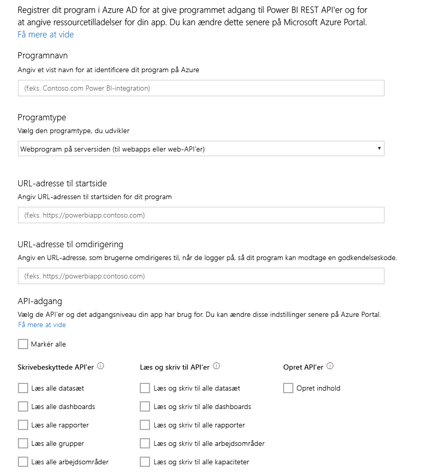

# Trin 1: Registrer en app i Azure AD
Denne artikel er en del af en trinvis vejledning til, hvordan du [overfører data til et datasæt](walkthrough-push-data.md).

Det første, du skal gøre for at overføre data til et Power BI-datasæt, er at registrere din app i Azure AD. Det skal du gøre for at få et **klient-id**, som identificerer din app i Azure AD. Uden et **klient-id** kan din app ikke godkendes i Azure AD.

> **Bemærk**! Inden du registrerer en app til Power BI, skal du [tilmelde dig Power BI](create-an-azure-active-directory-tenant.md).
> 
> 

Nedenfor kan du se, hvordan du registrerer en app i Azure AD.

## Registrer en app i Azure AD
1. Gå til dev.powerbi.com/apps.
2. Klik på **Log på med din eksisterende konto**, og log på din Power BI-konto.
3. Angiv et **navn på appen**, f.eks. "Prøveapp til overførsel af data".
4. I **Apptype** skal du vælge **Oprindelige app**.
5. Angiv en **URL-adresse til omdirigering**, f.eks **https://login.live.com/oauth20_desktop.srf**. Når du har en **oprindelig klientapp**, giver en URI til omdirigering **Azure AD** flere oplysninger om den app, der skal godkendes. Standard-URI'en for en klientapp er https://login.live.com/oauth20_desktop.srf.
6. I **Vælg de API'er, der skal opnås adgang til** skal du vælge **Læs og skriv alle datasæt**. Hvis du vil se en liste over alle tilladelser i Power BI-appen, skal du gå til [Tilladelser i Power BI](power-bi-permissions.md).
7. Klik på **Registrer app**, og gem det **klient-id**, der oprettes. Et **klient-id** identificerer appen i Azure AD.

Nedenfor kan du se, hvordan siden **Registrer en app til Power BI** bør se ud:

På næste trin kan du se, hvordan du [får en adgangstoken til godkendelse](walkthrough-push-data-get-token.md).

[Næste trin >](walkthrough-push-data-get-token.md)

## Næste trin
[Tilmeld dig Power BI](create-an-azure-active-directory-tenant.md)  
[Hent en adgangstoken til godkendelse](walkthrough-push-data-get-token.md)  
[Gennemgang: Overfør data til et datasæt](walkthrough-push-data.md)  
[Registrer en app](register-app.md)  
[Oversigt over Power BI REST-API'en](overview-of-power-bi-rest-api.md)  

Har du flere spørgsmål? [Prøv at spørge Power BI-community'et](http://community.powerbi.com/)

