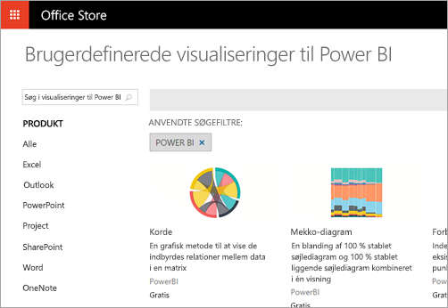
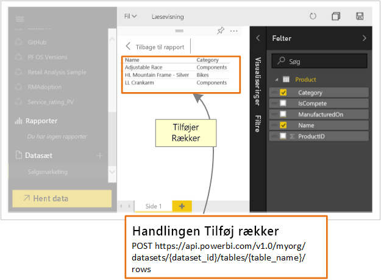

# Hvad kan udviklere bruge Power BI til?

Udviklere har forskellige muligheder, når de forsøger at inkludere Power BI-indhold i programmer. Som udvikler kan du bruge disse indstillinger, herunder **integrering med Power BI**, **brugerdefinerede visualiseringer** og **pushoverførsel af data i Power BI**.

## Integrer Power BI-indhold

Power BI-tjenesten (SaaS) og tjenesten Power BI Embedded i Azure (PaaS) har API'er, du kan bruge til at integrere dine dashboards og rapporter. Med denne funktion kan du få adgang til de nyeste funktioner i Power BI, f.eks. dashboards, gateways og apparbejdsområder, når du integrerer indhold.

Du kan gennemgå [Embedding-konfigurationsværktøjet](https://aka.ms/embedsetup) for hurtigt at komme i gang og downloade en eksempelapp.

Vælg den løsning, der er den rette for dig:

* Med [Embedding for your customers](embedding.md#embedding-for-your-customers) kan du integrere dashboards og rapporter for de brugere, der ikke har en konto til Power BI. Kør løsningen [Embed for your customers](https://aka.ms/embedsetup/AppOwnsData).

* Med [Embedding for your organization](embedding.md#embedding-for-your-organization) kan du udvide Power BI-tjenesten. Kør løsningen [Embed for your organization](https://aka.ms/embedsetup/UserOwnsData).

Hvis du vil have mere at vide om integration med Power BI, kan du se [Integration med Power BI](embedding.md).

## Udvikling af brugerdefinerede visualiseringer

Du kan bruge brugerdefinerede visualiseringer i Power BI til at oprette unikke visualiseringer, som er skræddersyet til dig eller din virksomhed. Disse brugerdefinerede visualiseringer er ofte oprettet af udviklere. De bygges, når mængden af visualiseringer, der er inkluderet i Power BI, ikke opfylder dine behov.

Med brugerdefinerede visualiseringer kan du oprette dine egne visualiseringer, som du kan bruge i Power BI-rapporter. Brugerdefinerede visualiseringer skrives i TypeScript, der er en udvidelse af JavaScript. TypeScript understøtter visse avancerede funktioner og tidlig adgang til ES6/ES7-funktioner. Formatering af visualiseringer håndteres ved hjælp af overlappende typografiark (CSS). For nemheds skyld bruger vi præcompileren Less, der understøtter nogle avancerede funktioner, f.eks. indlejring, variabler, betingelser, løkker og andre funktioner. Hvis du ikke vil bruge nogen af disse funktioner, kan du bare skrive almindelige overlappende CSS i Less-filen.

Hvis du vil have mere at vide om udvikling af brugerdefinerede visualiseringer, kan du se under [Udvikling af en brugerdefineret visualisering i Power BI](custom-visual-develop-tutorial.md).

## Brug af API-automatisering

Power BI viser dashboards, der er interaktive, og som kan oprettes og opdateres fra mange forskellige datakilder i realtid. Du kan bruge alle programmeringssprog, der understøtter REST-kald, til at oprette apps, der kan integreres med et Power BI-dashboard i realtid. Du kan også integrere Power BI-felter og -rapporter i apps.

Udviklere kan også oprette deres egne datavisualiseringer, der kan bruges i interaktive rapporter og på dashboards.

Du kan se nogle af de ting, du kan gøre med Power BI-API'erne, i [Hvad kan udviklere bruge Power BI-API'en til](overview-of-power-bi-rest-api.md)?

## Næste trin

[Integrer med Power BI](embedding.md)  

[Udvikling af en brugerdefineret visualisering i Power BI](https://microsoft.github.io/PowerBI-visuals/docs/step-by-step-lab/developing-a-power-bi-custom-visual/)

[Hvad kan udviklere bruge Power BI-API'en til?](overview-of-power-bi-rest-api.md)

[Power BI Developer Center](https://powerbi.microsoft.com/developers/)