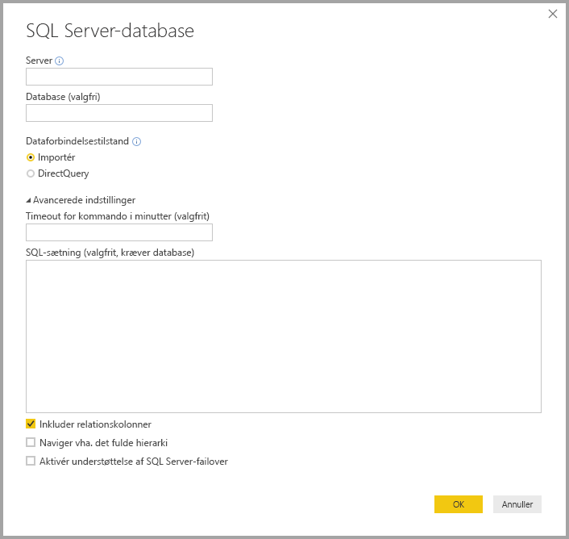

# Hvad er Power BI Desktop?

*Power BI Desktop* er et gratis program, som du installerer på din lokale computer, og som giver dig mulighed for at oprette forbindelse til, transformere og visualisere dine data. Med Power BI Desktop kan du oprette forbindelse til flere forskellige datakilder og kombinere dem (også kaldet *udformning*) i en datamodel. Med denne datamodel kan du bygge visualiseringer og samlinger af visualiseringer, som du kan dele som rapporter med andre personer i organisationen. De fleste brugere, der arbejder på Business Intelligence-projekter, bruger Power BI Desktop til at oprette rapporter og bruger derefter *Power BI-tjenesten* til at dele deres rapporter med andre.

De mest almindelige anvendelsesområder for Power BI Desktop er følgende:

* Opret forbindelse til data
* Transformér og ryd disse data for at oprette en datamodel
* Opret visuelle elementer, f.eks. diagrammer eller grafer, der giver visuelle præsentationer af dataene
* Opret rapporter, der er samlinger af visuelle elementer på en eller flere rapportsider
* Del rapporter med andre ved hjælp af Power BI-tjenesten

De personer, der oftest er ansvarlige for sådanne opgaver, opfattes ofte som *dataanalytikere* (kaldes også *analytikere*) eller Business Intelligence-medarbejdere (også kaldet *rapportoprettere*). Men mange, der ikke opfatter sig selv som analytiker eller rapportopretter, bruger Power BI Desktop til at oprette overbevisende rapporter eller til at trække data fra forskellige datakilder og oprette datamodeller, som de kan dele med kolleger og organisationer.

> [!IMPORTANT]
> Power BI Desktop opdateres og frigives hver måned med kundefeedback og nye funktioner. Det er kun den nyeste version af Power BI Desktop, der understøttes. Kunder, der kontakter support til Power BI Desktop, bliver bedt om at opgradere til den nyeste version. Du kan hente den nyeste version af Power BI Desktop fra [Windows Store](https://aka.ms/pbidesktopstore) eller som en enkelt eksekverbar fil, der indeholder alle understøttede sprog, som du [downloader](https://www.microsoft.com/download/details.aspx?id=58494) og installerer på din computer.

Der er tre visninger i Power BI Desktop, som du kan vælge i venstre side af lærredet. Visningerne er som følger (vist i den rækkefølge, de forekommer i):
* **Rapport**: I denne visning kan du oprette rapporter og visualiseringer, hvor du bruger mest tid på oprettelser.
* **Data**: I denne visning kan du se tabeller, målinger og andre data, der bruges i den datamodel, som er knyttet til din rapport, og transformere dataene til den bedste brug i rapportens model.
* **Model**: I denne visning kan du se og administrere relationerne mellem tabeller i din datamodel.

På følgende billede kan du se de tre visninger, som forekommer langs venstre side af lærredet:

 

## Opret forbindelse til data
For at komme i gang med Power BI Desktop skal du som det første oprette forbindelse til data. Du kan oprette forbindelse til mange forskellige typer datakilder fra Power BI Desktop. 

Sådan opretter du forbindelse til data:

1. På båndet **Hjem** skal du vælge **Hent data** > **Mere**. 

   Vinduet **Hent data** vises, og det indeholder de mange kategorier, som Power BI Desktop kan oprette forbindelse til.

   

2. Når du vælger en datatype, bliver du bedt om at angive oplysninger, f.eks. URL-adressen og legitimationsoplysningerne, der er nødvendige, for at Power BI Desktop kan oprette forbindelse til datakilden på dine vegne.

   

3. Når du har oprettet forbindelse til en eller flere datakilder, kan du transformere dataene, så de er nyttige for dig.

## Transformér og rens dataene, og opret en model

I Power BI Desktop kan du rense og transformere data ved hjælp af den indbyggede [Power Query-editor](https://docs.microsoft.com/power-bi/desktop-query-overview). Med Power Query-editoren ændrer du dine data, f.eks. ændring af en datatype, fjernelse af kolonner eller kombination af data fra flere kilder. Det er lige som at lave en skulptur: Du starter med en stor klump ler (eller data), og derefter barberer du stykker af eller tilføjer nogle efter behov, indtil formen af dataene er, som du ønsker det. 

Sådan starter du Power Query-editor:

- Vælg **Rediger forespørgsler** > **Rediger forespørgsler** under båndet **Hjem**.

   Vinduet **Power Query-editor** vises.

   

Hvert trin, du udfører, når du transformerer data (f.eks. omdøbning af en tabel, transformation af en datatype eller sletning af en kolonne), registreres af Power Query-editor. Hver gang denne forespørgsel opretter forbindelse til datakilden, udføres disse trin, så dataene altid formes på den måde, du angiver.

På følgende billede vises ruden **Power Query-editor** for en forespørgsel, der er formet og blevet til en model.

 

Når dine data er, som du ønsker det, kan du oprette visuelle elementer. 

## Opret visuelle elementer 

Når du har en datamodel, kan du trække *felter* til rapportlærredet for at oprette *visuelle elementer*. Et visuelt element er en grafisk repræsentation af dataene i din model. Du kan vælge mellem mange forskellige typer visuelle elementer i Power BI Desktop. Det følgende visuelle element viser et simpelt søjlediagram. 

Sådan opretter eller ændrer du et visuelt element: 

- Vælg ikonet for visuelt element i ruden **Visualiseringer**. 

   

   Hvis du allerede har et visuelt element, der er markeret på rapportlærredet, ændres det valgte visuelle element til den type, som du har valgt. 

   Hvis der ikke er markeret et visuelt element på lærredet, oprettes der et nyt visuelt element ud fra din markering.

## Opret rapporter

Typisk vil du oprette en samling visuelle elementer, der viser forskellige aspekter af de data, du har brugt til at oprette din model i Power BI Desktop. En samling visuelle elementer i én Power BI Desktop-fil kaldes en *rapport*. En rapport kan bestå af en eller flere sider, på samme måde som en Excel-fil kan bestå af et eller flere regneark.

Med Power BI Desktop kan du oprette komplekse og visuelt avancerede rapporter ved hjælp af data fra flere kilder – det hele i én rapport, som du kan dele med andre i din organisation.

På følgende billede kan du se den første side i en Power BI Desktop-rapport, der kaldes **Overview** som vist nederst på billedet. 

## Del rapporter

Når en rapport er klar til at blive delt med andre, kan du *udgive* rapporten til Power BI-tjenesten og gøre den tilgængelig for alle i din organisation, som har en licens til Power BI. 

Sådan udgiver du en Power BI Desktop-rapport: 

1. Vælg **Publicer** fra båndet **Hjem**.

   

   Power BI Desktop opretter forbindelse til Power BI-tjenesten med din Power BI-konto. 

2. Power BI beder dig vælge, hvor i Power BI-tjenesten du vil dele rapporten, f.eks. dit arbejdsområde, et gruppearbejdsområde eller en anden placering i Power BI-tjenesten. 

   Du skal have en licens til Power BI for at dele rapporter til Power BI-tjenesten.

## Næste trin

For at komme i gang med Power BI Desktop skal du først downloade og installere programmet. Du kan hente Power BI Desktop på to måder:

* [Hent Power BI Desktop fra Windows Store](https://aka.ms/pbidesktopstore)
* [Download Power BI Desktop fra internettet](https://www.microsoft.com/download/details.aspx?id=58494)

