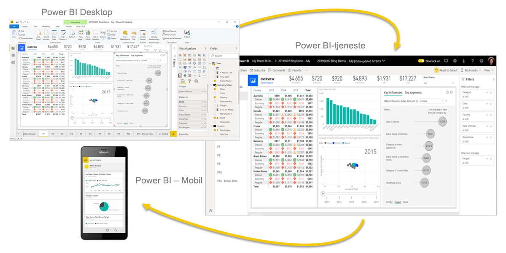
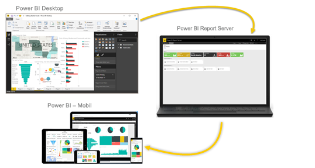

# Hvad er Power BI?
**Power BI** er en samling af softwaretjenester, apps og forbindelser, der arbejder sammen for at forvandle usammenhængende data til faste, visuelt fordybende og interaktive indsigter. Dine data kan være et Excel-regneark eller en samling cloudbaserede hybride data warehouses og hybride data warehouses i det lokale miljø. Med Power BI kan du nemt oprette forbindelse til dine datakilder, visualisere og finde vigtigt indhold samt dele det med alle, du vil.

## Delene i Power BI
Power BI består af: 
- Et skrivebordsprogram til Windows, der hedder **Power BI Desktop**.
- En onlinetjeneste af typen SaaS (*Software som en service*) kaldet **Power BI-tjeneste**. 
- Power BI-**mobilapps** til Windows-, iOS- og Android-enheder.

Disse tre elementer &mdash; Power BI Desktop, tjenesten og mobilappsene &mdash; er designet til at lade dig oprette, dele og bruge forretningsindsigt på en måde, der opfylder dit behov og din rolle mest effektivt.

Med det fjerde element **Power BI-rapportserver** kan du publicere Power BI-rapporter til en server i det lokale miljø, når du har oprettet dem i Power BI Desktop. Læs mere om [Power BI-rapportserver](#on-premises-reporting-with-power-bi-report-server).

## Sådan passer Power BI til din rolle
Din brug af Power BI kan afhænge af din rolle i et projekt eller på et team. Andre personer med andre roller bruger måske Power BI på en anden måde.

Du bruger f.eks. primært **Power BI-tjenesten** til at få vist rapporter og dashboards. En talfokuseret kollega med ansvar for oprettelse af forretningsrapporter bruger måske overvejende **Power BI Desktop** til oprettelse af rapporter og udgiver derefter de pågældende rapporter til Power BI-tjenesten, hvor du kan se dem. En anden kollega arbejder måske med salg og bruger hovedsageligt **Power BI-telefonappen** til at overvåge sine salgskvoter og til at analysere nye salgsemners oplysninger.

Hvis du er udvikler, bruger du måske Power BI-API'er til at pushe data til datasæt eller til at integrere dashboards og rapporter i dine egne brugerdefinerede programmer. Har du en ide til et nyt visuelt element? Skab det selv, og del det med andre.  

Det kan også være, du bruger alle elementer af Power BI på forskellige tidspunkter, afhængigt af hvad du arbejder med, eller hvad din rolle er i et bestemt projekt.

Den måde, du bruger Power BI på, kan være baseret på, hvilken funktion eller tjeneste i Power BI der er det bedste værktøj i din situation. Du kan f.eks. bruge Power BI Desktop til at oprette rapporter for dit eget team om statistikker for kundeengagementer, og du kan få vist lager og produktionsfremskridt på et dashboard i realtid i Power BI-tjenesten. Alle dele af Power BI er tilgængelige for dig, og derfor er det fleksibelt og overbevisende.

Udforsk dokumenter, der er relevante for din rolle:
- Power BI Desktop til [*designere*](desktop-what-is-desktop.md)
- Power BI for [*forbrugere*](../consumer/end-user-consumer.md)
- Power BI for [*administratorer*](../admin/service-admin-administering-power-bi-in-your-organization.md)
- Power BI til *udviklere*
    * [Integreret analyse med Power BI](../developer/embedded/embedding.md)
    * [Hvad er Power BI Embedded i Azure?](../developer/embedded/azure-pbie-what-is-power-bi-embedded.md)
    * [Visuals i Power BI](../developer/visuals/power-bi-custom-visuals.md)
    * [Hvad kan udviklere bruge Power BI-API'en til?](../developer/automation/overview-of-power-bi-rest-api.md)

## Arbejdsgangen i Power BI
En typisk arbejdsgang i Power BI starter med at oprette forbindelse til datakilder og at oprette en rapport i Power BI Desktop. Du publicerer derefter den pågældende rapport fra Power BI Desktop til Power BI-tjenesten og deler den, så slutbrugerne i Power BI-tjenesten og på mobilenhederne kan se og interagere med rapporten.
Denne arbejdsproces er almindelig og viser, hvordan de tre hovedelementer i Power BI komplementerer hinanden.

Her er en detaljeret [sammenligning af Power BI Desktop og Power BI-tjenesten](../fundamentals/service-service-vs-desktop.md).

## Rapportering i det lokale miljø med Power BI-rapportserveren

Men hvad hvis du ikke er klar til at flytte til et cloudbaseret miljø og har brug for at beholde dine rapporter bag en firmafirewall?  Læs videre.

Du kan oprette, udrulle og administrere Power BI – Mobil og sideinddelte rapporter i det lokale miljø med udvalget af brugsklare værktøjer og tjenester, som Power BI-rapportserver indeholder.

Power BI-rapportserveren er en løsning, som du udruller bag firewallen, og som derefter leverer dine rapporter til de rette brugere på forskellige måder, uanset om de skal vises i en webbrowser, på en mobilenhed eller som en mail. Og da Power BI-rapportserveren er kompatibel med Power BI i clouden, kan du flytte til clouden, når du er klar. 

Læs mere om [Power BI-rapportserver](../report-server/get-started.md).

## Næste trin
- [Hurtig start: Find vej i Power BI-tjenesten](../consumer/end-user-experience.md)   
- [Selvstudium: Kom i gang med Power BI-tjenesten](service-get-started.md)
- [Hurtig start: Opret forbindelse til data i Power BI Desktop](../connect-data/desktop-quickstart-connect-to-data.md)
