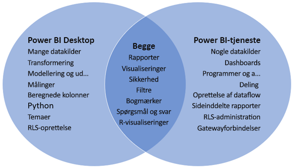

# Sammenligning af Power BI Desktop og Power BI-tjenesten

I et Venn-diagram, der sammenligner Power BI Desktop og Power BI-tjenesten, viser området i midten, hvordan de to overlapper hinanden. Nogle opgaver kan du foretage i enten Power BI Desktop eller tjenesten. De to sider af Venn-diagrammet viser de funktioner, der er unikke for programmet og for tjenesten.  

**Power BI Desktop** er et komplet værktøj til dataanalyse og rapportoprettelse, som du installerer gratis på din lokale computer. Det omfatter Forespørgselseditor, hvor du kan oprette forbindelse til mange forskellige datakilder og kombinere dem (også kaldet modellering) i en datamodel. Derefter designer du en rapport, der er baseret på den pågældende datamodel. I [Introduktionsvejledning til Power BI Desktop](desktop-getting-started.md) gennemgås processen.

**Power BI-tjenesten** er en cloudbaseret tjeneste. Den understøtter let rapportredigering og samarbejde for teams og organisationer. Du kan også oprette forbindelse til datakilder i Power BI-tjenesten, men mulighederne for modellering er begrænsede. 

De fleste rapportdesignere, der arbejder på business intelligence-projekter, bruger **Power BI Desktop** til at oprette rapporter og bruger derefter **Power BI-tjenesten** til at distribuere deres rapporter til andre.

## Rapportredigering

I både programmet og tjenesten kan du oprette og redigere *rapporter*. En rapport kan have en eller flere sider med visualiseringer og samlinger af visualiseringer. Tilføj bogmærker, knapper, filtre og detaljeadgang for at forbedre navigationen i dine rapporter.

Rapporteditorerne i Power BI Desktop og i tjenesten er ens. De består af tre sektioner:  

1. De øverste navigationsruder, der ikke er de samme i Power BI Desktop og tjenesten    
2. Rapportcanvasset     
3. Ruderne **Felter**, **Visualiseringer** og **Filtre**

Denne video viser rapporteditoren i Power BI Desktop. 

<iframe width="560" height="315" src="https://www.youtube.com/embed/IkJda4O7oGs" frameborder="0" allowfullscreen></iframe>

## Arbejde i Power BI-tjenesten

### Samarbejde

Når du har oprettet dine rapporter, kan du gemme dem i et *arbejdsområde* i **Power BI-tjenesten**, hvor du og dine kolleger kan samarbejde. Du kan bygge *dashboards* oven på disse rapporter. Derefter deler du disse dashboards og rapporter med brugere af rapporter i og uden for din organisation. Brugerne af rapporterne får dem vist i Power BI-tjenesten i en *læsevisning* ikke redigeringsvisning. De har ikke adgang til alle de funktioner, der er tilgængelige for oprettere af rapporter.  Du kan også dele dine datasæt og lade andre bygge deres egne rapporter ud fra dem. Læs mere om [samarbejde i Power BI-tjenesten](../collaborate-share/service-new-workspaces.md).

### Selvbetjent dataforberedelse med dataflow

Dataflows hjælper virksomheder med at samle data fra forskellige kilder og forberede dem til modellering. Analytikere kan nemt oprette dataflows ved hjælp af velkendte værktøjer til selvbetjening. Analytikere bruger dataflows til at indsamle, transformere, integrere og forbedre big data ved at definere datakildeforbindelser, ETL-logik, opdatere tidsplaner og meget mere. Læs mere om [selvbetjent dataforberedelse med dataflows](../transform-model/service-dataflows-overview.md).

## Næste trin

[Hvad er Power BI Desktop?](desktop-what-is-desktop.md)

[Opret en rapport](../create-reports/service-report-create-new.md) i Power BI-tjenesten

[De grundlæggende begreber for rapportdesignere](service-basic-concepts.md)

Har du flere spørgsmål? [Prøv at spørge Power BI-community'et](https://community.powerbi.com/)
