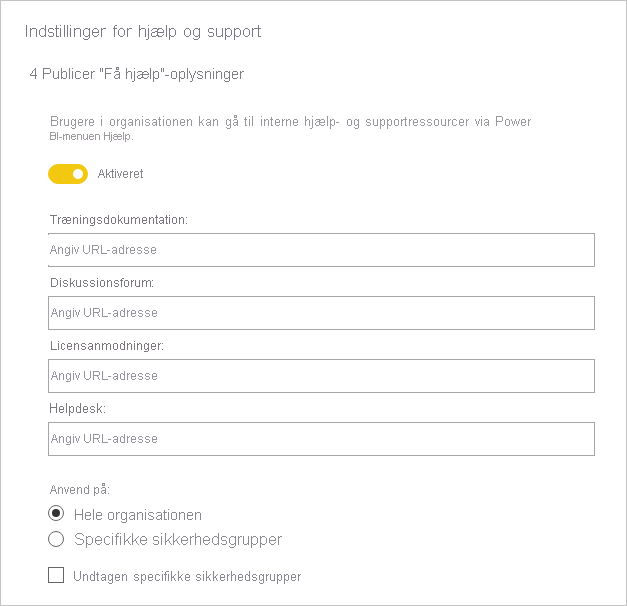
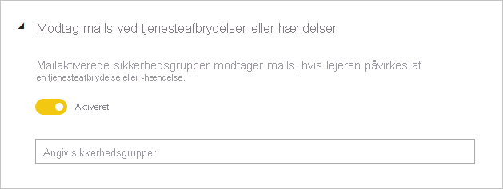
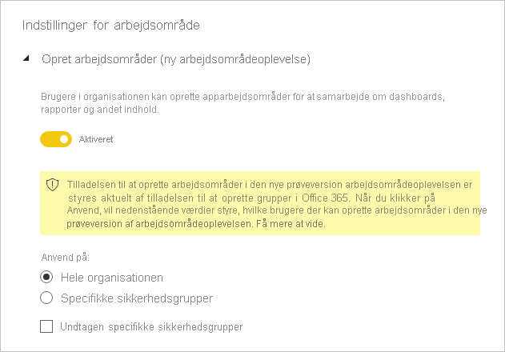
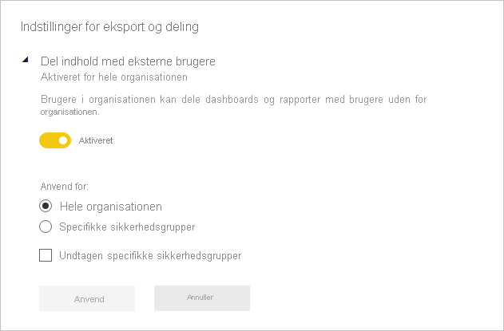
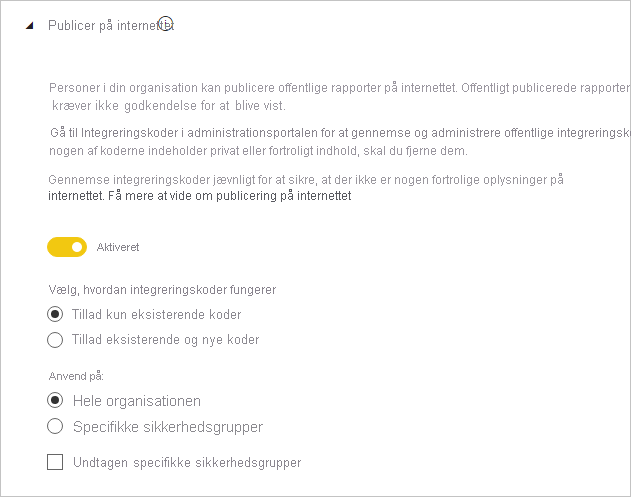
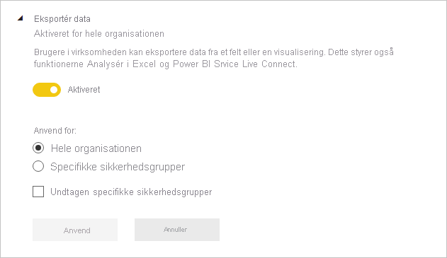
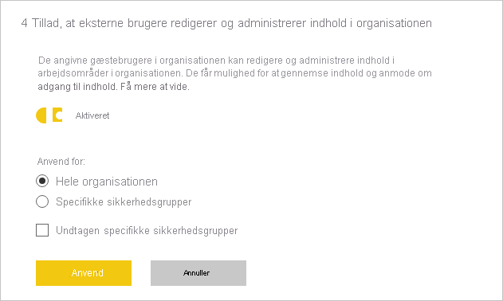
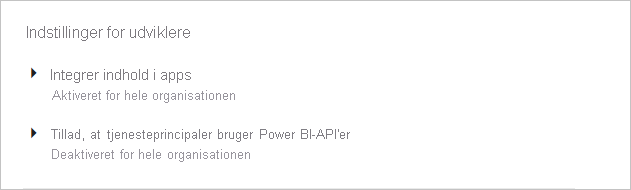

# Vejledning til indstillinger for lejeradministrator

Denne artikel er målrettet Power BI-administratorer, der er ansvarlige for at konfigurere Power BI-miljøet i deres organisation.

Vi yder vejledning om bestemte lejerindstillinger, der hjælper med at forbedre Power BI-oplevelsen, eller som kan udsætte din organisation for risiko. Vi anbefaler, at du altid konfigurerer din lejer i henhold til din organisations politikker og processer.

[Lejerindstillinger](../admin/service-admin-portal.md#tenant-settings) administreres på [administrationsportalen](https://app.powerbi.com/admin-portal/tenantSettings) og kan konfigureres af en [Power BI-tjenesteadministrator](../admin/service-admin-administering-power-bi-in-your-organization.md#administrator-roles-related-to-power-bi). Mange lejerindstillinger kan begrænse egenskaber og funktioner til et begrænset antal brugere. Derfor anbefaler vi, at du først får kendskab til indstillingerne for at planlægge de sikkerhedsgrupper, du har brug for. Det kan måske være, at du kan anvende den samme sikkerhedsgruppe for flere indstillinger.

## Opnå en bedre Power BI-oplevelse

### Publicer "Få hjælp"-oplysninger

Vi opfordrer dig til at konfigurere interne Power BI-relaterede websteder ved hjælp af [Microsoft Teams](/microsoftteams) eller en anden samarbejdsplatform. Disse websteder kan bruges til at gemme træningsdokumentation, værtsdiskussioner, foretage anmodninger om licenser eller reagere på hjælp.

Hvis du har gjort det, anbefaler vi, at du derefter aktiverer indstillingen **Publicer "Hent hjælp"-oplysninger** _for hele organisationen_. Den finder du i gruppen **Indstillinger for hjælp og support**. Du kan angive URL-adresser til:

- træningsdokumentation
- diskussionsforum
- licensanmodninger
- Helpdesk

Disse URL-adresser bliver tilgængelige som links i menuen Hjælp i Power BI.

> [!NOTE]
> Hvis du angiver URL-adressen for **licensanmodninger**, kan enkeltbrugere ikke købe en Power BI Pro-licens. De henvises i stedet til dit interne websted med oplysninger om, hvordan de anskaffer sig en licens. Indstillingen **Tillad brugere at prøve Power BI Pro** er aktiveret som standard og adskiller købs-og prøveversionsoplevelsen. Hvis du vil vide mere om, hvordan disse indstillinger fungerer sammen, skal du se [Tillad brugere at prøve Power BI Pro](../admin/service-admin-portal.md#allow-users-to-try-power-bi-pro).
>
>

Du kan finde flere oplysninger under [Indstillinger for Hjælp og support](../admin/service-admin-portal.md#help-and-support-settings).

## Administrer risiko
Indstillingerne til at administrere risici kan hjælpe dig med at oprette politikker for styring af politikker i din Power BI-lejer. Vær dog opmærksom på, at styringsindstillingerne ikke er en sikkerhedsmåling. Hvis du f.eks. deaktiverer indstillingen **Eksportér data**, fjernes funktionen fra Power BI-brugergrænsefladen og hjælper på denne måde Power BI-brugere med at overholde organisationens styringspolitikker, men den forhindrer ikke brugerne i at eksportere data ved hjælp af andre indstillinger. Set fra et sikkerhedsmæssigt synspunkt har en Power BI-bruger med læseadgang til et datasæt tilladelse til at forespørge dette datasæt og kan bevare resultaterne, uanset hvilke funktioner der er tilgængelige i Power BI-brugergrænsefladen.
### Modtag mails i forbindelse med tjenesteudfald eller hændelser

Du kan få besked via mail, hvis lejeren påvirkes af et tjenesteudfald eller en hændelse. På denne måde kan du proaktivt reagere på hændelser.

Vi anbefaler, at du aktiverer indstillingen **Modtag mails ved tjenesteudfald eller hændelser**. Den finder du i gruppen **Indstillinger for hjælp og support**. Tildel en eller flere _mailaktiverede_ sikkerhedsgrupper.

### Information Protection

Information Protection gør det muligt at gennemtvinge indstillinger for beskyttelse – f.eks. kryptering eller vandmærker – når der eksporteres data fra Power BI-tjenesten.

Der er to lejerindstillinger i relation til beskyttelse af oplysninger. Som standard er begge indstillinger deaktiveret for hele organisationen.

Vi anbefaler, at du aktiverer disse indstillinger, når du skal håndtere og beskytte følsomme data. Du kan finde flere oplysninger under [Databeskyttelse i Power BI](../admin/service-security-data-protection-overview.md).

### Opret arbejdsområder

Du kan begrænse brugerne i at oprette arbejdsområder. På den måde kan du styre, hvad der oprettes i din organisation.

> [!NOTE]
> I øjeblikket er der en overgangsperiode mellem det gamle arbejdsområde og det nye. Denne lejerindstilling gælder kun for den nye oplevelse.

Indstillingen **Opret arbejdsområder** er som standard aktiveret for hele organisationen. Du finder den i gruppen **Indstillinger for arbejdsområde**.

Vi anbefaler, at du tildeler én eller flere sikkerhedsgrupper. Tilladelse til at oprette arbejdsområder kan blive tildelt _eller afvist_ for disse grupper.

Sørg for at inkludere instruktioner i din dokumentation, så brugerne (der ikke har tilladelse til at oprette arbejdsområder) ved, hvordan de kan anmode om et nyt arbejdsområde.

### Del indhold med eksterne brugere

Brugerne kan dele rapporter og dashboards med personer uden for organisationen.

Indstillingen **Del indhold med eksterne brugere** er som standard aktiveret for hele organisationen. Du finder den i gruppen **Indstillinger for eksport og deling**.

Vi anbefaler, at du tildeler én eller flere sikkerhedsgrupper. Tilladelse til at dele indhold med eksterne brugere kan tildeles _eller afvises_ for disse grupper.

### Publicer på internettet

Funktionen [Publicer på internettet](../collaborate-share/service-publish-to-web.md) gør det muligt at publicere offentlige rapporter på internettet. Hvis funktionen ikke anvendes korrekt, er der en risiko for, at fortrolige oplysninger bliver tilgængelige live på internettet.

Indstillingen **Publicer på internettet** er som standard aktiveret for hele organisationen, men den begrænser muligheden for at oprette integreringskoder for brugere, der ikke er administratorer. Du finder den i gruppen **Indstillinger for eksport og deling**.

Hvis indstillingen er aktiveret, anbefaler vi, at du tildeler én eller flere sikkerhedsgrupper. Tilladelse til at publicere rapporter kan blive tildelt _eller afvist_ for disse grupper.

Desuden er der mulighed for at vælge, hvordan dine integreringskoder fungerer. Den er som standard angivet til **Tillad kun eksisterende koder**. Det betyder, at brugerne bliver bedt om at kontakte en Power BI-administrator for at oprette en integreringskode.

Vi anbefaler også, at du gennemgår [Publicer integreringskoder på internettet](https://app.powerbi.com/admin-portal/embedCodes) jævnligt. Fjern koder, hvis de medfører publicering af private eller fortrolige oplysninger.

### Eksportér data

Du kan begrænse brugernes eksport af data fra dashboardfelter eller rapportvisualiseringer.

Indstillingen **Eksportér data** er som standard aktiveret for hele organisationen. Du finder den i gruppen **Indstillinger for eksport og deling**.

Vi anbefaler, at du tildeler én eller flere sikkerhedsgrupper. Tilladelse til at publicere rapporter kan blive tildelt _eller afvist_ for disse grupper.

> [!IMPORTANT]
> Deaktivering af denne indstilling begrænser også brugen af funktionerne [Analysér i Excel](../collaborate-share/service-analyze-in-excel.md) og [liveforbindelse](../connect-data/desktop-report-lifecycle-datasets.md#using-a-power-bi-service-live-connection-for-report-lifecycle-management) i Power BI-tjenesten.

> [!NOTE]
> Hvis brugerne tillader andre brugere at eksportere data, kan du tilføje et beskyttelseslag ved at gennemtvinge [databeskyttelse](../admin/service-security-data-protection-overview.md). Når det er konfigureret, blokeres eksport af indhold der er markeret som følsomt for ikke-godkendte brugere.

### Tillad, at eksterne brugere kan redigere og administrere indhold i organisationen

Det er muligt, at eksterne gæstebrugere kan redigere og administrere Power BI-indhold. Se flere oplysninger under [Distribuer Power BI-indhold til eksterne gæstebrugere med Azure AD B2B](../admin/service-admin-azure-ad-b2b.md).

Indstillingen **Tillad, at eksterne gæstebrugere kan redigere og administrere indhold i organisationen** er som standard deaktiveret for hele organisationen. Du finder den i gruppen **Indstillinger for eksport og deling**.

Hvis du skal godkende, at eksterne brugere kan redigere og administrere indhold, anbefaler vi, at du tildeler én eller flere sikkerhedsgrupper. Tilladelse til at publicere rapporter kan blive tildelt _eller afvist_ for disse grupper.

### Indstillinger for udviklere

Der er to lejerindstillinger i forbindelse med [integration af Power BI-indhold](../developer/embedded/embedding.md). De er:

- Integrer indhold i apps (aktiveret som standard)
- Tillad, at tjenesteprincipaler bruger Power BI-API'er (deaktiveret som standard)

Hvis du ikke vil bruge udvikler-API'erne til at integrere indhold, anbefaler vi, at du deaktiverer dem. Du kan også konfigurere specifikke sikkerhedsgrupper, der udfører dette arbejde.

## Næste trin

Du kan finde flere oplysninger, der er relateret til denne artikel, i følgende ressourcer:

- [Hvad er Power BI-administration?](../admin/service-admin-administering-power-bi-in-your-organization.md)
- [Administrer Power BI på administrationsportalen](../admin/service-admin-portal.md)
- Har du spørgsmål? [Prøv at spørge Power BI-community'et](https://community.powerbi.com/)
- Forslag? [Få ideer til at forbedre Power BI](https://ideas.powerbi.com)