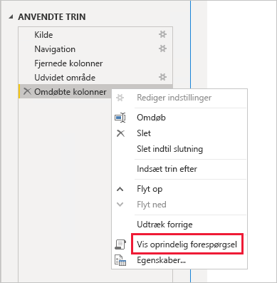
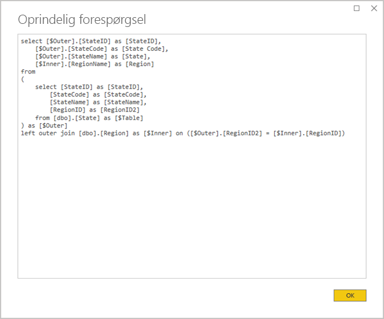
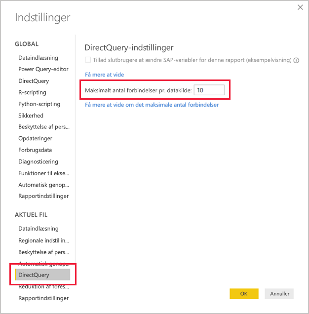
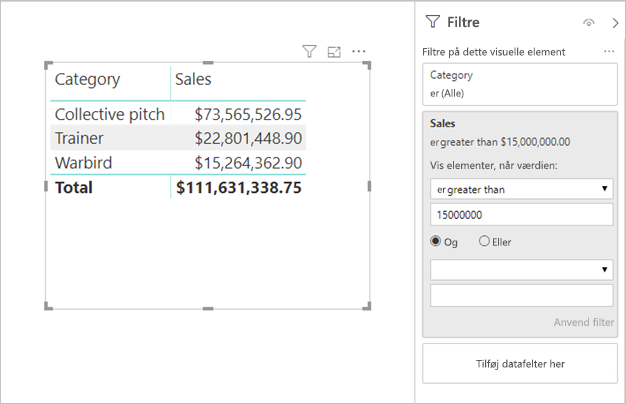

# <a name="directquery-model-guidance-in-power-bi-desktop"></a>Vejledning til DirectQuery-model i Power BI Desktop

Denne artikel er henvendt til designere af datamodeller, som udvikler DirectQuery-modeller i Power BI enten ved hjælp af Power BI Desktop eller Power BI-tjenesten. Heri beskrives use cases, begrænsninger og vejledning til DirectQuery. Vejledningen er især designet til at hjælpe dig med at afgøre, om DirectQuery er den rette tilstand for din model, og til at forbedre ydeevnen af dine rapporter, som er baseret på DirectQuery-modeller. Denne artikel er relevant for DirectQuery-modeller, der hostes i Power BI-tjenesten eller Power BI-rapportserver.

Det er ikke meningen, at artiklen skal indeholde en komplet drøftelse af designet af DirectQuery-modellen. Du kan finde en introduktion i artiklen [DirectQuery-modeller i Power BI Desktop](../desktop-directquery-about.md). Hvis du vil have en mere tilbundsgående drøftelse, skal du se dette whitepaper: [DirectQuery i SQL Server 2016 Analysis Services](https://download.microsoft.com/download/F/6/F/F6FBC1FC-F956-49A1-80CD-2941C3B6E417/DirectQuery%20in%20Analysis%20Services%20-%20Whitepaper.pdf). Vær opmærksom på, at dette whitepaper indeholder en beskrivelse af, hvordan DirectQuery bruges i SQL Server Analysis Services. Meget af indholdet er dog stadig relevant for Power BI DirectQuery-modeller.

Denne artikel dækker ikke direkte sammensatte modeller. En sammensat model består af mindst én DirectQuery-kilde og muligvis flere. Den vejledning, der beskrives i denne artikel, er stadig relevant – i hvert fald delvist – for design af sammensatte modeller. Konsekvenserne ved at kombinere Import-tabeller med DirectQuery-tabeller er dog ikke omfattet af denne artikel. Du kan finde flere oplysninger under [Brug sammensatte modeller i Power BI Desktop](../desktop-composite-models.md).

Det er vigtigt at forstå, at DirectQuery-modeller pålægger Power BI-miljøet (Power BI-tjenesten eller Power BI-rapportserver) og også de underliggende datakilder en anden arbejdsbelastning. Hvis du beslutter dig for, at DirectQuery er den relevante designtilgang, anbefaler vi, at du engagerer de rette personer til projektet. Vi ser ofte, at en vellykket DirectQuery-modeludrulning skyldes et team af it-medarbejdere, der arbejder tæt sammen. Teamet består normalt af modeludviklere og administratorer af kildedatabasen. Det kan også omfatte dataarkitekter og udviklere af data warehouses og ETL. Optimeringer skal ofte anvendes direkte på datakilden for at få gode resultater i forbindelse med ydeevnen.

## <a name="design-in-power-bi-desktop"></a>Design i Power BI Desktop

Der kan oprettes direkte forbindelse til datakilder både i Azure SQL Data Warehouse og Azure HDInsight Spark, uden at det er nødvendigt at bruge Power BI Desktop. Det opnås i Power BI-tjenesten ved at "hente data" og vælge feltet Databaser. Du kan finde flere oplysninger i [Azure SQL Data Warehouse med DirectQuery](../service-azure-sql-data-warehouse-with-direct-connect.md).

Selvom direkte forbindelse er praktisk, anbefaler vi ikke, at du bruger denne tilgang. Den primære årsag er, at det ikke er muligt at opdatere modelstrukturen, hvis skemaet for den underliggende datakilde ændres.

Vi anbefaler, at du bruger Power BI Desktop til at oprette og administrere alle dine DirectQuery-modeller. Denne tilgang giver dig fuld kontrol til at definere den model, du har brug for, herunder brugen af understøttede funktioner, f.eks. hierarkier, beregnede kolonner, målinger og meget mere. Du har også mulighed for at revidere modeldesignet, hvis skemaet for den underliggende datakilde ændres.

## <a name="optimize-data-source-performance"></a>Optimer ydeevnen af datakilden

Kilden til relationsdatabasen kan optimeres på forskellige måder, som beskrevet i følgende punktopstilling.

> [!NOTE]
> Vi forstår, at det ikke er alle modeldesignere, der har tilladelserne eller færdighederne til at optimere en relationsdatabase. Selvom det er det foretrukne lag til at forberede dataene til en DirectQuery-model, kan nogle optimeringer også opnås i modeldesignet uden at skulle ændre kildedatabasen. Men de bedste optimeringsresultater opnås ofte ved at anvende optimeringerne på kildedatabasen.

- **Sørg for, at dataintegritet er komplet:** Det er især vigtigt, at tabeller af dimensionstypen indeholder en kolonne med entydige værdier (dimensionsnøgle), der knyttes til tabeller af faktatypen. Det er også vigtigt, at dimensionskolonnerne af faktatypen indeholder gyldige dimensionsnøgleværdier. De muliggør konfiguration af mere effektive modelrelationer, der forventer overensstemmende værdier på begge sider af relationerne. Når kildedataene mangler integritet, anbefales det, at der tilføjes en "ukendt" dimensionspost for at reparere dataene effektivt. Du kan f.eks. føje en række til tabellen **Produkt** for at repræsentere et ukendt produkt og derefter tildele den en nøgle, der ligger uden for området, f.eks. -1. Hvis rækker i tabellen **Salg** indeholder en manglende værdi for en produktnøgle, skal de erstattes med -1. Det sikrer, at hver værdi for produktnøglen **Salg** har en tilsvarende række i tabellen **Produkt**.
- **Tilføj indekser:** Definer relevante indekser – for tabeller eller visninger – for at understøtte effektiv hentning af data til den forventede filtrering og gruppering af rapportvisualiseringen. I forbindelse med SQL Server-, Azure SQL Database- eller Azure SQL Data Warehouse-kilder kan du finde nyttige oplysninger om og vejledning til indeksdesignet i [Vejledning til indeksdesign og -arkitektur i SQL](/sql/relational-databases/sql-server-index-design-guide?view=sql-server-2017). I forbindelse med flygtige SQL Server- eller Azure SQL Database-kilder kan du læse [Kom i gang med kolonnelager for at få driftsanalyse i realtid](/sql/relational-databases/indexes/get-started-with-columnstore-for-real-time-operational-analytics?view=sql-server-2017).
- **Design distribuerede tabeller:** I forbindelse med Azure SQL Data Warehouse-kilder, der bruger arkitekturen med omfattende parallel behandling, kan du overveje at konfigurere store tabeller af faktatypen som hashdistribuerede og tabeller af dimensionstypen, som skal replikeres på tværs af alle beregningsnoderne. Du kan finde yderligere oplysninger i [Vejledning til design af distribuerede tabeller i Azure SQL Data Warehouse](/azure/sql-data-warehouse/sql-data-warehouse-tables-distribute#what-is-a-distributed-table).
- **Sørg for, at de nødvendige datatransformationer materialiseres:** I forbindelse med kilder til SQL Server-relationsdatabaser (og andre kilder til relationsdatabaser) kan der føjes beregnede kolonner til tabeller. Disse kolonner er baseret på et udtryk, f.eks. **Mængde** ganget med **Enhedspris**. Beregnede kolonner kan bevares (materialiseres), og ligesom med almindelige kolonner kan de indekseres. Du kan finde flere oplysninger under [Indekser for beregnede kolonner](/sql/relational-databases/indexes/indexes-on-computed-columns?view=sql-server-2017).

    Overvej også indekserede visninger, der kan samle data fra faktatabeller på forhånd med færre detaljer. Hvis der f.eks. gemmes data på ordrelinjeniveau i tabellen **Salg**, kan du oprette en visning for at opsummere disse data. Visningen kan være baseret på en SELECT-sætning, der grupperer dataene i tabellen **Salg** efter dato (på månedsniveau), kunde og produkt samt opsummerer målingsværdier, f.eks. salg, mængde osv. Visningen kan derefter indekseres. I forbindelse med SQL Server- eller Azure SQL Database-kilder kan du læse [Opret indekserede visninger](/sql/relational-databases/views/create-indexed-views?view=sql-server-2017).
- **Materialiser en datotabel:** Et almindeligt modelkrav omfatter tilføjelse af en datotabel for at understøtte tidsbaseret filtrering. Hvis du vil understøtte kendte tidsbaserede filtre i din organisation, skal du oprette en tabel i kildedatabasen og sikre, at den indlæses med en række datoer, der omfatter datoer i faktatabeller. Sørg også for, at den indeholder kolonner til nyttige tidsperioder, f.eks. år, kvartal, måned, uge osv.

## <a name="optimize-model-design"></a>Optimer modeldesignet

En DirectQuery-model kan optimeres på mange måder, som beskrevet i følgende punktopstilling.

- **Undgå komplekse Power Query-forespørgsler:** Du får et effektivt modeldesign ved at fjerne behovet for Power Query-forespørgsler for at anvende transformationer. Det betyder, at hver forespørgsel knyttes til en enkelt kildetabel eller -visning for relationsdatabasen. Du kan få forhåndsvist en repræsentation af den faktiske SQL-forespørgselssætning for et trin, der er anvendt i Power Query, ved at vælge indstillingen **Vis oprindelig forespørgsel**.

    
    
    

- **Undersøg brugen af beregnede kolonner og ændringer af datatyper:** DirectQuery-modeller understøtter tilføjelse af beregninger og Power Query-trin i forbindelse med konvertering af datatyper. En bedre ydeevne opnås dog ved at materialisere transformationsresultaterne i kilden til relationsdatabasen, når det er muligt.
- **Brug ikke relativ datofiltrering i Power Query:** Det er muligt at definere relativ datofiltrering i en Power Query-forespørgsel. Hvis du f.eks. vil hente de salgsordrer, der er oprettet inden for det seneste år (i forhold til dags dato). Denne filtertype oversættes til en ineffektiv oprindelig forespørgsel på følgende måde:

    ```SQL
    …
    from [dbo].[Sales] as [_]
    where [_].[OrderDate] >= convert(datetime2, '2018-01-01 00:00:00') and [_].[OrderDate] < convert(datetime2, '2019-01-01 00:00:00'))  
    ```
    
    En bedre designtilgang er at inkludere relative tidskolonner i datotabellen. I disse kolonner gemmes forskydningsværdier i forhold til den aktuelle dato. I kolonnen **RelativtÅr** repræsenterer værdien nul f.eks. det aktuelle år, -1 repræsenterer det forrige år osv. Det foretrækkes, at kolonnen **RelativtÅr** materialiseres i datotabellen. Selvom det er mindre effektivt, kan den også tilføjes som en beregnet kolonne i modellen baseret på udtrykket ved hjælp af DAX-funktionerne [TODAY](/dax/today-function-dax) og [DATE](/dax/date-function-dax).

- **Hold målinger enkle:** Det anbefales at begrænse målingerne til enkle samlinger – i det mindste indledningsvist. Aggregeringsfunktionerne omfatter SUM, COUNT, MIN, MAX og AVERAGE. Hvis målingerne er tilstrækkeligt dynamiske, kan du derefter eksperimentere med mere komplicerede målinger, men du skal være opmærksom på ydeevnen for hver enkelt. Selvom DAX-funktionen [CALCULATE](/dax/calculate-function-dax) kan bruges til at skabe sofistikerede udtryk for målinger, der manipulerer filterkontekst, så kan de generere dyre oprindelige forespørgsler, der ikke præsterer så godt.
- **Undgå relationer for beregnede kolonner:** Modelrelationer kan kun relatere en enkelt kolonne i én tabel til en enkelt kolonne i en anden tabel. Det kan dog være nødvendigt at relatere tabeller ved hjælp af flere kolonner. Tabellerne **Salg** og **Geografi** er f.eks. relateret med to kolonner: **Land** og **By**. Hvis du vil oprette en relation mellem tabellerne, kræves der en enkelt kolonne, og i tabellen **Geografi** skal kolonnen indeholde entydige værdier. Dette resultat kan opnås ved at sammenkæde Land og By med en bindestreg som separator.

    Den kombinerede kolonne kan oprettes enten ved hjælp af en brugerdefineret kolonne i Power Query eller som en beregnet kolonne i modellen. Det bør dog undgås, da beregningsudtrykket bliver integreret i kildeforespørgslerne. Dette er ikke kun ineffektivt, det forhindrer ofte også brugen af indekser. Du kan i stedet føje materialiserede kolonner til kilden til relationsdatabasen og overveje at indeksere dem. Du kan også overveje at føje surrogatnøglekolonner til tabeller af dimensionstypen, hvilket er almindelig praksis i design af relationelle data warehouses.
    
    Der er én undtagelse til denne vejledning, og det vedrører brugen af DAX-funktionen [COMBINEVALUES](/dax/combinevalues-function-dax). Formålet med denne funktion er at understøtte modelrelationer med flere kolonner. I stedet for at generere et udtryk, som relationen bruger, genererer den et prædikat for joinforbindelse af flere kolonner i SQL.
- **Undgå relationer for kolonner med "entydigt id":** Power BI understøtter ikke oprindeligt datatypen GUID (entydigt id). Når du definerer en relation mellem kolonner af denne type, genererer Power BI en kildeforespørgsel med en joinforbindelse, der involverer en tvungen konvertering. Denne konvertering af forespørgsel i forhold til tid resulterer ofte i dårlig ydeevne. Indtil dette bliver optimeret, er den eneste løsning at materialisere kolonnerne for en alternativ datatype på den underliggende database.
- **Skjul én side-kolonnen med relationer:** Én side-kolonnen med relationer bør skjules. (Det er normalt den primære nøglekolonne i tabeller af dimensionstypen.) Når den er skjult, er den ikke tilgængelig i ruden **Felter** og kan derfor ikke bruges til at konfigurere en visualisering. Mange sider-kolonnen kan forblive synlig, hvis det er nyttigt for at gruppere eller filtrere rapporter efter kolonneværdier. Du kan f.eks. overveje at skabe en model, hvor der findes en relation mellem tabellerne **Salg** og **Produkt**. Relationskolonnerne indeholder værdier med varenumre for produktet (enhed for lagerbeholdning). Hvis produktets varenummer skal føjes til visualiseringer, skal det være synligt i tabellen **Salg**. Når denne kolonne bruges til at filtrere eller gruppere i en visualisering, genererer Power BI en forespørgsel, der ikke behøver at joinforbinde tabellerne **Salg** og **Produkt**.
- **Angiv relationer for at gennemtvinge integritet:** Egenskaben **Antag referentiel integritet** for DirectQuery-relationer bestemmer, om Power BI genererer kildeforespørgsler ved hjælp af en indre joinforbindelse i stedet for en ydre joinforbindelse. Det forbedrer generelt ydeevnen af forespørgsler, selvom det afhænger af specifikationerne for kilden til relationsdatabasen. Du kan finde flere oplysninger i [Indstillinger for antagelse af referentiel integritet i Power BI Desktop](../desktop-assume-referential-integrity.md).
- **Undgå at bruge tovejsfiltrering af relationer:** Brug af tovejsfiltrering af relationer kan resultere i forespørgselssætninger, som ikke fungerer korrekt. Brug kun denne relationsfunktion, når det er nødvendigt, og det er normalt tilfældet, når du implementerer en mange til mange-relation på tværs af en brotabel. Du kan finde flere oplysninger i [Relationer med mange til mange-kardinalitet i Power BI Desktop](../desktop-many-to-many-relationships.md).
- **Begræns parallelle forespørgsler:** Du kan angive det maksimale antal forbindelser, som DirectQuery åbner for hver underliggende datakilde. Det styrer antallet af forespørgsler, der sendes til datakilden samtidigt.

    
    
    Denne indstilling er kun aktiveret, når der er mindst én DirectQuery-kilde i modellen. Værdien gælder for alle DirectQuery-kilder og for alle nye DirectQuery-kilder, der føjes til modellen.

    En forøgelse af værdien **Maksimale antal forbindelser pr. datakilde** sikrer, at der kan sendes flere forespørgsler (op til det maksimalt angivne antal) til den underliggende datakilde, hvilket er nyttigt, når der er mange visualiseringer på en enkelt side, eller når mange brugere tilgår en rapport samtidigt. Når det maksimale antal forbindelser er nået, sættes yderligere forespørgsler i kø, indtil en forbindelse bliver tilgængelig. En forøgelse af denne grænse resulterer i en større belastning på den underliggende datakilde, så indstillingen garanterer ikke, at den overordnede ydeevne forbedres.
    
    Når modellen er publiceret til Power BI, afhænger det maksimale antal forespørgsler, der sendes samtidigt til den underliggende datakilde, også af miljøet. Forskellige miljøer (f.eks. Power BI, Power BI Premium eller Power BI-rapportserver) kan hver pålægge forskellige grænser for gennemløb. Du kan finde flere oplysninger om ressourcebegrænsninger for Power BI Premium-kapacitet i [Udrulning og administration af Power BI Premium-kapaciteter](https://docs.microsoft.com/power-bi/whitepaper-powerbi-premium-deployment#premium-capacities).

## <a name="optimize-report-designs"></a>Optimer rapportdesign

Rapporter, der er baseret på et DirectQuery-datasæt, kan optimeres på mange måder, som beskrevet i følgende punktopstilling.

- **Aktivér teknikker til reduktion af forespørgsler:** _Indstillingerne_ i Power BI Desktop omfatter en side til reduktion af forespørgsler. Der er tre praktiske valgmuligheder på denne side. Det er muligt at deaktivere krydsfremhævning og krydsfiltrering som standard, selvom det kan tilsidesættes ved at redigere interaktioner. Det er også muligt at få vist knappen Anvend på udsnit og filtre. Indstillingerne for udsnit eller filter anvendes først, når brugeren af rapporten klikker på knappen. Hvis du aktiverer disse indstillinger, anbefaler vi, at du gør det, når du starter med at oprette rapporten.

    
    
- **Anvend filtre først:** Når du starter med at designe rapporter, anbefaler vi, at du anvender relevante filtre – på rapport-, side- eller visualiseringsniveau – før felterne knyttes til visualiseringens felter. I stedet for f.eks. at trække målingerne **Land** og **Salg** ind og derefter filtrere dem efter et bestemt år, skal du anvende filteret på feltet **År** først. Det skyldes, at hvert enkelt trin i oprettelsen af en visualisering sender en forespørgsel, og selvom det derefter er muligt at foretage en anden ændring, før den første forespørgsel er fuldført, så pålægger det stadig den underliggende datakilde en unødvendig belastning. Når du anvender filtre tidligt, hjælper det generelt med at gøre disse mellemliggende forespørgsler billigere og hurtigere. Hvis du ikke anvender filtre tidligt, kan det også resultere i en overskridelse af grænsen på 1 million rækker, sådan som det er beskrevet ovenfor.
- **Begræns antallet af visuelle elementer på en side:** Når en rapportside åbnes (og når der anvendes filtre på siden), opdateres alle visualiseringer på siden. Der er dog en grænse for antallet af forespørgsler, der kan sendes parallelt, og som pålægges af Power BI-miljøet, og for indstillingen **Maksimale antal forbindelser pr. datakilde** for modellen, som beskrevet ovenfor. Så i takt med at antallet af visualiseringer på siden øges, er der større risiko for, at de opdateres serielt. Det øger den tid, det tager at opdatere hele siden, og det øger også risikoen for, at visualiseringerne kan vise uoverensstemmende resultater (for flygtige datakilder). Derfor anbefales det at begrænse antallet af visualiseringer på en enkelt side og i stedet anvende flere enklere sider. Et lignende sidelayout kan opnås ved at erstatte flere kortvisualiseringer med en enkelt kortvisualisering med flere rækker.
- **Slå interaktion mellem visualiseringer fra:** Krydsfremhævning og krydsfiltrering af interaktioner kræver, at der sendes forespørgsler til den underliggende kilde. Medmindre disse interaktioner er nødvendige, anbefales det, at de slås fra, hvis den tid, det tager at reagere på brugernes valg, vil være urimelig lang. Disse interaktioner kan dog slås fra enten for hele rapporten (som beskrevet ovenfor i forbindelse med indstillinger for reduktion af forespørgsler) eller på ad hoc-basis, som beskrevet i artiklen [Sådan krydsfiltrerer visualiseringer hinanden i en Power BI-rapport](../consumer/end-user-interactions.md).

Foruden ovenstående liste over optimeringsteknikker kan hver af følgende rapporteringsegenskaber bidrage til problemer med ydeevnen:

- **Målingsfiltre:** Der kan være anvendt filtre på målingerne i de visualiseringer, der indeholder målinger (eller samlinger af kolonner). Nedenstående visualisering viser f.eks. **Salg** efter **Kategori**, men kun for kategorier med et salg på mere end 15 mio. USD.

    
    
    
    Det kan resultere i, at der sendes to forespørgsler til den underliggende kilde:
    
      - Med den første forespørgsel hentes de kategorier, der opfylder betingelsen (Salg > 15 mio. USD)
      - Med den anden forespørgsel hentes de nødvendige data til visualiseringen, herunder de kategorier, der opfylder betingelsen i WHERE-parameteren
    
    Processen fungerer som regel fint, hvis der er hundreder eller tusinder af kategorier som i dette eksempel. Ydeevnen kan dog blive forringet, hvis antallet af kategorier er meget større (og pga. den ovenfor beskrevne grænse på 1 million rækker, vil forespørgslen helt sikkert mislykkes, hvis der er mere end 1 million kategorier, der opfylder betingelsen).
- **TopN-filtre:** Der kan defineres avancerede filtre, så det kun er de øverste (eller nederste) N-værdier, der filtreres, rangeret efter en måling. Hvis du f.eks. kun vil vise de øverste fem kategorier i ovenstående visualisering. Ligesom med filtrene for måling resulterer det også i, at der sendes to forespørgsler til den underliggende datakilde. Den første forespørgsel returnerer dog alle kategorier fra den underliggende kilde, og derefter bestemmes de øverste N-værdier på baggrund af de returnerede resultater. Afhængigt af kardinaliteten for den involverede kolonne kan det medføre problemer med ydeevnen (eller forespørgselsfejl pga. grænsen på 1 mio. rækker).
- **Median:** Normalt sendes evt. samlinger (Sum, Count Distinct osv.) via push til den underliggende kilde. Det gælder dog ikke for medianen, da denne samling ikke understøttes af den underliggende kilde. I så fald hentes detaljerede data fra den underliggende kilde, og Power BI evaluerer medianen ud fra de returnerede resultater. Det er fint, når medianen skal beregnes i forhold til et relativt lille antal resultater, men der vil opstå problemer med ydeevnen (eller forespørgselsfejl på grund af grænsen på 1 million rækker), hvis kardinaliteten er stor. Medianen for befolkning i lande er f.eks. muligvis rimelig, men medianen for salgspris er muligvis ikke.
- **Udsnit med flere valg:** Det kan medføre problemer med ydeevnen, hvis der tillades flere valg i udsnit og filtre. Det skyldes, at hvert nye valg resulterer i, at der sendes en ny forespørgsel til den underliggende kilde, når brugeren vælger flere elementer i udsnittet (f.eks. opbygning til de 10 produkter, de er interesseret i). Selvom brugeren kan markere det næste element, før forespørgslen er udført, resulterer det i en ekstra belastning af den underliggende kilde. Denne situation kan undgås ved at vise knappen Anvend, som beskrevet ovenfor under teknikkerne til reduktion af forespørgsler.
- **Visuelle totaler:** Som standard vises totaler og subtotaler i tabeller og matrixer. I mange tilfælde skal der sendes yderligere forespørgsler til den underliggende kilde for at hente værdierne for totalerne. Det gælder, når Count Distinct eller mediansamlinger bruges, og i alle tilfælde, når du bruger DirectQuery via SAP HANA eller SAP Business Warehouse. Sådanne totaler bør slås fra (ved hjælp af ruden Format), hvis de ikke er nødvendige.

## <a name="convert-to-a-composite-model"></a>Konvertér til en sammensat model

Fordelene ved Import- og DirectQuery-modeller kan kombineres i en enkelt model ved at konfigurere lagringstilstanden for modeltabellerne. Lagringstilstanden for tabellen kan være Import eller DirectQuery eller begge dele, hvilket kaldes for Dobbelt. Når en model indeholder tabeller med forskellige lagringstilstande, kaldes den for en sammensat model. Du kan finde flere oplysninger under [Brug sammensatte modeller i Power BI Desktop](../desktop-composite-models.md).

Der kan opnås mange forbedringer af funktionerne og ydeevnen ved at konvertere en DirectQuery-model til en sammensat model. Der kan integreres mere end én DirectQuery-kilde i en sammensat model, og modellen kan også indeholde sammenlægninger. Sammenlægningstabeller kan føjes til DirectQuery-tabeller for at importere en opsummeret repræsentation af tabellen. Der kan opnås en dramatisk forbedring af ydeevnen, når visualiseringerne forespørger samlinger på højere niveau. Du kan finde flere oplysninger i [Sammenlægninger i Power BI Desktop](../desktop-aggregations.md).

## <a name="educate-users"></a>Oplær brugere

Det er vigtigt at oplære dine brugere i, hvordan de arbejder effektivt med rapporter, der er baseret på DirectQuery-datasæt. Rapportforfatterne bør oplæres i indholdet, der er beskrevet under [Optimer rapportdesign](#optimize-report-designs).

Vi anbefaler, at du oplærer forbrugerne af dine rapporter i de rapporter, der er baseret på DirectQuery-datasæt. Det kan være nyttigt for dem at forstå den generelle dataarkitektur, herunder eventuelle relevante begrænsninger, som beskrevet i denne artikel. Fortæl dem, at de kan forvente, at reaktioner i forbindelse med opdatering og interaktiv filtrering til tider kan være langsom. Når brugerne af rapporten forstår, hvorfor der sker en forringelse af ydeevnen, er der mindre sandsynlighed for, at de mister tilliden til rapporterne og dataene.

Når du leverer rapporter om flygtige datakilder, skal du sørge for at oplære brugerne af rapporten i brugen af knappen Opdater. Fortæl dem også, at de muligvis kan se uoverensstemmende resultater, og at en opdatering af rapporten muligvis kan løse eventuelle uoverensstemmelser på rapportsiden.

## <a name="next-steps"></a>Næste trin

Du kan finde flere oplysninger om DirectQuery i følgende ressourcer:

- [DirectQuery-modeller i Power BI Desktop](../desktop-directquery-about.md)
- [Brug DirectQuery i Power BI Desktop](../desktop-use-directquery.md)
- [Fejlfinding af DirectQuery-model i Power BI Desktop](../desktop-directquery-troubleshoot.md)
- Har du spørgsmål? [Prøv at spørge Power BI-community'et](https://community.powerbi.com/)
