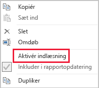

# Teknikker til datareduktion i forbindelse med importmodeller

Denne artikel henvender sig til Power BI Desktop-datamodeludviklere, der udvikler importmodeller. Heri beskrives de forskellige teknikker, der hjælper med at reducere de data, der indlæses i importmodeller.

Importmodeller indlæses med data, der komprimeres og optimeres og derefter gemmes på disken af VertiPaq-lagringsprogrammet. Når kildedata indlæses i hukommelsen, kan de blive komprimeret op til 10 gange, og det er derfor rimeligt at forvente, at 10 GB kildedata kan komprimeres til ca. 1 GB. Når de desuden bevares på en disk, kan de blive yderligere reduceret med 20 %.

På trods af den effektivitet, der opnås af VertiPaq-lagringsprogrammet, er det vigtigt, at du bestræber dig på at minimere de data, der skal indlæses i dine modeller. Dette er især tilfældet for store modeller, eller modeller, som du forventer, vil vokse, så de bliver store med tiden. Fire overbevisende årsager omfatter:

- Større modeller understøttes muligvis ikke af din kapacitet. Delt kapacitet kan hoste modeller med en størrelse på op til 1 GB, mens Premium-kapaciteter kan hoste modeller på op til 13 GB. Du kan finde flere oplysninger i artiklen [Power BI Premium-understøttelse af store datasæt](../service-premium-large-datasets.md).
- Mindre modeller reducerer konflikter i forbindelse med kapacitetsressourcer, især hukommelse. Det gør det muligt at indlæse flere modeller samtidigt i længere tid, hvilket resulterer i lavere fjernelseshyppighed. Du kan finde flere oplysninger ved at læse emnet [Sådan fungerer kapaciteter](../whitepaper-powerbi-premium-deployment.md#how-capacities-function) i dette whitepaper [Power BI Premium-udrulning](../whitepaper-powerbi-premium-deployment.md).
- Data i mindre modeller opdateres hurtigere, hvilket medfører rapportering om lavere ventetid, højere gennemløb i forbindelse med opdatering af datasæt og mindre tryk på kildesystemet og kapacitetsressourcerne.
- Et mindre antal tabelrækker kan resultere i hurtigere beregning i forbindelse med evaluering, hvilket kan levere en bedre overordnet ydeevne af forespørgsler.

Der er otte forskellige teknikker til datareduktion, som dækkes i denne artikel. Disse omfatter:

- [Fjern unødvendige kolonner](#remove-unnecessary-columns)
- [Fjern unødvendige rækker](#remove-unnecessary-rows)
- [Gruppér efter og opsummer](#group-by-and-summarize)
- [Optimer kolonnedatatyper](#optimize-column-data-types)
- [Præference for brugerdefinerede kolonner](#preference-for-custom-columns)
- [Deaktiver indlæsning Power Query-forespørgsler](#disable-power-query-query-load)
- [Deaktiver automatisk dato og klokkeslæt](#disable-auto-datetime)
- [Skift til blandet tilstand](#switch-to-mixed-mode)

## Fjern unødvendige kolonner

Der er to primære formål med modellens tabelkolonner:

- **Rapportering** for at få et rapportdesign, der filtrerer, grupperer og opsummerer modeldata på en passende måde
- **Modelstruktur** for at understøtte modelrelationer, modelberegninger, sikkerhedsroller og tilmed formatering af datafarver

Kolonner, der ikke opfylder disse formål, fjernes muligvis. Fjernelse af kolonner omtales som _lodret filtrering_.

Vi anbefaler, at du designer modeller med præcis det rette antal kolonner baseret på de kendte rapporteringskrav. Disse krav kan naturligvis blive ændret over tid, men vær opmærksom på, at det er nemmere at tilføje kolonner senere, end det er at fjerne dem. Fjernelse af kolonner kan ødelægge rapporter eller modelstrukturen.

## Fjern unødvendige rækker

Modeltabeller skal indlæses med så få rækker som muligt. Dette kan opnås ved at indlæse filtrerede rækkesæt i modeltabeller af to forskellige årsager: for at filtrere efter enhed eller efter klokkeslæt. Fjernelse af rækker omtales som _vandret filtrering_.

**Filtrering efter enhed** omfatter indlæsning af et undersæt af kildedata i modellen. I stedet for at indlæse salgsfakta for alle salgsområder, kan du f.eks. nøjes med at indlæse fakta for et enkelt område. Denne designtilgang vil resultere i mange mindre modeller, og den kan også fjerne behovet for at definere sikkerhed på rækkeniveau, men den kræver, at der gives bestemte tilladelser til datasæt i Power BI-tjenesten, og at der oprettes "duplikerede" rapporter, som opretter forbindelse til hvert datasæt. Du kan udnytte brugen af Power Query-parametre og Power BI-skabelonfiler for at forenkle administration og publicering. Du kan finde flere oplysninger ved at læse blogindlægget [Detaljeret gennemgang af forespørgselsparametre og Power BI-skabeloner](https://powerbi.microsoft.com/blog/deep-dive-into-query-parameters-and-power-bi-templates/).

**Filtering efter tid** omfatter begrænsning af mængden af _datahistorik,_ der indlæses i faktatabeller (og begrænsning af de datorækker, der indlæses i modeldatatabellerne). Vi foreslår, at du ikke automatisk indlæser al tilgængelig historik, medmindre dette er et kendt rapporteringskrav. Det er nyttigt at forstå, at tidsbaserede Power Query-filtre kan parameteriseres og tilmed angives til at bruge relative tidsperioder (i forhold til opdateringsdatoen, f.eks. de seneste fem år). Du skal også være opmærksom på, at tilbagevirkende ændringer af tidsfiltre ikke ødelægger rapporter. Det medfører blot, at der er mindre (eller mere) datahistorik tilgængelig i rapporterne.

## Gruppér efter og opsummer

Den mest effektive teknik til at reducere en modelstørrelse er måske nok at indlæse data, der allerede er opsummeret. Denne teknik kan bruges til at gøre faktatabeller mindre detaljerede. Manglen på detaljer er dog én markant konsekvens.

Der gemmes f.eks. én række pr. ordrelinje i en kildefaktatabel over salg. Der kan opnås en betydelig datareduktion ved at opsummere alle salgsmålinger ved at gruppere efter dato, kunde og produkt. Overvej derefter, at en endnu mere betydelig datareduktion kan opnås ved at gruppere efter dato _på månedsniveau_. Dette kan resultere i en mulig reduktion af modelstørrelsen på 99 %, men det er selvfølgelig ikke længere muligt at rapportere på dagsniveau eller på individuelt ordreniveau. Der er altid en konsekvens ved at opsummere faktatabeller. Denne konsekvens kan afhjælpes ved at bruge et design med en blandet model, hvilket drøftes senere under emnet [Skift til blandet model](#switch-to-mixed-mode).

## Optimer kolonnedatatyper

Der bruges separate datastrukturer for hver kolonne i VertiPaq-lagringsprogrammet. Disse datastrukturer resulterer med vilje i den højeste optimering for numeriske kolonnedata, hvor der bruges værdikodning. Der bruges dog hashkodning til tekst og andre ikke-numeriske data. Dette kræver, at der i lagringsprogrammet tildeles et numerisk id til hver enkelt entydige tekstværdi, der findes i kolonnen. Det er derefter det numeriske id, der gemmes i datastrukturen, så der kræves et hashopslag under lagring og forespørgsler.

I nogle bestemte tilfælde kan du konvertere kildetekstdata til numeriske værdier. Et salgsordrenummer kan f.eks. have en ensartet foranstillet tekstværdi (f.eks. "SO123456"). Den foranstillede værdi kan fjernes, og ordrenummerværdien konverteres til tal. I forbindelse med store tabeller kan dette medføre betydelige datareduktioner, især når kolonnen indeholder entydige værdier eller værdier med høj kardinalitet.

I dette eksempel anbefaler vi, at du angiver egenskaben for kolonnen Standardopsummering til "Opsummer ikke". Dette vil hjælpe med at minimere forkert opsummering af ordrenummerværdierne.

## Præference for brugerdefinerede kolonner

I VertiPaq-lagringsprogrammet gemmes modelberegnede kolonner (defineret i DAX) på samme måde som almindelige kolonner, der kommer fra Power Query. Datastrukturerne gemmes dog på en lidt anden måde, hvilket typisk resulterer i mindre effektiv komprimering. De oprettes i øvrigt, når alle Power Query-tabeller indlæses, hvilket kan resultere i, at det tager længere tid at opdatere data. Det er derfor mindre effektivt at tilføje tabelkolonner som _beregnede_ kolonner end _Power Query_-beregnede kolonner (defineret i M).

Præferencen bør være at oprette brugerdefinerede kolonner i Power Query. Når kilden er en database, kan du opnå større indlæsningseffektivitet på to måder. Beregningen kan defineres i SQL-sætningen (ved hjælp af det oprindelige forespørgselssprog i provideren), eller den kan materialiseres som en kolonne i datakilden.

I nogle tilfælde vil modelberegnede kolonner dog være et bedre valg. Det kan være tilfældet, når formlen omfatter evaluering af målinger, eller hvis den kræver en specifik udformningsfunktion, som kun understøttes i DAX-funktioner. Du kan finde flere oplysninger om sådan et eksempel i artiklen [Forstå funktioner for underordnet-overordnet-hierarkier i DAX](/dax/understanding-functions-for-parent-child-hierarchies-in-dax).

## Deaktiver indlæsning af Power Query-forespørgsler

Power Query-forespørgsler, der er beregnet til at understøtte dataintegration med andre forespørgsler, bør ikke indlæses i modellen. Hvis du vil undgå at indlæse forespørgslen i modellen, skal du sørge for at deaktivere indlæsning af forespørgsler i disse tilfælde.

## Deaktiver automatisk dato og klokkeslæt

Power BI Desktop indeholder en indstilling, der hedder _Automatisk dato/klokkeslæt_. Når funktionen er aktiveret, oprettes der en skjult automatisk dato-/klokkeslætstabel, så datokolonner kan understøtte rapportforfattere ved konfiguration af filtre, gruppering og detailudledning for kalendertidsperioder. De skjulte tabeller er faktisk beregnede tabeller, der øger modellens størrelse. Du kan finde oplysninger om, hvordan du bruger denne indstilling, i artiklen [Vejledning til automatisk dato/klokkeslæt i Power BI Desktop](../desktop-auto-date-time.md).

## Skift til blandet tilstand

I Power BI Desktop skaber et design med en blandet model en sammensat model. Den giver dig i bund og grund mulighed for at bestemme lagringstilstanden _for hver tabel_. Hver tabel kan derfor have egenskaben Lagringstilstand angivet som Import eller DirectQuery (Dobbelt er en anden mulighed).

En effektiv teknik til at reducere modelstørrelsen er at angive egenskaben Lagringstilstand til DirectQuery for store faktatabeller. Denne designtilgang kan fungere godt sammen med emnet [Gruppér efter og opsummer](#group-by-and-summarize), som blev introduceret tidligere. Opsummerede salgsdata kan f.eks. bruges til at få "opsummeret" rapportering med høj ydeevne. Der kan vises detaljeret salg for en specifik (og smal) filterkontekst på en side med detaljeadgang, hvor alle salgsordrer i konteksten vises. I dette eksempel ville siden med detaljeadgang indeholde visualiseringer baseret på en DirectQuery-tabel, som blev brugt til at hente salgsordredata.

Der er dog mange konsekvenser for sikkerhed og ydeevne forbundet med sammensatte modeller. Du kan finde flere oplysninger i artiklen [Brug sammensatte modeller i Power BI Desktop](../desktop-composite-models.md).

## Næste trin

Du kan finde flere oplysninger om design af en Power BI-model i følgende artikler:

- [Brug sammensatte modeller i Power BI Desktop](../desktop-composite-models.md)
- [Lagringstilstand i Power BI Desktop](../desktop-storage-mode.md)
