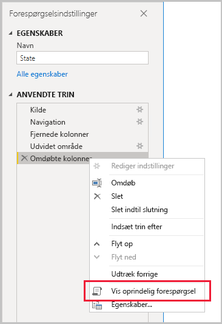
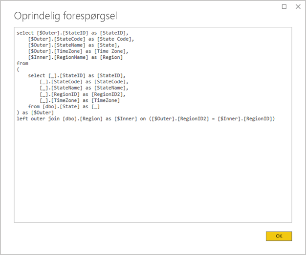
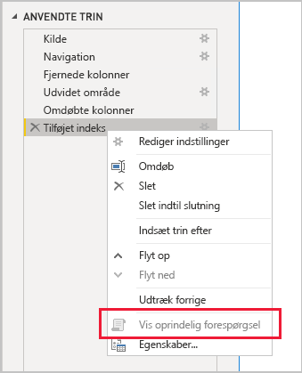

# <a name="the-importance-of-query-folding"></a>Vigtigheden af forespørgselsdelegering

Denne artikel er henvendt til designere af datamodeller i Power BI Desktop. Den indeholder en beskrivelse af, hvad forespørgselsdelegering er, og hvorfor det er vigtigt. Den indeholder også en beskrivelse af de datakilder og transformationer, der kan opnå forespørgselsdelegering, og hvordan du kan fastlægge, at dine Power Query-forespørgsler kan delegeres enten helt eller delvist. Sidst men ikke mindst indeholder den en vejledning til bedste praksis for, hvornår og hvordan du opnår forespørgselsdelegering.

Forespørgselsdelegering er muligheden for, at en Power Query-forespørgsel genererer en enkelt forespørgselssætning for at hente og transformere kildedata. Power Query-miksprogrammet bestræber sig på at opnå forespørgselsdelegering, når det er muligt, da det giver den mest effektive sti til at forbinde en Power BI-modeltabel til den underliggende datakilde.

Forespørgselsdelegering er et vigtigt koncept for dataudformning af flere årsager:

- **Tabel med importmodel:** Opdatering af data i tabeller med importmodeller er effektivt i forhold til udnyttelsen af ressourcer og varigheden af opdateringen
- **DirectQuery-tabellen og tabeller med dobbelt lagringstilstand:** Hver DirectQuery-tabel og tabel med dobbelt lagringstilstand skal baseres på en Power Query-forespørgsel, der kan delegeres
- **Trinvis opdatering:** Trinvis opdatering af data vil være effektivt i forhold til udnyttelsen af ressourcer og varigheden af opdateringen. Vinduet med konfigurationen af den trinvise opdatering vil faktisk give dig besked, hvis det fastlægges, at forespørgselsdelegering ikke kan udføres for tabellen. Hvis det ikke kan udføres, er formålet med den trinvise opdatering tilsidesat. Det vil derefter kræves af miksprogrammet, at det henter alle kilderækker og derefter anvender filtre for at fastlægge de trinvise ændringer.

Der kan ske forespørgselsdelegering for en hel Power Query-forespørgsel eller for en delmængde af dens trin. Når forespørgselsdelegering ikke kan opnås – enten helt eller delvist – skal Power Query-miksprogrammet i Power BI kompensere ved at behandle selve datatransformationerne. Det kan medføre, at der hentes resultater for kildeforespørgsler, hvilket er meget ressourcetungt og langsomt for store datasæt.

Vi anbefaler, at designere af datamodeller bestræber sig på at opnå effektivitet i designet af deres importmodel ved at sikre, at der sker forespørgselsdelegering, når det er muligt.

## <a name="sources-that-support-query-folding"></a>Kilder, der understøtter forespørgselsdelegering

De fleste datakilder, der indeholder et forespørgselssprog, understøtter forespørgselsdelegering. Disse datakilder kan omfatte relationsdatabaser, OData-feeds (inklusive SharePoint-lister), Exchange og Active Directory. Datakilder såsom flade filer, BLOB-filer og webfiler gør dog typisk ikke.

## <a name="transformations-that-can-achieve-query-folding"></a>Transformationer, der kan opnå forespørgselsdelegering

Transformationer af relationsdatakilder, hvor forespørgsler kan delegeres, kan skrives som en enkelt SELECT-sætning. En SELECT-sætning kan konstrueres med passende WHERE-, GROUP BY- og JOIN-delsætninger. Den kan også indeholde kolonneudtryk (beregninger), hvor der bruges almindelige indbyggede funktioner, som understøttes af SQL-databaser.

Generelt beskriver følgende punktopstilling transformationer, hvor forespørgslerne kan delegeres.

- Fjernelse af kolonner
- Omdøbning af kolonner (SELECT-kolonnealiasser)
- Filtrering af rækker med statiske værdier eller Power Query-parametre (WHERE-delsætningsprædikater)
- Gruppering og opsummering (GROUP BY-delsætning)
- Udvidelse af postkolonner (kolonner til fremmed nøgle for kilden) for at opnå en joinforbindelse af to kildetabeller (JOIN-delsætning)
- Fletning, der ikke er fuzzy, af forespørgsler, som kan delegeres, baseret på den samme kilde (JOIN-delsætning)
- Tilføjer forespørgsler, som kan delegeres, baseret på den samme kilde (UNION ALL-operator)
- Tilføjelse af brugerdefinerede kolonner med _enkel logik_ (SELECT-kolonneudtryk). Enkel logik indebærer ukomplicerede handlinger, hvilket muligvis omfatter brugen af M-funktioner, der har tilsvarende funktioner i SQL-datakilden, f.eks. funktioner til manipulation af matematik eller tekst. Følgende udtryk returnerer f.eks. årskomponenten for kolonneværdien **Ordredato** (for at returnere en numerisk værdi).

    ```powerquery-m
    Date.Year([OrderDate])
    ```

- Pivotering og normalisering (PIVOT- og UNPIVOT-operatorer)

## <a name="transformations-that-prevent-query-folding"></a>Transformationer, der forhindrer forespørgselsdelegering

Generelt beskriver følgende punktopstilling transformationer, der forhindrer forespørgselsdelegering. Det er ikke meningen, at denne liste er komplet.

- Fletning af forespørgsler baseret på forskellige kilder
- Tilføjelse (union-ing) af forespørgsler baseret på forskellige kilder
- Tilføjelse af brugerdefinerede kolonner med _kompleks logik_. Kompleks logik indebærer brugen af M-funktioner, der ikke har nogen tilsvarende funktioner i datakilden. Følgende udtryk formaterer f.eks. kolonneværdien **Ordredato** (for at returnere en tekstværdi).

    ```powerquery-m
    Date.ToText([OrderDate], "yyyy")
    ```

- Tilføjelse af indekskolonner
- Ændring af datatypen for en kolonne

Når en Power Query-forespørgsel omfatter flere datakilder, kan inkompatibilitet på niveauerne for beskyttelse af personlige oplysninger for datakilderne forhindre, at der sker forespørgselsdelegering. Du kan finde flere oplysninger i artiklen [Niveauer for beskyttelse af personlige oplysninger i Power BI Desktop](../desktop-privacy-levels.md).

## <a name="determine-when-a-query-can-be-folded"></a>Fastlæg, hvornår en forespørgsel kan delegeres

I vinduet Power Query-editor er det muligt at fastlægge, hvornår en Power Query-forespørgsel kan delegeres. Når du højreklikker på det senest anvendte trin i ruden **Forespørgselsindstillinger**, og indstillingen **Vis oprindelig forespørgsel** er aktiveret (ikke nedtonet), så kan forespørgslen delegeres.



Hvis du vil se den delegerede forespørgsel, skal du gå videre og markere indstillingen **Vis oprindelig forespørgsel**. Derefter får du vist den oprindelige forespørgsel, som Power Query vil bruge til kildedata.



Hvis indstillingen **Vis oprindelig forespørgsel** ikke er aktiveret (nedtonet), er det et tegn på, at alle forespørgselstrin ikke kan delegeres. Det kan dog betyde, at en delmængde af trinnene stadig kan delegeres. Når du arbejder bagud fra det sidste trin, kan du kontrollere hvert trin for at se, om indstillingen **Vis oprindelig forespørgsel** bliver aktiveret. Når det sker, har du fundet ud af, hvor i rækkefølgen af trin forespørgselsdelegering ikke længere kunne opnås.



## <a name="best-practice-guidance"></a>Vejledning til bedste praksis

Kort sagt, så skal der opnås forespørgselsdelegering for Power Query-forespørgslen for en DirectQuery-tabel eller tabel med dobbelt lagringstilstand. I forbindelse med en importtabel, der er baseret på en relationskilde, og når en enkelt SELECT-sætning kan konstrueres, opnås den _bedste ydeevne af opdateringen af data_ ved at sikre, der sker forespørgselsdelegering. Hvis miksprogrammet stadig er påkrævet til at behandle transformationer, skal du bestræbe dig på at minimere det arbejde, der skal udføres, især for store datasæt.

Følgende punktopstilling indeholder vejledningen til bedste praksis.

- **Deleger så meget behandling som muligt til datakilden:** Når alle trin i en Power Query-forespørgsel ikke kan delegeres, skal du finde det trin, der forhindrer forespørgselsdelegering. Når det er muligt, skal du flytte efterfølgende trin længere frem i rækkefølgen, så de kan indregnes i forespørgselsdelegeringen. Power Query-miksprogrammet kan være smart nok til at ændre rækkefølgen af dine forespørgselstrin, når kildeforespørgslen genereres.

I forbindelse med en relationsdatakilde kan du overveje at bruge en oprindelig forespørgselssætning, hvis det trin, der forhindrer forespørgselsdelegering, kan opnås i en enkelt SELECT-sætning eller inden for den proceduremæssig logik for en gemt procedure, som beskrevet herunder.

- **Brug en oprindelig SQL-forespørgsel:** Når en Power Query-forespørgsel henter data fra en relationskilde, er det muligt at bruge en oprindelig SQL-forespørgsel. Forespørgslen kan faktisk være en gyldig sætning, herunder en udførelse af en gemt procedure. Hvis sætningen producerer flere resultatsæt, er det kun det første, der returneres. Parametre kan deklareres i sætningen, og vi anbefaler, at du bruger M-funktionen [Value.NativeQuery](/powerquery-m/value-nativequery) til at overføre parameterværdier sikkert og hurtigt. Det er vigtigt at forstå, at Power Query-miksprogrammet ikke kan delegere efterfølgende forespørgselstrin, og det er derfor vigtigt at inkludere al transformationslogik (eller så meget som muligt) i den oprindelige forespørgselssætning.

    Der er to vigtige overvejelser, du skal være opmærksom på, når du bruger oprindelige SQL-forespørgsler:

    - I forbindelse med en DirectQuery-modeltabel skal forespørgslen være en SELECT-sætning, og den kan ikke bruge CTE (Common Table Expression) eller en gemt procedure
    - En oprindelig SQL-forespørgsel kan ikke anvendes i den trinvise opdatering, og den ville derfor tvinge Power Query-miksprogrammet til at hente alle kilderækker og derefter anvende filtre for at fastlægge de trinvise ændringer

    > [!IMPORTANT]
    > En oprindelig forespørgsel kan potentielt gøre mere end at hente data. Enhver gyldig sætning kan udføres (og muligvis flere gange), herunder én, der ændrer eller sletter data. Det er vigtigt at anvende princippet om færrest mulige rettigheder for at sikre, at den konto, der bruges til at få adgang til databasen, kun har læsetilladelse til de påkrævede data.

- **Forbered og transformér data i kilden:** Hvis du identificerer, at visse Power Query-forespørgselstrin ikke kan delegeres, kan det være muligt at anvende transformationerne i datakilden. Dette kan opnås ved at skrive en databasevisning, der logisk transformerer kildedata eller ved fysisk at forberede og materialisere data, før Power BI forespørger på dem. Et relationelt data warehouse er et glimrende eksempel på forberedte data, der normalt består af forudintegrerede kilder med organisationsdata.

## <a name="next-steps"></a>Næste trin

Du kan finde flere oplysninger om forespørgselsdelegering og relaterede artikler i følgende ressourcer:

- [Brug sammensatte modeller i Power BI Desktop](../desktop-composite-models.md)
- [Trinvis opdatering i Power BI Premium](../service-premium-incremental-refresh.md)
- [Brug af Table.View til at implementere forespørgselsdelegering](/power-query/handlingqueryfolding)
- Har du spørgsmål? [Prøv at spørge Power BI-community'et](https://community.powerbi.com/)
