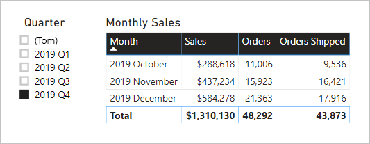

# <a name="active-vs-inactive-relationship-guidance"></a>Vejledning til aktive i forhold til inaktive relationer

Denne artikel henvender sig til designere af datamodeller, der arbejder med Power BI Desktop. Den indeholder en vejledning i, hvornår du skal oprette aktive og inaktive modelrelationer. Aktive relationer overfører som standard filtre til andre tabeller. Inaktive relationer overfører derimod kun filtre, når et DAX-udtryk aktiverer (bruger) relationen.

[!INCLUDE [relationships-prerequisite-reading](includes/relationships-prerequisite-reading.md)]

## <a name="active-relationships"></a>Aktive relationer

Generelt anbefales det, at du definerer aktive relationer, når det er muligt. De udvider omfanget af og potentialet for, hvordan din model kan bruges af rapportforfattere og brugere, der arbejder med Spørgsmål og svar.

Se et eksempel på en importmodel, der er designet til at analysere luftfartsselskabers rettidige fly. Modellen indeholder tabellen **Fly**, som er en tabel af faktatypen, hvor der gemmes én række pr. fly. I hver række registreres flydatoen, flynummeret, afgangs- og ankomstlufthavne og evt. forsinkelser (i minutter). Der er også en tabel med navnet **Lufthavn**, som er en tabel af dimensionstypen, hvor der gemmes én række pr. lufthavn. I hver rækkes beskrives lufthavnskoden, navnet på lufthavnen og landet.

Her er et delvist modeldiagram over de to tabeller.


Der er to modelrelationer mellem tabellerne **Fly** og **Lufthavn**. I tabellen **Fly** er kolonnerne **Afgangslufthavn** og **Ankomstlufthavn** relateret til kolonnen **Lufthavn** i tabellen **Lufthavn**. I et stjerneskemadesign er tabellen **Lufthavn** beskrevet som en [dimension med forskellige roller](star-schema.md#role-playing-dimensions). I denne model er de to roller _afgangslufthavn_ og _ankomstlufthavn_.

Selvom dette design fungerer godt for relationelle stjerneskemadesign, så fungerer det ikke godt for Power BI-modeller. Det skyldes, at modelrelationer er stier til filteroverførsel, og disse stier skal være deterministiske. Af denne årsag kan en model ikke have flere aktive relationer mellem to tabeller. Som beskrevet i denne artikel, er én relation derfor aktiv, mens den anden er inaktiv (angivet med den stiplede linje). Helt konkret, så er det relationen til kolonnen **Ankomstlufthavn**, der er aktiv. Det betyder, at filtre, der anvendes på tabellen **Lufthavn**, automatisk overføres til kolonnen **Ankomstlufthavn** i tabellen **Fly**.

Dette modeldesign medfører alvorlige begrænsninger på, hvordan dataene kan rapporteres. Helt konkret, så er det ikke muligt at filtrere tabellen **Lufthavn** for at isolere flyoplysninger automatisk for en afgangslufthavn. Da rapporteringskravene omfatter filtrering (eller gruppering) efter afgangs- og ankomstlufthavne _samtidigt_, er der behov for to aktive relationer. Overførsel af dette krav til et Power BI-modeldesign betyder, at modellen skal have to lufthavnstabeller.

Her er det forbedrede modeldesign.


Modellen indeholder nu to lufthavnstabeller: **Afgangslufthavn** og **Ankomstlufthavn**. Modelrelationerne mellem disse tabeller og tabellen **Fly** er aktive. Bemærk også, at der foran kolonnenavnene i tabellerne **Afgangslufthavn** og **Ankomstlufthavn** nu står _Afgang_ eller _Ankomst_.

Det forbedrede modeldesign understøtter udarbejdelse af følgende rapportdesign.


Rapportsiden filtrerer efter Melbourne som afgangslufthavn, og tabelvisualiseringen grupperer efter ankomstlufthavne.

> [!NOTE]
> I forbindelse med importmodeller resulterer den ekstra tabel i en større model og længere opdateringstider. Derfor modsiger det anbefalingerne, der er beskrevet i artiklen [Teknikker til reducering af data i importmodeller](import-modeling-data-reduction.md). Men i eksemplet tilsidesætter kravet om kun at have aktive relationer disse anbefalinger.
>
> Det er desuden almindeligt, at tabeller af dimensionstypen indeholder et lavt antal rækker sammenlignet med antallet af rækker i tabeller af faktatypen. Den øgede modelstørrelse og de længere opdateringstider vil derfor sandsynligvis ikke være overdrevet store eller længe.

### <a name="refactoring-methodology"></a>Metodik til omstrukturering

Her er en metodik til omstrukturering af en model fra en enkelt tabel af dimensionstypen med forskellige roller til et design med _én tabel pr. rolle_.

1. Fjern alle inaktive relationer.
2. Overvej at omdøbe tabellen af dimensionstypen med forskellige roller, så dens rolle beskrives bedre. I eksemplet er tabellen **Lufthavn** relateret til kolonnen **Ankomstlufthavn** i tabellen **Fly**, så den omdøbes til **Ankomstlufthavn**.
3. Opret en kopi af tabellen med forskellige roller, og giv den et navn, der afspejler dens rolle. Hvis det er en importtabel, anbefales det, at du definerer en beregnet tabel. Hvis det er en DirectQuery-tabel, kan du duplikere Power Query-forespørgslen.

    I eksemplet blev tabellen **Afgangslufthavn** oprettet ved hjælp af følgende definition for en beregnet tabel.

    ```dax
    Departure Airport = 'Arrival Airport'
    ```

4. Opret en aktiv relation for at relatere den nye tabel.
5. Overvej at omdøbe kolonnerne i tabellerne, så de afspejler deres rolle nøjagtigt. I eksemplet står ordet _Afgang_ eller _Ankomst_ foran alle kolonner. Disse navne sikrer, at rapportvisualiseringer som standard har selvbeskrivende og utvetydige mærkater. Det forbedrer også oplevelsen med Spørgsmål og svar, hvilket giver brugerne mulighed for nemt at skrive deres spørgsmål.
6. Overvej at føje beskrivelser til tabeller med forskellige roller. I ruden **Felter** vises en beskrivelse i et værktøjstip, når en rapportforfatter holder markøren over tabellen. På denne måde kan du kommunikere alle yderligere oplysninger om filteroverførsel til dine rapportforfattere.

## <a name="inactive-relationships"></a>Inaktive relationer

Under særlige omstændigheder kan inaktive relationer hjælpe med at håndtere særlige rapporteringsbehov.

Lad os nu kigge på forskellige model- og rapporteringskrav:

- En salgsmodel indeholder tabellen **Salg**, der har to datokolonner: **Ordredato** og **Afsendelsesdato**
- I hver række i tabellen **Salg** registreres en enkelt ordre
- Der anvendes næsten altid datofiltre på kolonnen **Ordredato**, hvor der altid gemmes en gyldig værdi
- Der er kun én måling, som kræver overførsel af datofilteret til kolonnen **Afsendelsesdato**, som kan indeholde TOMME værdier (indtil ordren afsendes)
- Der er ingen krav om, at der skal filtreres (eller grupperes) efter perioder for ordre- _og_  afsendelsesdato samtidigt

Her er et delvist modeldiagram over de to tabeller.


Der er to modelrelationer mellem tabellerne **Salg** og **Dato**. I tabellen **Salg** relaterer kolonnerne **Ordredato** og **Afsendelsesdato** til kolonnen **Dato** i tabellen **Dato**. I denne model er de to roller for tabellen **Dato** _ordredato_ og _afsendelsesdato_. Det er relationen til kolonnen **Ordredato**, der er aktiv.

Alle seks målinger – undtagen én – skal filtrere efter kolonnen **Ordredato**. Målingen **Afsendte ordrer** skal dog filtrere efter kolonnen **Afsendelsesdato**.

Her er definitionen af målingen **Ordre**. Den tæller simpelthen rækkerne i tabellen **Salg** i filterkonteksten. Alle filtre, der er anvendt på tabellen **Dato**, overføres til kolonnen **Ordredato**.

```dax
Orders = COUNTROWS(Sales)
```

Her er definitionen af målingen **Afsendte ordrer**. Den bruger DAX-funktionen [USERELATIONSHIP](/dax/userelationship-function-dax), som kun aktiverer filteroverførsel for en bestemt relation under evalueringen af udtrykket. I dette eksempel bruges relationen til kolonnen **Afsendelsesdato**.

```dax
Orders Shipped =
CALCULATE(
    COUNTROWS(Sales)
    ,USERELATIONSHIP('Date'[Date], Sales[ShipDate])
)
```

Dette modeldesign understøtter udarbejdelse af følgende rapportdesign.



Rapportsiden filtrerer efter 4. kvartal 2019. Tabelvisualiseringen grupperer efter måned og viser forskellige salgsstatistikker. Målingerne **Ordrer** og **Afsendte ordrer** giver forskellige resultater. De bruger begge den samme opsummeringslogik (antal rækker i tabellen **Salg**), men forskellig filteroverførsel fra tabellen **Dato**.

Bemærk, at kvartalsudsnittet indeholder en TOM værdi. Dette udsnit vises som et resultat af [tabeludvidelsen](../desktop-relationships-understand.md#strong-relationships). Hvor hver tabel med **Salg** indeholder en række med ordredato, har nogle rækker en TOM afsendelsesdato, fordi disse ordrer endnu ikke er afsendt. Der tages også højde for inaktive relationer i tabeludvidelsen, og derfor kan der vises TOMME værdier, fordi der er TOMME værdier på mange-siden af relationen, eller fordi der er problemer med dataintegritet.

## <a name="recommendations"></a>Anbefalinger

Kort sagt, anbefales det, at du definerer aktive relationer, når det er muligt. De udvider omfanget af og potentialet for, hvordan din model kan bruges af rapportforfattere og brugere, der arbejder med Spørgsmål og svar. Det betyder, at tabeller af dimensionstyper med forskellige roller bør duplikeres i din model.

Under særlige omstændigheder kan du dog definere en eller flere inaktive relationer for en tabel af dimensionstypen med forskellige roller. Du kan overveje dette design, når:

- der ikke er noget krav om, at rapportvisualiseringer skal filtrere efter forskellige roller samtidigt
- du bruger DAX-funktionen USERELATIONSHIP DAX til at aktivere en bestemt relation for relevante modelberegninger

## <a name="next-steps"></a>Næste trin

Du kan finde flere oplysninger, der er relateret til denne artikel, i følgende ressourcer:

- [Modelrelationer i Power BI Desktop](../desktop-relationships-understand.md)
- [Forstå, hvad et stjerneskema er, og hvorfor det er vigtigt for Power BI](star-schema.md)
- [Vejledning til fejlfinding af relationer](relationships-troubleshoot.md)
- Har du spørgsmål? [Prøv at spørge Power BI-community'et](https://community.powerbi.com/)
- Forslag? [Få ideer til at forbedre Power BI](https://ideas.powerbi.com/)
