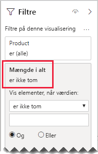

# <a name="bi-directional-relationship-guidance"></a>Vejledning til tovejsrelationer

Denne artikel henvender sig til designere af datamodeller, der arbejder med Power BI Desktop. Den indeholder en vejledning i, hvornår du skal oprette tovejsmodelrelationer. En tovejsrelation er en, der filtrerer i _begge retninger_.

[!INCLUDE [relationships-prerequisite-reading](includes/relationships-prerequisite-reading.md)]

Generelt anbefales det, at du minimerer brugen af tovejsrelationer. De kan have en negativ indvirkning på ydeevnen af forespørgsler i modellen og muligvis give dine rapportbrugere forvirrende oplevelser.

Der er tre scenarier, hvor tovejsfiltrering kan løse bestemte krav:

- [Specielle modelrelationer](#special-model-relationships)
- [Udsnitselementer "med data"](#slicer-items-with-data)
- [Analyse af dimension til dimension](#dimension-to-dimension-analysis)

## <a name="special-model-relationships"></a>Specielle modelrelationer

Tovejsrelationer spiller en vigtig rolle, når du opretter følgende to specielle modelrelationstyper:

- **En til en**: Alle en til en-relationer skal være tovejs. Det er ikke muligt at konfigurere andet. Generelt anbefales det ikke, at du opretter disse typer relationer. Du kan finde en komplet diskussion og alternative design i [Vejledning til en til en-relationer](relationships-one-to-one.md).
- **Mange til mange**: Når du relaterer to typer tabeller af dimensionstypen, kræves der en brotabel. Der kræves et tovejsfilter for at sikre, at filtrene overføres på tværs af brotabellen. Du kan finde flere oplysninger i [Vejledning til mange til mange-relationer (Relater mange til mange-dimensioner)](relationships-many-to-many.md#relate-many-to-many-dimensions).

## <a name="slicer-items-with-data"></a>Udsnitselementer "med data"

Tovejsrelationer kan levere udsnit, der begrænser elementer til de data, hvor der er data. Hvis du kender Excel-pivottabeller og -udsnit, er det standardfunktionsmåden, når du henter data fra et Power BI-datasæt eller en Analysis Services-model. For at hjælpe med at forklare, hvad det betyder, skal du først se følgende modeldiagram.


Den første tabel kaldes for **Kunde** og indeholder tre kolonner: **Land-område**, **Kunde** og **Kundekode**. Den anden tabel kaldes for **Produkt** og indeholder tre kolonner: **Farve**, **Produkt** og **SKU**. Den tredje tabel kaldes for **Salg** og indeholder fire kolonner: **Kundekode**, **Ordredato**, **Antal** og **SKU**. Tabellerne **Kunde** og **Produkt** er tabeller af dimensionstypen, og hver har en én til mange-relation til tabellen **Salg**. Hver relation filtrerer i en enkelt retning.

For at hjælpe med at beskrive, hvordan tovejsfiltrering fungerer, er modeldiagrammet blevet redigeret til at vise tabelrækkerne. Alle eksempler i denne artikel er baseret på disse data.

> [!NOTE]
> Det er ikke muligt at vise tabelrækkerne i Power BI Desktop-modeldiagrammet. Det gøres i denne artikel for at understøtte diskussionen med tydeligere eksempler.


Rækkedetaljerne for de tre tabeller er beskrevet i følgende punktopstilling:

- Tabellen **Kunde** indeholder to rækker:
  - **Kundekode** CUST-01, **Kunde** Kunde-1, **Land-område** USA
  - **Kundekode** CUST-02, **Kunde** Kunde-2, **Land-område** Australien
- Tabellen **Produkt** indeholder tre rækker:
  - **SKU** CL-01, **Produkt** T-shirt, **Farve** Grøn
  - **SKU** CL-02, **Produkt** Jeans, **Farve** Blå
  - **SKU** AC-01, **Produkt** Hat, **farve** Blå
- Tabellen **Salg** indeholder tre rækker:
  - **Ordredato** 1. januar 2019, **Kundekode** CUST-01, **SKU** CL-01, **Antal** 10
  - **Ordredato** 2. februar 2019, **Kundekode** CUST-01, **SKU** CL-02, **Antal** 20
  - **Ordredato** 3. marts 2019, **Kundekode** CUST-02, **SKU** CL-01, **Antal** 30

Se nu følgende rapportside.


Siden består af to udsnit og en kortvisualisering. Det første udsnit er for **Land-Område** og indeholder to elementer: Australien og USA. Det er i øjeblikket filtreret efter Australien. Det andet udsnit er for **Produkt** og indeholder tre elementer: Hat, jeans og T-shirt. Der er ikke valgt nogen elementer (hvilket betyder, at der ikke filtreres efter _nogen produkter_). Der vises et antal på 30 i kortvisualiseringen.

Når rapportbrugerne opretter udsnit efter Australien, vil du måske begrænse udsnittet **Produkt** til at vise elementer, hvor dataene er _relateret_ til salg i Australien. Det er dét, visning af udsnit "med data" betyder. Du kan opnå denne funktionsmåde ved at konfigurere relationen mellem tabellerne **Produkt** og **Salg** til at filtrere i begge retninger.


Der vises nu et enkelt element i udsnittet **Produkt**: T-shirt. Dette element repræsenterer det eneste produkt, der sælges til australske kunder.


Det anbefales, at du først overvejer, om dette design fungerer for dine rapportbrugere. Nogle rapportbrugere synes, at det er forvirrende. De forstår ikke, hvorfor udsnitselementer vises dynamisk eller forsvinder, når de interagerer med andre udsnit.

Hvis du beslutter dig for at vise udsnitselementer "med data", anbefales det ikke, at du konfigurerer tovejsrelationer. Tovejsrelationer kræver mere behandling, og de kan derfor påvirke forespørgslens ydeevne negativt – især i takt med, at antallet af tovejsrelationer i din model øges.

Der er en bedre måde at opnå det samme resultat på: I stedet for at bruge tovejsfiltre kan du anvende et filter på visualiseringsniveau på selve udsnittet **Produkt**.

Lad os nu overveje, at relationen mellem tabellerne **Produkt** og **Salg** ikke længere filtreres i begge retninger. Og at følgende målingsdefinition er føjet til tabellen **Salg**.

```dax
Total Quantity = SUM(Sales[Quantity])
```

Hvis du vil have vist udsnitselementet **Produkt** "med data", skal det blot filtreres efter målingen **Samlet antal** ved hjælp af betingelsen "er ikke tom".



## <a name="dimension-to-dimension-analysis"></a>Analyse af dimension til dimension

Et andet scenarie, der involverer tovejsrelationer, behandler en tabel af faktatypen som en brotabel. På denne måde understøtter det analyse af tabeller af dimensionstypen i filterkonteksten for en anden tabel af dimensionstypen.

Brug eksemplet i denne artikel, og overvej, hvordan følgende spørgsmål kan besvares:

- Hvor mange farver blev solgt til australske kunder?
- Hvor mange lande har købt jeans?

Begge spørgsmål kan besvares _uden_ at opsummere data i brotabellen af faktatypen. De kræver dog, at filtre overføres fra én tabel af dimensionstypen til den anden. Når filtrene overføres via tabellen af faktatypen, kan der opnås en opsummering af kolonnerne i tabellen af dimensionstypen ved hjælp af DAX-funktionen [DISTINCTCOUNT](/dax/distinctcount-function-dax) – og muligvis DAX-funktionerne [MIN](/dax/min-function-dax) og [MAX](/dax/max-function-dax).

Når tabellen af faktatypen fungerer som en brotabel, kan du følge vejledningen til mange til mange-relationer for at relatere to tabeller af dimensionstypen. Det kræver, at der konfigureres mindst én relation, som filtrerer i begge retninger. Du kan finde flere oplysninger i [Vejledning til mange til mange-relationer (Relater mange til mange-dimensioner)](relationships-many-to-many.md#relate-many-to-many-dimensions).

Som allerede beskrevet i denne artikel vil dette design sandsynligvis resultere i en negativ indvirkning på ydeevnen og de konsekvenser for brugeroplevelsen, der er relateret til [udsnitselementer "med data"](#slicer-items-with-data). Derfor anbefales det, at du aktiverer tovejsfiltrering _i en målingsdefinition_ ved at bruge DAX-funktionen [CROSSFILTER](/dax/crossfilter-function) i stedet. Funktionen CROSSFILTER kan bruges til at ændre filterretningen – eller tilmed deaktivere relationen – under evalueringen af et udtryk.

Se følgende målingsdefinition, som er føjet til tabellen **Salg**. I dette eksempel er modelrelationen mellem tabellerne **Kunde** og **Salg** konfigureret til at filtrere i en _enkelt retning_.

```dax
Different Countries Sold =
CALCULATE(
    DISTINCTCOUNT(Customer[Country-Region]),
    CROSSFILTER(
        Customer[CustomerCode],
        Sales[CustomerCode],
        BOTH
    )
)
```

Under evalueringen af målingsudtrykket **Salg i forskellige lande** filtreres relationen mellem tabellerne **Kunde** og **Salg** i begge retninger.

I følgende tabelvisualisering vises statistik for hvert solgte produkt. Kolonnen **Antal** er blot summen af værdierne for antal. Kolonnen **Salg i forskellige lande** repræsenterer det entydige antal af lande-/områdespecifikke værdier for alle kunder, der har købt produktet.


## <a name="next-steps"></a>Næste trin

Du kan finde flere oplysninger, der er relateret til denne artikel, i følgende ressourcer:

- [Modelrelationer i Power BI Desktop](../desktop-relationships-understand.md)
- [Forstå, hvad et stjerneskema er, og hvorfor det er vigtigt for Power BI](star-schema.md)
- [Vejledning til en til en-relationer](relationships-one-to-one.md)
- [Vejledning til mange til mange-relation](relationships-many-to-many.md)
- [Vejledning til fejlfinding af relationer](relationships-troubleshoot.md)
- Har du spørgsmål? [Prøv at spørge Power BI-community'et](https://community.powerbi.com/)
- Forslag? [Få ideer til at forbedre Power BI](https://ideas.powerbi.com/)
