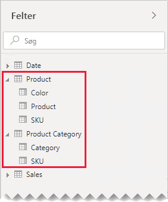
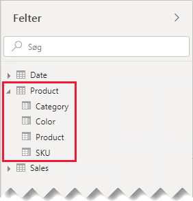
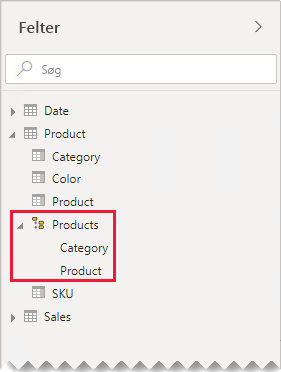
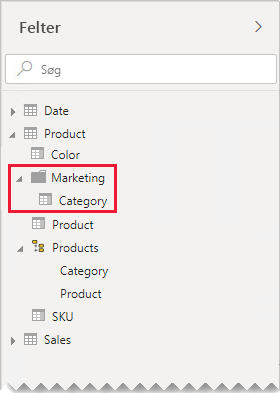

# Vejledning til en til en-relationer

Denne artikel henvender sig til designere af datamodeller, der arbejder med Power BI Desktop. Den indeholder en vejledning til at arbejde med modeller med en til en-relationer. Der kan oprettes en én til en-relation, når begge tabeller indeholder en kolonne med almindelige og unikke værdier.

[!INCLUDE [relationships-prerequisite-reading](includes/relationships-prerequisite-reading.md)]

Der er to scenarier, som omfatter en til en-relationer:

- [Forringede dimensioner](#degenerate-dimensions): Du kan udlede en [forringet dimension](star-schema.md#degenerate-dimensions) fra en tabel af faktatypen.
- [Rækkedata spænder på tværs af tabeller](#row-data-spans-across-tables): En enkelt forretningsenhed eller et enkelt forretningsemne indlæses som to (eller flere) modeltabeller, muligvis fordi deres data hentes fra forskellige datalagre. Dette scenarie kan være almindeligt for tabeller af dimensionstypen. Masterproduktoplysninger gemmes f.eks. i et driftsklart salgssystem, og supplerende produktoplysninger gemmes i en anden kilde.

    Det er dog usædvanligt, at du ville relatere to tabeller af faktatypen via en én til en-relation. Det skyldes, at begge tabeller af faktatypen ville være nødt til at have den samme dimensionalitet og granularitet. Hver tabel af faktatypen ville også være nødt til at have unikke kolonner, før modelrelationen ville kunne oprettes.

## Forringede dimensioner

Når kolonner i en tabel af faktatypen bruges til filtrering eller gruppering, kan du overveje at gøre dem tilgængelige i en separat tabel. På denne måde kan du adskille kolonner, der bruges til filtrering eller gruppering, fra de kolonner, der bruges til at opsummere faktarækker. Denne adskillelse kan:

- Reducere lagerplads
- Forenkle modelberegninger
- Bidrage til forbedret ydeevne af forespørgsler
- Gøre ruden **Felter** mere intuitiv for rapportforfattere

Se f.eks. en kildesalgstabel, hvor oplysninger om salgsordrer gemmes i to kolonner.

Ordrenummeret gemmes i kolonnen **Ordrenummer**, og en række linjer fra ordren gemmes i kolonnen **Ordrelinjenummer**.

I følgende modeldiagram vil du bemærke, at kolonnerne med ordrenummer og ordrelinjenummer ikke er blevet indlæst i tabellen **Salg**. I stedet blev deres værdier brugt til at oprette en kolonne med en [surrogatnøgle](star-schema.md#surrogate-keys), der kaldes for **Id for salgsordrelinje**. Nøgleværdien beregnes ved at gange ordrenummeret med 1000 og derefter lægge ordrelinjenummeret til.

Tabellen **Salgsordre** giver rapportforfattere en omfattende oplevelse med tre kolonner: **Salgsordre**, **Salgsordrelinje** og **Linjenummer**. Den indeholder også et hierarki. Disse tabelressourcer understøtter rapportdesignere, der har brug for at filtrere, gruppere efter eller zoome ind på detaljeniveauet i ordrer og ordrelinjer.

Da tabellen **Salgsordre** udledes af salgsdataene, burde der være nøjagtigt det samme antal rækker i hver tabel. Der burde desuden være matchende værdier mellem hver kolonne med **Id for salgsordrelinje**.

## Rækkedata spænder på tværs af tabeller

Se et eksempel med to en til en-relaterede tabeller af dimensionstypen: **Produkt** og **Produktkategori**. Hver tabel repræsenterer importerede data og har en kolonne for **SKU** (Stock-Keeping Unit – varenummer), der indeholder unikke værdier.

Her er et delvist modeldiagram over de to tabeller.

Den første tabel kaldes for **Produkt** og indeholder tre kolonner: **Farve**, **Produkt** og **SKU**. Den anden tabel kaldes for **Produktkategori** og indeholder to kolonner: **Kategori** og **SKU**. En én til en-relation relaterer de to **SKU**-kolonner. Relationen filtrerer i begge retninger, hvilket altid er tilfældet for en til en-relationer.

For at hjælpe med at beskrive, hvordan filteroverførslen af relationen fungerer, er modeldiagrammet blevet redigeret for at vise tabelrækkerne. Alle eksempler i denne artikel er baseret på disse data.

> [!NOTE]
> Det er ikke muligt at vise tabelrækkerne i Power BI Desktop-modeldiagrammet. Det gøres i denne artikel for at understøtte diskussionen med tydeligere eksempler.

Rækkedetaljerne for de to tabeller er beskrevet i følgende punktopstilling:

- Tabellen **Produkt** indeholder tre rækker:
  - **SKU** CL-01, **Produkt** T-shirt, **Farve** Grøn
  - **SKU** CL-02, **Produkt** Jeans, **Farve** Blå
  - **SKU** AC-01, **Produkt** Hat, **farve** Blå
- Tabellen **Produktkategori** indeholder to rækker:
  - **SKU** CL-01, **Kategori** Tøj
  - **SKU** AC-01, **Kategori** Tilbehør

Bemærk, at tabellen **Produktkategori** ikke indeholder en række for produkt-SKU'en CL-02. Vi drøfter konsekvenserne af denne manglende række senere i denne artikel.

I ruden **Felter** finder rapportforfattere produktrelaterede felter i to tabeller: **Produkt** og **Produktkategori**.

Lad os se, hvad der sker, når felter fra begge tabeller føjes til en tabelvisualisering. I dette eksempel hentes kolonnen **SKU** fra tabellen **Produkt**.

Bemærk, at værdien **Kategori** for produkt-SKU'en CL-02 er TOM. Det skyldes, at der ikke er nogen række i tabellen **Produktkategori** for dette produkt.

### Anbefalinger

Når det er muligt, anbefaler vi dig at undlade at oprette modeller med en til en-relationer, når rækkedataene spænder på tværs af modeltabeller. Det skyldes, at dette design kan:

- Bidrage til rod i ruden **Felter**, så der angives flere tabeller end nødvendigt
- Gøre det svært for rapportforfattere at finde relaterede felter, fordi de distribueres på tværs af flere tabeller
- Begrænse muligheden for at oprette hierarkier, da deres niveauer skal være baseret på kolonner fra den _samme tabel_
- Give uventede resultater, når der ikke er et komplet match af rækker mellem tabellerne

Bestemte anbefalinger varierer, afhængigt af om en til en-relationen er i _et internt område_ eller _mellem områder_. Du kan finde flere oplysninger om evaluering af relationer i [Modelrelationer i Power BI Desktop (evaluering af relationer)](../transform-model/desktop-relationships-understand.md#relationship-evaluation).

### En til en-relation i et internt område

Når der er en én til en-relation i et _internt område_ mellem tabeller, anbefaler vi, at du konsoliderer dataene i en enkelt modeltabel. Det gøres ved at flette Power Query-forespørgslerne.

I følgende trin præsenteres en metodik til at konsolidere og udforme en til en-relaterede data:

1. **Flet forespørgsler**: Når du [kombinerer to forespørgsler](../connect-data/desktop-shape-and-combine-data.md#combine-queries), skal du overveje fuldstændigheden af dataene i hver forespørgsel. Hvis én forespørgsel indeholder et komplet sæt af rækker (f.eks. en masterliste), skal du flette den anden forespørgsel med den. Konfigurer flettetransformationen til at bruge en _venstre ydre joinforbindelse_, som er standardtypen for joinforbindelser. Denne type joinforbindelse sikrer, at du bevarer alle rækker i den første forespørgsel og supplerer dem med alle matchende rækker i den anden forespørgsel. Udvid alle påkrævede kolonner i den anden forespørgsel til den første forespørgsel.
2. **Deaktiver indlæsning af forespørgsel**: Sørg for at [deaktivere indlæsningen](import-modeling-data-reduction.md#disable-power-query-query-load) af den anden forespørgsel. På den måde bliver resultaterne fra den ikke indlæst som en modeltabel. Denne konfiguration reducerer størrelsen af datamodellageret og hjælper med at fjerne rodet i ruden **Felter**.

    I vores eksempel kan rapportforfattere nu finde en enkelt tabel med navnet **Produkt** i ruden **Felter**. Den indeholder alle produktrelaterede felter.

    
3. **Erstat manglende værdier**: Hvis den anden forespørgsel indeholder rækker, der ikke er matchet, vises NULL i kolonnerne, der introduceres fra den. Overvej, at erstatte NULL med en tokenværdi, når det er relevant. Det er især vigtigt at erstatte manglende værdier, når rapportforfattere filtrerer eller grupperer kolonneværdierne, da der ellers vises TOMME værdier i rapportvisualiseringer.

    I følgende tabelvisualisering vil du bemærke, at der nu står _[Udefineret]_ under kategorien for produkt-SKU'en CL-02. I forespørgslen blev null-kategorier erstattet med denne tokentekstværdi.

    

4. **Opret hierarkier**: Hvis der findes relationer _mellem kolonnerne_ i den tabel, der nu er konsolideret, bør du overveje at oprette hierarkier. På den måde kan rapportforfattere hurtigt identificere muligheder for at analysere rapportvisualiseringer.

    I vores eksempel kan rapportforfattere nu bruge et hierarki, der har to niveauer: **Kategori** og **Produkt**.

    

Selvom du godt kan lide den måde, som separate tabeller hjælper dig med at organisere felter på, anbefaler vi stadig, at du konsoliderer til en enkelt tabel. Du kan stadig organisere felterne, men ved hjælp af _visningsmapper_ i stedet.

I vores eksempel kan rapportforfattere finde feltet **Kategori** i visningsmappen **Marketing**.

Hvis du stadig beslutter dig for at definere en til en-relationer i et internt område i din model, skal du sikre, at der er matchende rækker i de relaterede tabeller, når det er muligt. Da en til en-relationer i et internt område evalueres som en [stærk relation](../transform-model/desktop-relationships-understand.md#strong-relationships), kan problemer med dataintegritet i dine rapportvisualiseringer blive vist som TOMME. Du kan se et eksempel på en TOM gruppering i den første tabelvisualisering, som er præsenteret i denne artikel.

### En til en-relation mellem områder

Når der er en én til en-relation _mellem områder_ mellem tabeller, er der ingen alternative modeldesign – medmindre du konsoliderer dataene i dine datakilder på forhånd. Power BI evaluerer en til en-relationen i modellen som en [svag relation](../transform-model/desktop-relationships-understand.md#weak-relationships). Du skal derfor nøje sikre, at der er matchende rækker i de relaterede tabeller, da rækker, som ikke matches, fjernes fra forespørgselsresultaterne.

Lad os se, hvad der sker, når felter fra begge tabeller føjes til en tabelvisualisering, og der er en svag relation mellem tabellerne.

Der vises kun to rækker i tabellen. Produkt-SKU'en CL-02 mangler, da der ikke er nogen matchende rækker i tabellen **Produktkategori**.

## Næste trin

Du kan finde flere oplysninger, der er relateret til denne artikel, i følgende ressourcer:

- [Modelrelationer i Power BI Desktop](../transform-model/desktop-relationships-understand.md)
- [Forstå, hvad et stjerneskema er, og hvorfor det er vigtigt for Power BI](star-schema.md)
- [Vejledning til fejlfinding af relationer](relationships-troubleshoot.md)
- Har du spørgsmål? [Prøv at spørge Power BI-community'et](https://community.powerbi.com/)
- Forslag? [Få ideer til at forbedre Power BI](https://ideas.powerbi.com/)
