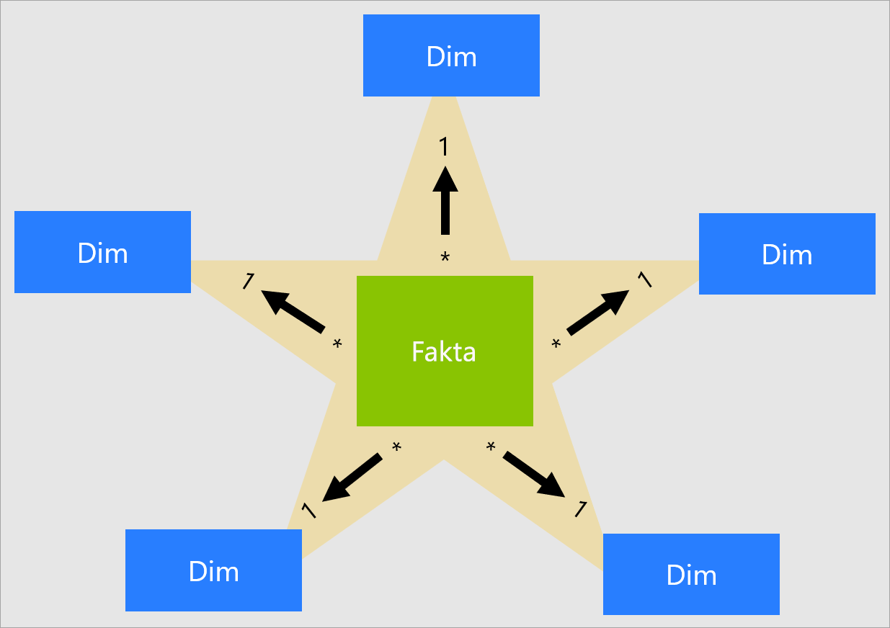
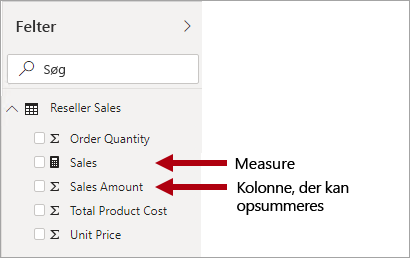
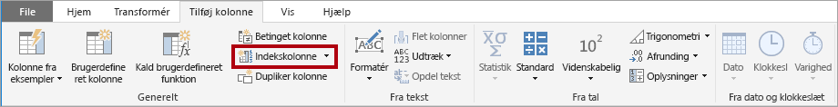
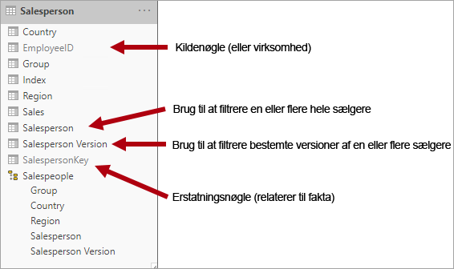
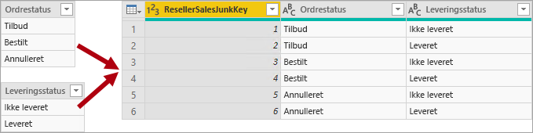
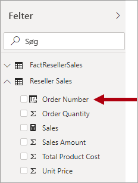

# Forstå, hvad et stjerneskema er, og hvorfor det er vigtigt for Power BI

Denne artikel henvender sig til personer, der skaber Power BI Desktop-datamodeller. Heri beskrives, hvad et stjerneskemadesign er, og hvilken relevans det har for udvikling af Power BI-datamodeller, der er optimeret til ydeevne og anvendelighed.

Det er ikke meningen, at artiklen skal indeholde en komplet beskrivelse af stjerneskemadesign. Du kan finde flere oplysninger ved at se publiceret indhold, såsom **The Data Warehouse Toolkit: The Complete Guide to Dimensional Modeling** (2. udgave, 2002) af Ralph Kimball et al.

## Oversigt over stjerneskema

Et **stjerneskema** er en fuldt udviklet udformningstilgang, som en lang række relationelle data warehouses anvender. Det kræver, at modeludviklere klassificerer deres modeltabeller som enten _dimension_ eller _fakta_.

**Dimensionstabeller** beskriver forretningsenheder – de "ting", du udformer. Enheder kan omfatte produkter, personer, steder og begreber, inklusive tid. Den mest ensartede tabel, du finder i et stjerneskema, er en datodimensionstabel. En dimensionstabel indeholder en nøglekolonne (eller kolonner), der fungerer som et entydigt id, og beskrivende kolonner.

I **faktatabeller** gemmes observationer eller begivenheder. Det kan være salgsordrer, lageropgørelser, valutakurser, temperaturer osv. En faktatabel indeholder dimensionsnøglekolonner, der er relateret til dimensionstabeller og numeriske målingskolonner. Dimensionsnøglekolonnerne bestemmer _dimensionaliteten_ for en faktatabel, mens dimensionsnøgleværdierne bestemmer _granulariteten_ for en faktatabel. Tag f.eks. en faktatabel, der er designet til at gemme salgsmål, som har to dimensionsnøglekolonner: **Dato** og **Produktnøgle**. Det er nemt at forstå, at tabellen har to dimensioner. Det er dog ikke muligt at bestemme granulariteten uden at tage højde for dimensionsnøgleværdierne. I dette eksempel er de værdier, der er gemt i kolonnen **Dato**, den første dag i måneden. I dette tilfælde er granulariteten på måned-produkt-niveauet.

Dimensionstabeller indeholder generelt et relativt lille antal rækker. Faktatabeller kan omvendt indeholde et meget stort antal rækker og fortsætte med at vokse over tid.

## Relevans af stjerneskema i forhold til Power BI-modeller

Stjerneskemadesign og mange af de relaterede begreber, der introduceres i denne artikel, er yderst relevante for udvikling af Power BI-modeller, der er optimeret til ydeevne og anvendelighed.

Hver visualisering i en Power BI-rapport genererer en forespørgsel, der sendes til Power BI-modellen (som Power BI-tjenesten kalder for et datasæt). Disse forespørgsler bruges til at filtrere, gruppere og opsummere modeldata. En veldesignet model er derfor en model, der indeholder tabeller til filtrering og gruppering samt tabeller til opsummering. Dette passer godt med designprincipperne for et stjerneskema:

- Dimensionstabeller understøtter _filtrering_ og _gruppering_
- Faktatabeller understøtter _opsummering_

Selvom der ikke er nogen tabelegenskab, som modeludviklere har angivet for at konfigurere tabeltypen (dimension eller fakta), bestemmes den af modelrelationerne. En modelrelation etablerer en filteroverførselssti mellem to tabeller, og det er relationens egenskab for **Kardinalitet**, der bestemmer tabeltypen. En almindelig kardinalitet for en relation er "en til mange" eller den omvendte "mange til en". "En"-siden er altid en dimensionstabel, hvorimod "mange"-siden altid er en faktatabel.

Et velstruktureret modeldesign bør omfatte tabeller, der enten er af typen dimensionstabel eller af typen faktatabel. Du bør undgå at blande de to typer sammen i en enkelt tabel. Det anbefales også, at du stræber efter at levere det rette antal tabeller med de rigtige relationer på plads. Det er også vigtigt, at faktatabeller altid indlæser data i en ensartet retning.

Endelig er det vigtigt at forstå, at det optimale modeldesign er delvist videnskab og delvist kunst. Nogle gange kan du se bort fra gode råd, når det giver mening for dig at gøre det.

Der er mange andre begreber, som er relateret til stjerneskemadesign, der kan anvendes på en Power BI-model. Disse omfatter:

- [Målinger](#measures)
- [Surrogatnøgler](#surrogate-keys)
- [Snowflake-dimensioner](#snowflake-dimensions)
- [Dimension med forskellige roller](#role-playing-dimensions)
- [Dimensioner, der langsomt ændrer sig](#slowly-changing-dimensions)
- [Dimensioner til tilfældige attributter](#junk-dimensions)
- [Forringede dimensioner](#degenerate-dimensions)
- [Faktafrie faktatabeller](#factless-fact-tables)

## Målinger

I et stjerneskemadesign er en **måling** en kolonne i en faktatabel, der gemmer værdier, som skal opsummeres.

I en Power BI-model har en **måling** en anden – men lignende – definition. Det er en formel, som er skrevet i [DAX (Data Analysis Expressions)](https://docs.microsoft.com/dax/data-analysis-expressions-dax-reference), der resulterer i opsummering. DAX-sammenlægningsfunktioner, som SUM, MIN., MAKS., GENNEMSNIT osv., bruges ofte i målingsudtryk til at skabe et skalarværdisæt på forespørgselstidspunktet (værdierne gemmes aldrig i modellen). Målingsudtryk kan variere fra simple kolonnesammenlægninger til mere avancerede formler, der tilsidesætter filterkontekst og/eller relationsoverførsler. Du kan finde flere oplysninger i artiklen [Grundlæggende om DAX i Power BI Desktop](https://docs.microsoft.com/power-bi/desktop-quickstart-learn-dax-basics).

Det er vigtigt at forstå, at Power BI-modeller understøtter en anden metode for at resultere i opsummering. En hvilken som helst kolonne – og som regel numeriske kolonner – kan opsummeres i en visualisering i en rapport eller ved hjælp af Spørgsmål og svar. Dette er praktisk for dig som modeludvikler, da du i mange tilfælde ikke har brug for at oprette målinger. Kolonnen **Salgsbeløb** for Adventure Works-forhandlersalg kan opsummeres på flere måder (sum, antal, gennemsnit, median, min., maks. osv.), uden at det er nødvendigt at oprette en måling for hver mulige sammenlægningstype.

Der er dog to overbevisende grunde til, at du bør oprette målinger selv for simple opsummeringer på kolonneniveau:

- Når du ved, at rapportforfattere sender forespørgsler til modellen ved hjælp af [flerdimensionelle udtryk (MDX)](https://docs.microsoft.com/sql/analysis-services/multidimensional-models/mdx/mdx-query-the-basic-query?view=sql-server-2017), så skal modellen indeholde målinger. MDX kan ikke resultere i opsummering af kolonneværdier. Dette er yderst relevant, når der sendes en forespørgsel til Power BI-datasæt ved hjælp af MDX, og det er tilfældet, når du bruger [Analysér i Excel](https://docs.microsoft.com/power-bi/service-analyze-in-excel) (pivottabeller udsteder MDX-forespørgsler).
- Hvis du vil sikre, at rapportforfattere kun kan opsummere kolonner på bestemte måder. Kolonnen **Enhedspris** for forhandlersalg (der repræsenterer en pris pr. enhed) kan f.eks. opsummeres, men kun ved hjælp af bestemte sammenlægningsfunktioner. Den bør aldrig lægges sammen, men den kan passende opsummeres ved hjælp af andre sammenlægningsfunktioner (min., maks., gennemsnit osv.). I dette tilfælde kan modeludvikleren skjule kolonnen **Enhedspris** og oprette målinger for alle relevante sammenlægningsfunktioner.

Bemærk, at denne designtilgang fungerer godt til rapporter, der er forfattet i Power BI-tjenesten, og til Spørgsmål og svar. Direkte forbindelser i Power BI Desktop giver dog rapportforfattere mulighed for at få vist skjulte felter i ruden **Felter**, der kan resultere i omgåelse af denne designtilgang.

## Surrogatnøgler

En **surrogatnøgle** er et entydigt id, som du føjer til en tabel for at understøtte udformning af et stjerneskema. Den er pr. definition hverken defineret eller gemt i kildedata. Surrogatnøgler føjes ofte til dimensionstabeller for relationelle data warehouses for at angive et entydigt id for hver række i dimensionstabellen.

Power BI-modelrelationer er baseret på en enkelt entydig kolonne i én tabel, der overfører filtre til en enkelt kolonne i en anden tabel. Når en dimensionstabel i modellen ikke indeholder en enkelt entydig kolonne, skal du tilføje et entydigt id for at blive til "en"-siden af en relation. I Power BI Desktop kan du nemt opnå dette ved at oprette en [Power Query-indekskolonne](https://docs.microsoft.com/powerquery-m/table-addindexcolumn).

Du skal flette denne forespørgsel med "mange"-siden af forespørgslen, så du også kan føje indekskolonnen til den. Når du indlæser disse forespørgsler i modellen, kan du oprette en en-til-mange-relation mellem modeltabellerne.

## Snowflake-dimensioner

En **Snowflake-dimension** er et sæt normaliserede tabeller til en enkelt forretningsenhed. Produkter klassificeres f.eks. efter kategori og underkategori i Adventure Works. Der tildeles kategorier til underkategorier, og produkterne tildeles omvendt underkategorier. I det relationelle data warehouse, Adventure Works, er produktdimensionen normaliseret og gemt i tre relaterede tabeller: **DimProductCategory**, **DimProductSubcategory** og **DimProduct**.

Hvis du bruger din fantasi, kan du forestille dig, at de normaliserede tabeller er placeret ud fra faktatabellen, som danner et snefnugdesign.

I Power BI Desktop kan du vælge at efterligne et design med en Snowflake-dimension (måske fordi dine kildedata gør) eller integrere (denormalisere) kildetabellerne i en enkelt modeltabel. Generelt opvejer fordelene ved en enkelt modeltabel fordelene ved flere modeltabeller. Den mest optimale beslutning kan være afhængig af datamængderne og kravene til anvendelighed for modellen.

Når du vælger at efterligne et design med en Snowflake-dimension:

- Power BI indlæser flere tabeller, hvilket er mindre effektivt set fra et lager- og ydeevneperspektiv. Disse tabeller skal indeholde kolonner, der understøtter modelrelationer, og det kan medføre, at modellen bliver større.
- Længere overførselskæder for relationsfiltre skal gennemgås, hvilket er mindre effektivt end filtre, der anvendes på en enkelt tabel.
- Ruden **Felter** præsenterer flere modeltabeller til rapportforfattere, hvilket kan resultere i en mindre intuitiv oplevelse, især når Snowflake-dimensionstabeller kun indeholder én eller to kolonner.
- Det er ikke muligt at oprette et hierarki, der spænder over tabellerne.

Når du vælger at integrere til en enkelt modeltabel, kan du også definere et hierarki, der omfatter den højeste og laveste retning i dimensionen. Lagring af redundante, denormaliserede data kan f.eks. resultere i, at modellageret bliver større, især for meget store dimensionstabeller.

## Dimension, der langsomt ændrer sig

En **dimension, der langsomt ændrer sig** er en, der styrer ændringer af dimensionsmedlemmer korrekt over tid. Det gælder, når værdier for forretningsenheder ændres over tid og på en ad hoc-måde. Et godt eksempel på en dimension, der _langsomt_ ændrer sig, er en kundedimension, især kolonner med kontaktoplysninger, f.eks. mailadresse og telefonnummer. I modsætning hertil anses nogle dimensioner for at ændre sig _hurtigt_, når en dimensionsattribut ændres ofte, f.eks. en akties markedspris. Den almindelige designtilgang i disse tilfælde er at gemme attributværdier, der ændrer sig hurtigt, i en måling i en faktatabel.

Teorien bag et stjerneskemadesign refererer til to almindelige typer af dimensioner, der langsomt ændrer sig: Type 1 og Type 2. En dimensionstabel kan være Type 1 eller Type 2 eller understøtte begge typer samtidig for forskellige kolonner.

### Type 1 af en dimension, der langsomt ændrer sig

En **Type 1** af en **dimension, der langsomt ændrer sig,** afspejler altid de nyeste værdier, og når der registreres ændringer i kildedataene, overskrives dataene i dimensionstabellen simpelthen. Denne designtilgang er almindelig for kolonner, der gemmer supplerende værdier, f.eks. en kundes mailadresse eller telefonnummer. Når en kundes mailadresse eller telefonnummer ændres, opdateres kundens række med de nye værdier i dimensionstabellen. Det bliver ligesom om, at kunden altid har haft disse kontaktoplysninger.

En opdatering, der ikke er trinvis, af en dimensionstabel i en Power BI-model resulterer i en Type 1 af en dimension, der langsomt ændrer sig. Tabeldataene opdateres for at sikre, at de nyeste værdier indlæses.

### Type 2 af en dimension, der langsomt ændrer sig

En **Type 2** af en **dimension, der langsomt ændrer sig**, understøtter versionering af dimensionsmedlemmer. Hvis kildesystemet ikke gemmer versioner, er det som regel indlæsningsprocessen for det pågældende data warehouse, der registrerer ændringer, og som styrer ændringen i en dimensionstabel korrekt. I dette tilfælde skal dimensionstabellen bruge en surrogatnøgle til at angive en entydig reference til en _version_ af dimensionsmedlemmet. Den indeholder også kolonner, der definerer gyldigheden af datoområdet for versionen (f.eks. **Startdato** og **Slutdato**) og muligvis en kolonne med flag (f.eks. **ErAktuel**), så der nemt kan filtreres efter aktuelle dimensionsmedlemmer.

Adventure Works tildeler f.eks. sælgere til en salgsregion. Når en sælger skifter område, skal der oprettes en ny version af sælgeren for at sikre, at de historiske fakta forbliver knyttet til det tidligere område. Der skal gemmes versioner af sælgere og deres tilknyttede områder i dimensionstabellen for at understøtte nøjagtig historisk analyse af salg efter sælger. Tabellen skal også indeholde værdier for start- og slutdato for at definere gyldigheden af tid. Der kan defineres en tom slutdato (eller 31-12-9999) for aktuelle versioner, hvilket angiver, at rækken er den aktuelle version. Der skal også defineres en surrogatnøgle i tabellen, da forretningsnøglen (i denne forekomst er det medarbejder-id) ikke er entydig.

Det er vigtigt at forstå, at du skal bruge et mellemliggende system (f.eks. et data warehouse) for at registrere og gemme ændringer, når kildedataene ikke gemmer versioner. Indlæsningsprocessen for tabellen skal bevare eksisterende data og registrere ændringer. Når der registreres en ændring, skal den aktuelle version udløbe under indlæsningsprocessen for tabellen. Det sker ved at opdatere værdien **Slutdato** og indsætte en ny version, hvor værdien **Startdato** starter fra den forrige **Slutdato**. Relaterede fakta skal også bruge et tidsbaseret opslag for at hente den værdi for dimensionsnøglen, som er relevant for faktadatoen. En Power BI-model, der bruger Power Query, kan ikke opnå dette. Den kan dog indlæse data fra en forudindlæst Type 2-dimensionstabel, som er en dimension, der langsomt ændrer sig.

Power BI-modellen bør understøtte forespørgsler om historiske data for et medlem, uanset om de er ændret, og for en version af medlemmet, hvilket repræsenterer en bestemt tilstand for medlemmet over tid. I forbindelse med Adventure Works giver dette dig mulighed for at sende en forespørgsel om sælgeren, uanset hvilket salgsområde der er tildelt, eller om en bestemt version af sælgeren.

For at opnå dette skal dimensionstabellen i Power BI-modellen indeholde en kolonne til filtrering af sælgeren og en anden kolonne til filtrering af en bestemt version af sælgeren. Det er vigtigt, at kolonnen med versionen indeholder en entydig beskrivelse, f.eks. "Michael Blythe (15-12-2008-26-06-2019)" eller "Michael Blythe (aktuel)". Det er også vigtigt at uddanne forfattere og forbrugere af rapporter i de grundlæggende funktioner i Type 2 af en dimension, der langsomt ændrer sig, og hvordan de opnår et passende rapportdesign ved at anvende korrekte filtre.

Det er også en god designpraksis at inkludere et hierarki, der giver mulighed for at zoome ind på versionsniveauer i visualiseringer.

## Dimension med forskellige roller

En **dimension med forskellige roller**, er en dimension, der kan filtrere relaterede fakta på en anden måde. I Adventure Works har datodimensionstabellen f.eks. tre relationer med fakta for forhandlersalg. Den samme dimensionstabel kan bruges til at filtrere fakta efter ordredato, afsendelsesdato eller leveringsdato.

I et data warehouse er den accepterede designtilgang at definere en enkelt datodimensionstabel. På forespørgselstidspunktet etableres "rollen" for datodimensionen efter, hvilken faktakolonne du bruger til at forene tabellerne. Når du f.eks. analyserer salg efter ordredato, forenes der efter den relaterede kolonne med ordredato for forhandlersalg i tabellen.

I en Power BI-model kan dette design efterlignes ved at oprette flere relationer mellem to tabeller. I eksemplet med Adventure Works ville der være tre relationer mellem salgstabellerne for dato og forhandler. Dette er muligt, men det er vigtigt at forstå, at der kun kan være én aktiv relation mellem to Power BI-modeltabeller. Alle resterende relationer skal være angivet til inaktive. Hvis du har en enkelt aktiv relation, betyder det, at der er en standardfilteroverførsel fra dato til forhandlersalg. I denne forekomst angives den aktive relation til det mest almindelige filter, der bruges af rapporter, hvilket hos Adventure Works er relationen for ordredato.

Den eneste måde, du kan bruge en inaktiv relation på, er ved at definere et DAX-udtryk, der bruger [funktionen BRUGRELATION](https://docs.microsoft.com/dax/userelationship-function-dax). I vores eksempel skal modeludvikleren oprette målinger for at aktivere analyse af forhandlersalg efter afsendelsesdato og leveringsdato. Det kan være kedeligt, især når der defineres mange målinger i forhandlertabellen. Det skaber også rod i ruden **Felter**, hvor der en overflod af målinger. Der er også andre begrænsninger:

- Når rapportforfatterne sætter deres lid til opsummering af kolonner i stedet for at definere målinger, kan de ikke opsummere de inaktive relationer uden at skrive en måling på rapportniveau. Målinger på rapportniveau kan kun defineres, når der forfattes rapporter i Power BI Desktop.
- Med kun én aktiv relationssti mellem dato og forhandlersalg, er det ikke muligt at filtrere forhandlersalg efter forskellige typer af datoer samtidigt. Du kan f.eks. ikke oprette en visualisering, der afbilder salg efter ordredato ved hjælp af afsendt salg.

Hvis du vil overvinde disse begrænsninger, er en almindelig udformningsteknik i Power BI at oprette en dimensionstabel for hver dimension med forskellige roller. Du opretter typisk de ekstra dimensionstabeller som [beregnede tabeller](https://docs.microsoft.com/dax/calculatetable-function-dax) ved hjælp af DAX. Ved hjælp af beregnede tabeller kan modellen indeholde en tabel for **Dato**, en tabel for **Afsendelsesdato** og en tabel for **Leveringsdato**, der hver har en enkelt aktiv relation til deres respektive kolonner i tabeller med forhandlersalg.

Denne designtilgang kræver ikke, at du definerer flere målinger for forskellige datoroller, og den tillader samtidig filtrering efter forskellige datoroller. En mindre pris, der skal betales med denne designtilgang, er dog, at der vil være en gentagelse af datodimensionstabellen, hvilket resulterer i, at modellageret bliver større. Da der typisk gemmes færre rækker i dimensionstabeller i forhold til faktatabeller, er dette sjældent et problem.

Se følgende gode designpraksis, når du opretter modeller med dimensionstabeller for hver rolle:

- Sørg for, at kolonnenavnene beskriver sig selv. Selvom det er muligt at have en kolonne af typen **År** i alle datotabeller (kolonnenavne er entydige i deres tabel), beskriver den ikke sig selv ved hjælp af standardtitlerne i visualiseringen. Overvej at omdøbe kolonner i hver dimensionsrolletabel, så tabellen **Afsendelsesdato** indeholder en kolonne af typen År med navnet **Afsendelsesår** osv.
- Når det er relevant, skal du sørge for, at tabelbeskrivelser giver feedback til rapportforfatterne (via værktøjstip i ruden **Felter**) om, hvordan filteroverførsel er konfigureret. Denne klarhed er vigtig, når modellen indeholder en generisk navngiven tabel, f.eks. **Dato**, som bruges til at filtrere mange faktatabeller. Hvis denne tabel f.eks. har en aktiv relation til kolonnen med ordredato for forhandlersalg, kan du overveje at angive en tabelbeskrivelse såsom "Filtrerer forhandlersalg efter ordredato".

## Dimensioner til tilfældige attributter

En **dimension til tilfældige attributter** er nyttig, når der er mange dimensioner, som især består af få attributter (måske én), og når disse attributter har få værdier. Gode kandidater omfatter kolonner med ordrestatus eller kolonner med kundegrupper (køn, aldersgruppe osv.).

Designformålet med dimension til tilfældige attributter er at konsolidere mange "små" dimensioner i en enkelt dimension for at reducere størrelsen af modellageret og samtidig reducere rodet i ruden **Felter** ved at vise færre modeltabeller.

En tabel med en dimension til tilfældige attributter er typisk det kartesianske produkt for alle dimensionsattributmedlemmer med en kolonne for surrogatnøgle. Surrogatnøglen indeholder en entydig reference til hver række i tabellen. Du kan oprette dimensionen i et data warehouse eller ved at bruge Power Query til at oprette en forespørgsel, der udfører [komplet ydre joinforbindelse for forespørgslen](https://docs.microsoft.com/powerquery-m/table-join) og derefter tilføjer en surrogatnøgle (indekskolonne).

Du indlæser denne forespørgsel i modellen som en dimensionstabel. Du skal også flette denne forespørgsel med faktaforespørgslen, så indekskolonnen indlæses i modellen for at understøtte oprettelsen af en relation med en "en til mange"-model.

## Forringede dimensioner

En **forringet dimension** refererer til en attribut i faktatabellen, der kræves til filtrering. Hos Adventure Works er forhandlerens salgsordrenummer et godt eksempel. I dette tilfælde er det ikke et godt modeldesign at oprette en uafhængig tabel, der kun består af denne ene kolonne, da det ville øge modellagerets størrelse og resultere i rod i ruden **Felter**.

I Power BI-modellen kan det være hensigtsmæssigt at føje kolonnen med salgsordrenummeret til en faktatabel, så der kan filtreres eller grupperes efter salgsordrenummer. Dette er en undtagelse i forhold til den tidligere introducerede regel om, at du ikke må blande tabeltyper (dvs. generelt skal modeltabeller være enten dimensionstabeller eller faktatabeller).

## Faktafrie faktatabeller

En **faktafri faktatabel** indeholder ingen målingskolonner. Den indeholder kun dimensionsnøgler.

Der kan gemmes observationer, defineret af dimensionsnøgler, i en faktafri faktatabel. En bestemt kunde kan f.eks. være logget på dit websted på en bestemt dato og et bestemt klokkeslæt. Du kan definere en måling for at tælle rækkerne i den faktafrie faktatabel for at analysere, hvornår og hvor mange kunder der er logget på.

En bedre måde at bruge faktatabeller på er ved at gemme relationer mellem dimensioner, og det er den designtilgang til Power BI-modeller, vi anbefaler, hvor du også definerer mange til mange-dimensionsrelationer. I et design med mange til mange-dimensionrelationer refereres der til den faktafrie faktatabel som en _brotabel_.

Du kan f.eks. overveje, at sælgere kan tildeles et _eller flere_ salgsområder. Brotabellen er designet som en faktafri faktatabel, der består af to kolonner: sælgernøglen og områdenøglen. Duplikerede værdier kan gemmes i begge kolonner.

Denne mange til mange-designtilgang er veldokumenteret, og den kan opnås uden en brotabel. Tilgangen med brotabellen anses dog for at være bedste praksis, når der skal oprettes en relation mellem to dimensioner. Du kan finde flere oplysninger under [Relationer med mange til mange-kardinalitet i Power BI Desktop](https://docs.microsoft.com/power-bi/desktop-many-to-many-relationships).

## Næste trin

Du kan finde flere oplysninger om stjerneskemadesign eller design af en Power BI-model i følgende artikler:

- [Wikipedia-artikel om dimensional udformning](https://go.microsoft.com/fwlink/p/?linkid=246459)
- [Opret og administrer relationer i Power BI Desktop](../desktop-create-and-manage-relationships.md)
- [Relationer med en mange til mange-kardinalitet i Power BI Desktop](../desktop-many-to-many-relationships.md)
- [Kursus med vejledning om udformning](/learn/modules/model-data-power-bi/)