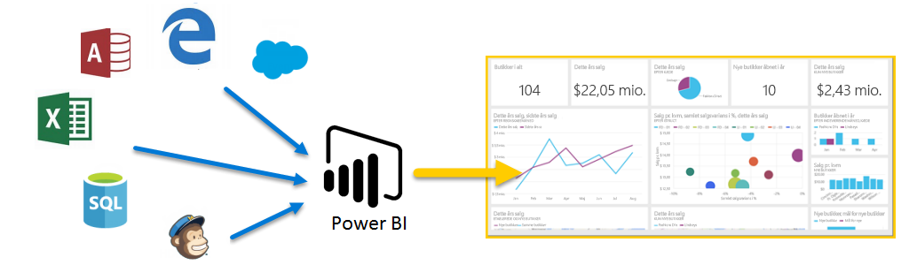

Velkommen til **Automatiseret læring** til Power BI. I dette selvstyrede onlinekursus får du kendskab til Power BI bid for bid, så du kan opbygge din viden fra bunden.

Kurset er designet som en vejledning inddelt i mindre og letforståelige afsnit med et logisk forløb, som hjælper dig med at få indblik i begreber, detaljer og eksempler. Kurset indeholder desuden en masse visuelle elementer, som med fordel kan bruges i læringsprocessen.

Dette kursus med **Automatiseret læring** indeholder mange **afsnit**, og hvert afsnit omfatter mange **emner**. Efter de første par emner i dette **Indledende** afsnit suppleres næsten alle emner af en video, som beskriver, hvad du kan få mere at vide om. Indholdet under videoen beskriver konceptet nærmere, så du kan granske og lære i dit eget tempo.

Hvis du er **nybegynder**, vil dette Power BI-kursus få dig i gang med programmet, og hvis du er en **erfaren** Power BI-bruger, så vil kurset binde koncepterne sammen og fylde hullerne. Vi håber, du vil få gavn af kurset, og ser frem til at inkludere mere indhold i fremtiden.

## Hvad er Power BI?
**Power BI** er en samling af softwaretjenester, apps og forbindelser, der arbejder sammen for at forvandle usammenhængende data til faste, visuelt fordybende og interaktive indsigter. Uanset om dataene er et enkelt Excel-regneark eller en samling cloudbaserede og lokale hybride datalagre, så giver **Power BI** dig let adgang til at oprette forbindelse til dine datakilder, visualisere (eller granske) vigtige elementer og dele indholdet med alle.

**Power BI** kan være enkelt og hurtigt – i stand til at oprette hurtige indsigter ud fra et Excel-regneark eller en lokal database. Men **Power BI** er også et robust program i virksomhedsklassen, der er klar til omfattende udformning og realtidsanalyser samt tilpasset opbygning. Det kan dermed være både et personligt rapporterings- og visualiseringsværktøj samt fungere som et analyse- og beslutningsprogam bag gruppeprojekter, divisioner eller hele selskaber.

## Delene i Power BI
Power BI består af et desktopprogram i Windows kaldet **Power BI Desktop**, der er en online SaaS (*Software, som en tjeneste*) kaldet **Power BI-tjeneste**, og mobile Power BI-**apps**, der fås på telefoner og tablets fra Windows samt til iOS- og Android-enheder.

Disse tre elementer – **Desktop**-programmet, **tjenesten** og **Mobil**-programmet – er designet til at give adgang til at oprette, dele og forbruge forretningsindsigter på en måde, der opfylder brugernes behov eller rolle mest effektivt.

## Sådan passer Power BI til din rolle
Din brug af Power BI kan afhænge af din rolle i et projekt eller på et team. Andre bruger måske Power BI på en anden måde, der svarer til deres rolle, hvilket er helt fint.

Måske bruger du primært **Power BI-tjenesten**, mens en talfokuseret kollega med ansvar for oprettelse af forretningsrapporter overvejende bruger **Power BI Desktop** (og udgiver Desktop-rapporter til Power BI-tjenesten, som du derefter får vist). Og en anden kollega arbejder måske med salg, hovedsageligt bruger Power BI-telefonappen til at holde styr på salgskvoter og til at analysere nye salgsemners oplysninger.

Du bruger måske også hvert element af **Power BI** på forskellige tidspunkter, afhængigt af hvad du forsøger at opnå, eller hvad din rolle er i et givent projekt eller tiltag.

Måske får du få vist lager- og produktionsgangen i et realtidsdashboard i tjenesten og bruger også **Power BI Desktop** til at oprette rapporter til dit eget team baseret på statistikker over kundeengagement. Din brug af Power BI kan være baseret på hvilken funktion eller tjeneste i Power BI, der passer bedst til situationen, men hver del af Power BI er tilgængelig for dig på en særdeles fleksibel og avanceret måde.

Vi behandler disse tre elementer – **Desktop**-programmet, **tjenesten** og **Mobil**-appsene – nærmere lidt senere i dette kursus med **Automatiseret læring**. Vi opretter også rapporter i Power BI Desktop, deler dem i tjenesten og analyserer dem desuden på vores mobilenhed i kommende artikler.

## Arbejdsgangen i Power BI
Som regel starter arbejdsgangen i Power BI i **Power BI Desktop**, hvor der oprettes en rapport. Rapporten udgives derefter i Power BI-**tjenesten** og deles, så brugere af **Power BI Mobile**-appsene kan forbruge oplysningerne.

Det er ikke altid, at arbejdet udføres på denne måde, hvilket er fint nok, men vi bruger ovenstående arbejdsgang til at beskrive de forskellige dele af Power BI, og måden de komplementerer hinanden på.

Vi har nu givet et overblik over kurset, beskrevet hvad Power BI er samt dets tre hovedelementer, så nu vil vi se på, hvordan **Power BI** bruges.

