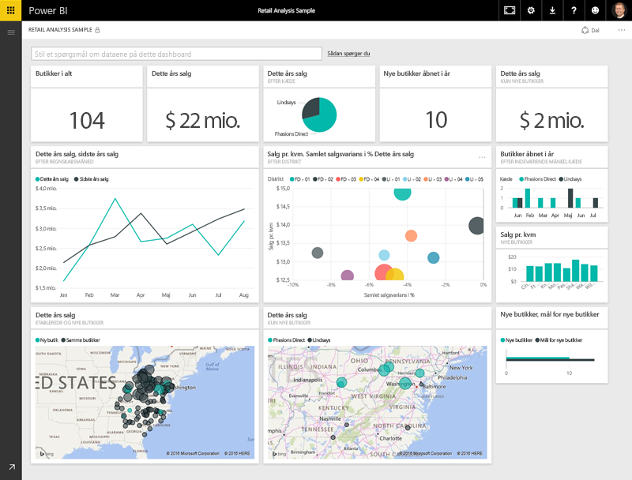
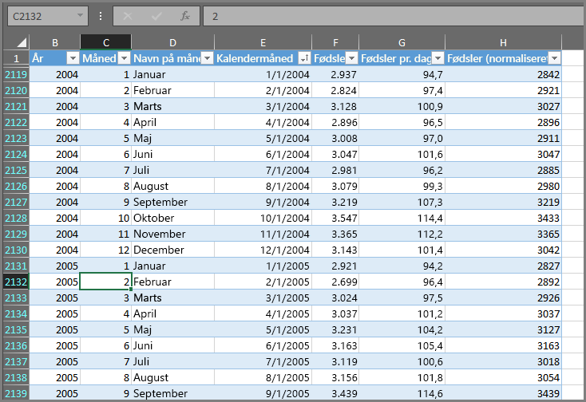
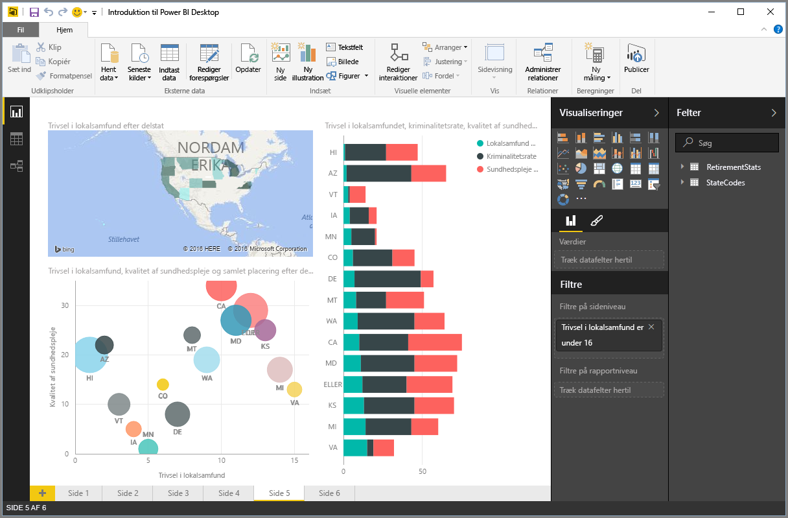
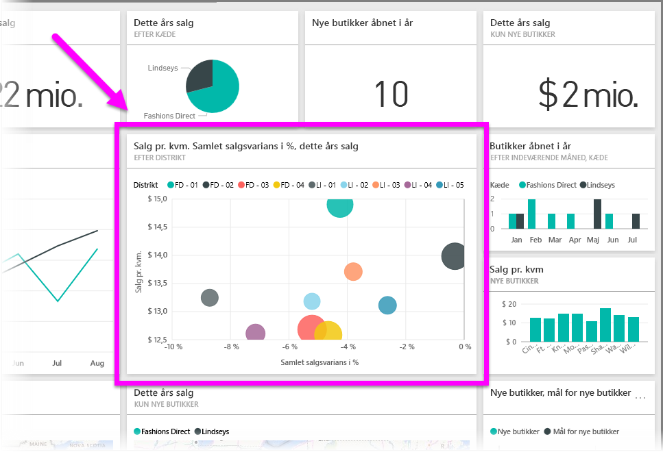

Alle funktionerne i Power BI kan brydes ned til nogle få grundlæggende **byggesten**. Når du er bekendt med disse byggesten, kan du bygge videre på dem alle hver især og begynde at oprette detaljerede og komplekse rapporter. Selv komplekse ting er jo opbygget af grundlæggende byggesten – bygninger er bygget af træ, stål, beton og glas. Biler består af metal, stof og gummi. Bygninger og biler kan selvfølgelig også være basale og detaljerede – afhængigt af hvordan de pågældende byggesten er tilrettelagt.

Lad os kigge nærmere på disse grundlæggende byggesten og granske nogen af de enkle ting, der kan bygges med dem og derefter give et kort indblik i, hvordan komplekse ting kan opbygges.

Nedenstående er de grundlæggende byggesten i Power BI:

* Visualiseringer
* Datasæt
* Rapporter
* Dashboards
* Felter

## Visualiseringer
En **visualisering** (også kaldet et **visuelt element**) er en visuel gengivelse af data, f.eks. et diagram, en graf, et farvekodet kort eller andre interessante ting, du kan lave for at repræsentere data visuelt. Power BI indeholder mange forskellige visualiseringstyper og flere kommer til hele tiden. Det følgende billede viser en samling af forskellige visualiseringer, der er blevet oprettet i Power BI-tjenesten.

Visualiseringer kan være enkle – f.eks. et enkelt tal, der repræsenterer noget væsentligt – eller de kan være visuelt komplekse – som f.eks. et farvegradueret kort, der viser stemningen blandt vælgere i relation til et vist samfundsproblem eller sag. Målsætningen med et visuelt element er at præsentere data på en måde, der giver kontekst og indsigt, hvilket kan være svært at tyde ud fra en rå tabel med numre og tekst.

## Datasæt
Et **datasæt** er en samling af data, som Power BI bruger til at oprette visualiseringer.

Du kan have et simpelt datasæt baseret på en enkelt tabel fra en Excel-projektmappe – svarende til det viste i det følgende billede.

**Datasæt** kan også være en kombination af mange forskellige kilder, som du kan filtrere og kombinere, så det viser en entydige samling af data (et datasæt) til brug i Power BI.

Du kan f.eks. oprette et datasæt ud fra tre forskellige databasefelter, en webstedstabel, en Excel-tabel og onlineresultater af en mailmarketingkampagne. Denne entydige kombination behandles stadig som et enkelt **datasæt**, selvom den blev trukket sammen ud fra mange forskellige kilder.

Når du filtrerer data, før de indføres i Power BI, så kan du fokusere på de væsentligste data. Du kan f.eks. filtrere kontaktdatabasen, så kun kunder, der har modtaget mails fra marketingkampagnen, er blevet inkluderet i datasættet. Du kan derefter oprette visuelle elementer baseret på dette udsnit (den filtrerede samling) af kunder, som var inkluderet i kampagnen. Du kan med fordel bruge filtrering til at fokusere på dine data og din indsats.

Et vigtigt og kompetencegivende aspekt af Power BI er de mange medfølgende data**tilslutninger**. Uanset om de ønskede data er i Excel eller en SQL-database, i Azure eller Oracle, er i en tjeneste som f.eks. Facebook, Salesforce eller MailChimp, så har Power BI indbyggede datatilslutninger, der let kan forbindes til de pågældende data, filtreres om nødvendigt og overføres til dit datasæt.

Når du har et datasæt, så kan du begynde at oprette visualiseringer, der viser forskellige dele af datasættet på forskellige måder – og opnå indsigter gennem de viste elementer. Det er her, rapporter kommer ind i billedet.

## Rapporter
I Power BI er en **rapport** en samling visualiseringer, der vises sammen på én eller flere sider. På samme måde som med enhver anden rapport, som du kan oprette til en salgspræsentation, eller en rapport du skal skrive til en skoleopgave, så er en **rapport** i Power BI en samling af elementer, der er relateret til hinanden. Følgende billede viser en **rapport** i Power BI Desktop – i dette tilfælde er det femte side i en rapport på seks sider. Du kan også oprette rapporter i Power BI-tjenesten.

Rapporter giver dig adgang til at oprette mange visualiseringer på mange forskellige sider efter behov, og de giver dig mulighed for at tilrettelægge dem på en måde, som illustrerer din historie bedst muligt.

Måske handler din rapport om kvartalsvist salg, om produktstigning i et bestemt segment, eller måske ønsker du at oprette en rapport om isbjørnes migrationsmønstre. Uanset hvilke emner du arbejder med, så kan du bruge rapporter til at samle og organisere dine visualiseringer på én eller flere sider.

## Dashboards
Når du er klar til at dele en enkelt side af en rapport, eller dele en samling af visualiseringer, så skal du oprette et **dashboard**. Et **dashboard** i Power BI består af en samling af visuelle elementer fra en enkelt side, som du vil dele med andre. Der er ofte tale om en udvalgt gruppe af visuelle elementer, der giver et hurtigt indblik i dataene eller fortællingen, du vil præsentere.

Et dashboard skal kunne være på én side, der ofte kaldes et lærred (lærredet er den blanke baggrund i Power BI Desktop, eller tjenesten, hvor du anbringer dine visualiseringer). Den kan sammenlignes med et lærred, som en kunstmaler bruger – et arbejdsområde, hvor du skaber, kombinerer og redigerer interessante og overbevisende visuelle elementer.
Du kan dele dashboards med andre brugere eller grupper, der derefter kan interagere med dit dashboard, når de er i Power BI-tjenesten eller på deres mobilenhed.

## Felter
I Power BI er et **felt** en enkelt visualisering, der findes i en rapport eller på et dashboard. Det er det trekantede felt, der indeholder hver enkelt visuelle element. På det følgende billede kan du se ét felt (indrammet), som også er omgivet af andre felter.

Når du *opretter* en rapport eller et dashboard i Power BI, kan du flytte eller tilrettelægge felter alt efter, hvordan du vil præsentere dine oplysninger. Du kan gøre dem større, ændre deres højde eller bredde og anbringe dem tæt op ad andre felter, alt efter dine behov.

Når du får *vist* eller *bruger* et dashboard eller en rapport – hvilket betyder, at du ikke har oprettet eller er ejeren, men at det pågældende er blevet delt med dig – så kan du interagere med det, men ikke ændre størrelsen på felterne eller ændre på tilrettelæggelsen.

## Så er alt samlet
Vi har nu gennemgået alt det grundlæggende om Power BI og programmets byggesten. Lad os lige bruge et øjeblik på at rekapitulere.

Power BI er en samling af tjenester, apps og forbindelser, der gør det muligt at oprette forbindelse til dine data – uanset hvor de er placeret – filtrere dem om nødvendigt og derefter føre dem ind i Power BI, hvor du kan oprette overbevisende visualiseringer, du kan dele med andre.  

Nu hvor du har fået indsigt i samlingen af grundlæggende byggesten i Power BI, så er det blevet tydeligt, at du kan oprette datasæt, der giver mening *for dig* og oprette visuelt overbevisende rapporter, der fortæller din historie. Beretninger fortalt med Power BI behøver ikke være komplekse eller komplicerede for at virke overbevisende.

Nogle kan få stor fordel ud af at bruge Power BI med en enkelt Excel-tabel i et datasæt og derefter dele et dashboard med sit team.

Andre vil drage fordel af at bruge Azure SQL Data Warehouse-realtidstabeller i Power BI, der kombinerer med andre databaser og realtidskilder, som derefter bliver filtreret i realtid for at oprette et datasæt, der overvåger den momentvise fremstillingsproces.

Processen er i begge tilfælde den samme: opret datasæt, opret overbevisende visuelle elementer og del dem med andre. Resultatet er også identisk i begge tilfælde: udnyt den stigende mængde af data og forvandl dem til indsigter, der kan handles på.

Uanset om dine dataindsigter kræver simple eller komplekse datasæt, så hjælper Power BI dig med at komme hurtigt i gang og kan udvides iht. dine behov og være lige så komplekse, som dit dataunivers kræver. Og idet Power BI er et Microsoft-produkt, kan du være sikker på, at det er robust, kan udvides, er Office-venligt og klar til erhvervsbrug.

Lad os se, hvordan det fungerer. Vi begynder med at kaste et hurtigt blik på Power BI-tjenesten.

