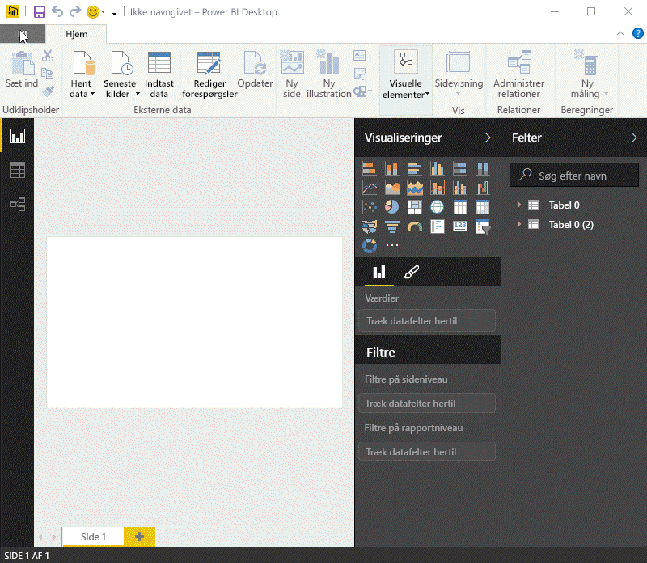
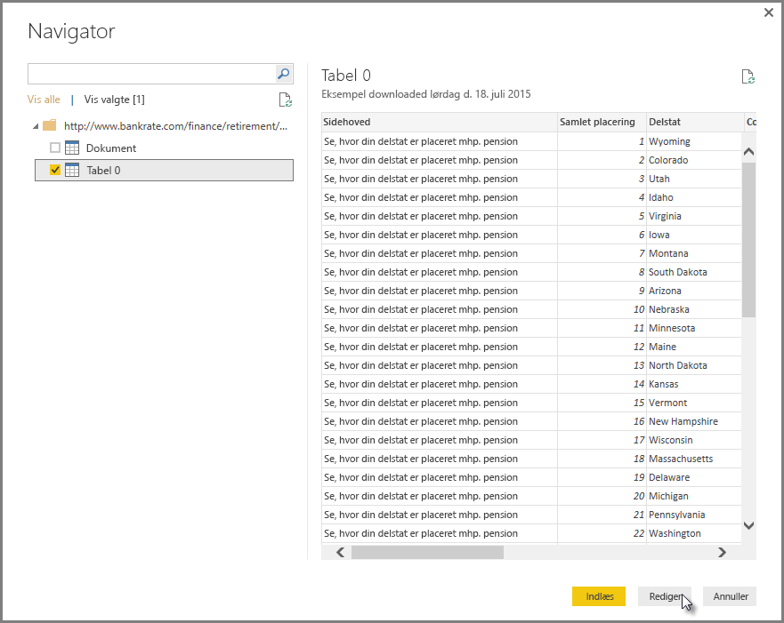
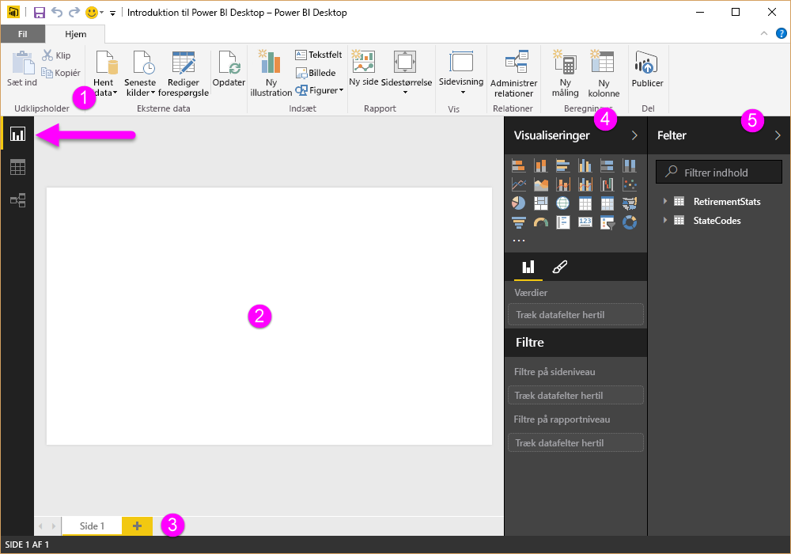
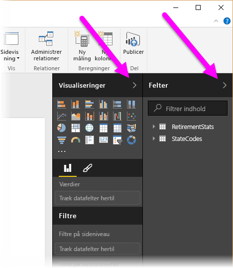
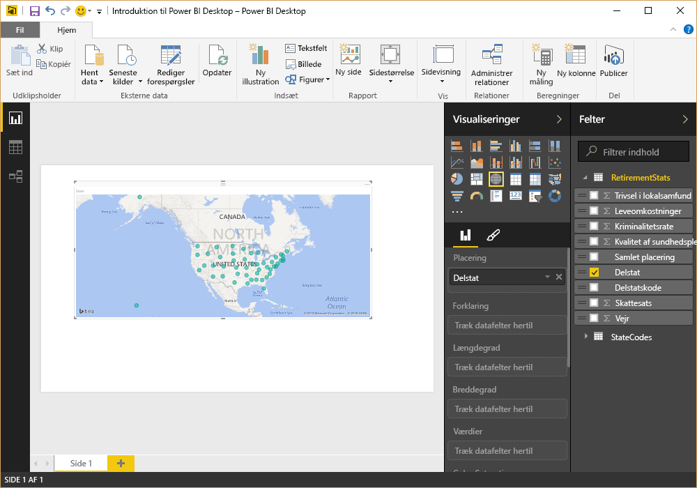
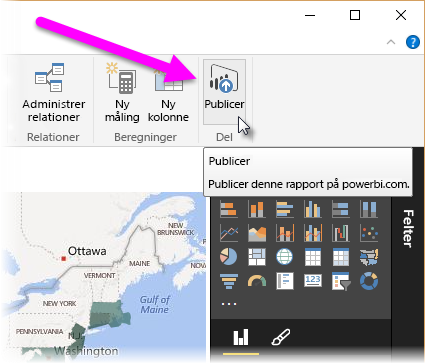
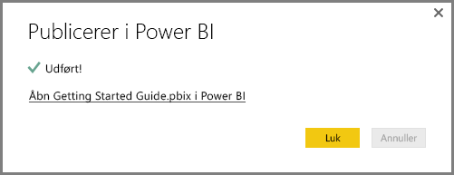
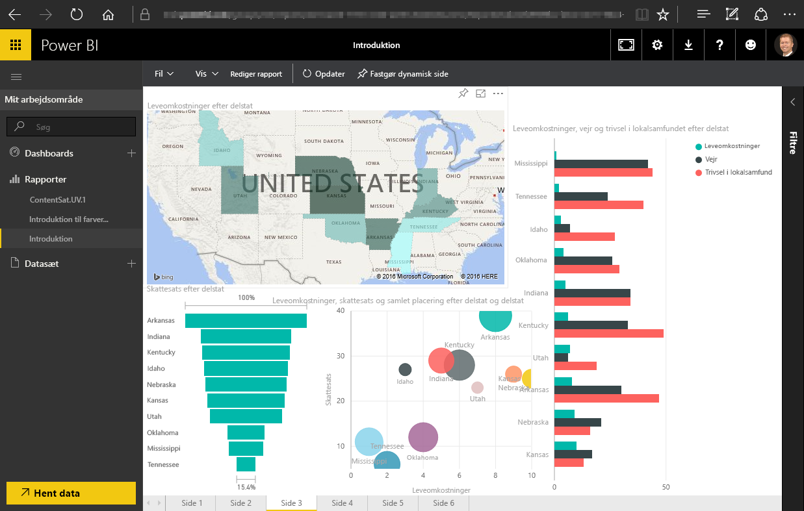
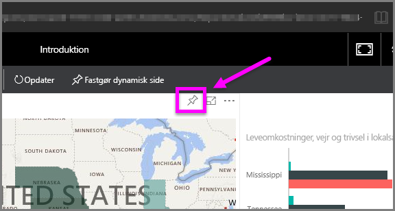
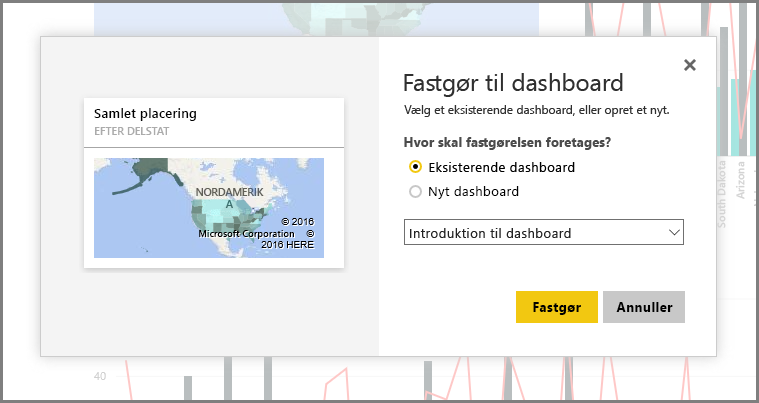

I dette emne ser vi nærmere på, hvordan de første to dele af Power BI passer sammen:

* Opret en rapport i **Power BI Desktop**
* Udgiv rapporten i **Power BI-tjenesten**

Vi starter i Power BI Desktop, og vælger **Hent data**. Indsamlingen af datakilder vises, hvor du kan vælge en datakilde. I billedet nedenfor vises, at en webside vælges som kilde – i videoen ovenfor, valgte Will en **Excel**-projektmappe.

Uanset hvilken datakilde, du vælger, så opretter Power BI forbindelse til den pågældende datakilde og viser dig de tilgængelige data fra kilden. Det følgende billede viser et andet eksempel – her fra en webside, der analyserer forskellige tilstande og nogle interessante tilbagetrækningsstatistikker.

I visningen **Rapport** i Power BI Desktop kan du begynde at oprette rapporter.

Visningen **Rapport** har fem hovedområder:

1. Båndet, som viser almindelige opgaver, der er knyttet til rapporter og visualiseringer
2. Visningen **Rapport**, eller lærred, hvor visualiseringer oprettes og arrangeres
3. Faneområdet **Sider** langs bunden, hvor du kan vælge eller tilføje en rapportside
4. Ruden **Visualiseringer**, hvor du kan ændre visualiseringer, tilpasse farver eller akser, anvende filtre, trække felter m.m.
5. Ruden **Felter**, hvorfra forespørgselselementer og filtre kan trækkes til visningen **Rapport** eller trækkes til området **Filtre** i ruden **Visualiseringer**

Ruden **Visualiseringer** og **Felter** kan skjules ved at vælge den lille pil langs med kanten, så der er mere plads i visningen **Rapport** til at oprette flotte visualiseringer. Når du redigerer visualiseringer, får du også vist disse pile pegende op eller ned, hvilket betyder, at du kan udvide eller skjule det pågældende afsnit tilsvarende.

For at oprette en visualisering skal du bare trække et felt fra listen **Felter** over på visningen **Rapport**. I dette tilfælde trækker vi feltet Stat fra *RetirementStats* og ser, hvad der sker.

Således... Power BI Desktop har automatisk oprettet en kortbaseret visualisering, fordi det har genkendt, at feltet Stat indeholdt geoplaceringsdata.

Lad os nu spole lidt frem – til efter vi har oprettet en rapport med nogle få visualiseringer – vi er nu klar til at udgive dette indhold til Power BI-tjenesten. På båndet **Hjem** i Power BI Desktop skal du vælge **Udgiv**.

Du bliver bedt om at logge på Power BI.

Når du er logget på, og udgivelsesprocessen er gennemført, så får du vist den følgende dialogskærm. Du kan vælge linket (under **Udført!**) for at gå til Power BI-tjenesten, hvor du kan se rapporten, du netop har udgivet.

Når du logger på Power BI, får du vist Power BI Desktop-filen, som du netop har udgivet i tjenesten. I billedet nedenfor vises den oprettede rapport i Power BI Desktop i afsnittet **Rapporter**.

I den rapport kan jeg vælge **tegnestift**-ikonet for at fastgøre det visuelle element til et dashboard. Det følgende billede viser tegnestift-ikonet indrammet og med en pil.

Når jeg vælger den, vises den følgende dialogskærm, hvor jeg kan fastgøre det visuelle element til et eksisterende dashboard eller oprette et nyt dashboard.

Når vi fastgør et par visuelle elementer fra vores rapport, kan vi se dem i dashboardet.

Der er selvfølgelig meget andet, du kan gøre med Power BI, som f.eks. at dele de dashboards du opretter. Vi drøfter deling senere i dette kursus.

I næste afsnit ser vi på en funktion, der automatisk kan oprette dashboards for dig, blot ved at oprette forbindelse til en cloudtjeneste som Facebook, Salesforce m.fl.

