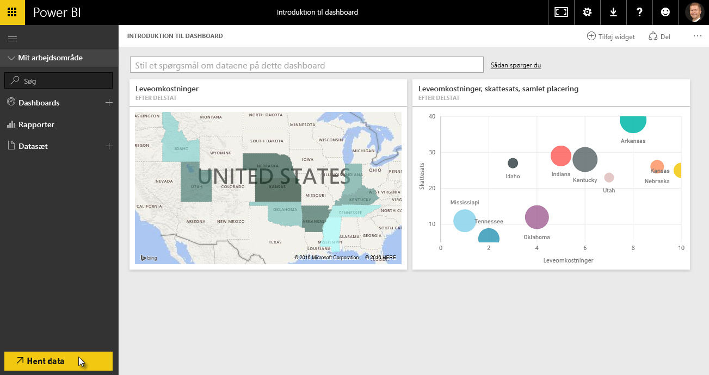
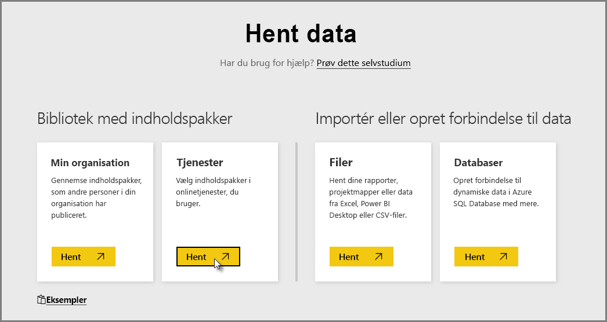
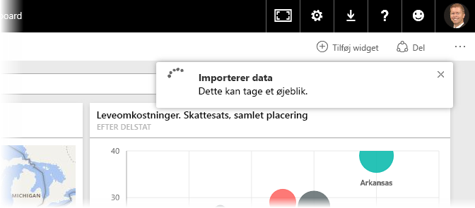
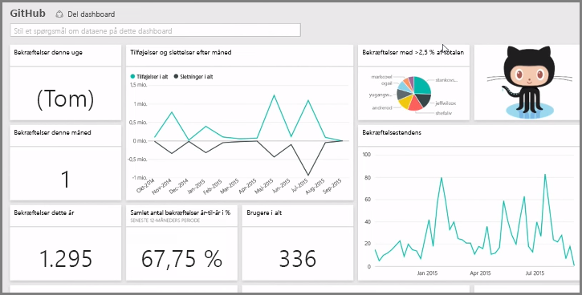
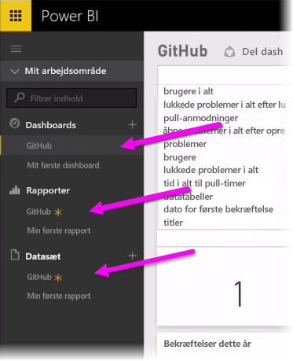
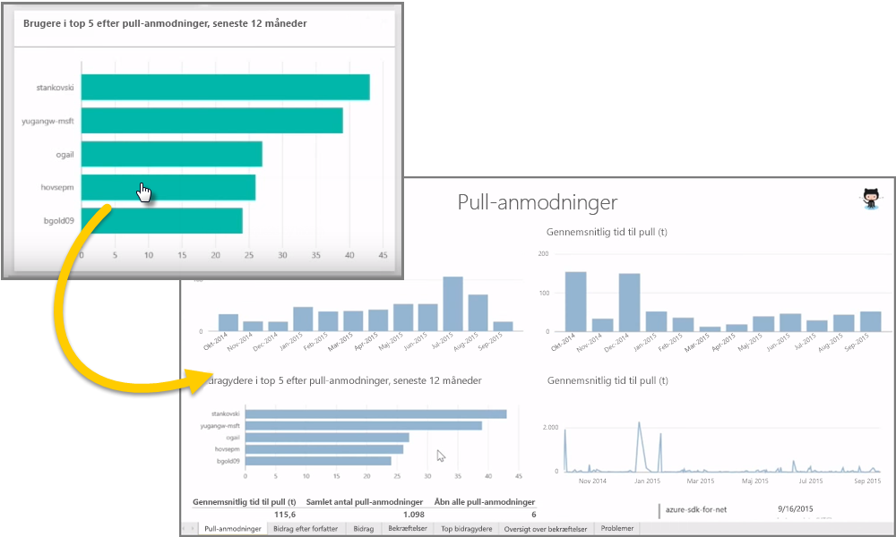
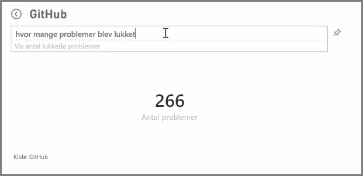
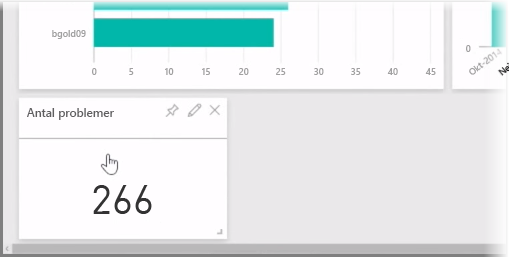
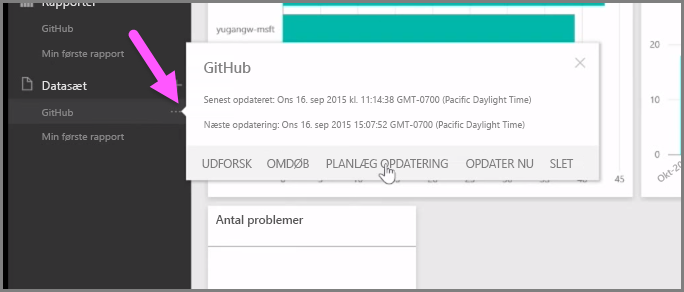

Vi har lært, at den hyppigste arbejdsgang i Power BI er at oprette en rapport i Power BI Desktop, udgive den i Power BI-tjenesten og derefter dele den med andre, så de kan få vist den i tjenesten eller på en mobil-app.

Nogle brugere starter dog i Power BI-tjenesten, så vi tager et hurtigt kig på tjenesten og får mere at vide om, hvordan man let og hurtigt opretter visuelle elementer i Power BI med *indholdspakker*.

En **indholdspakke** er en samling af forudkonfigurerede og færdiglavede visuelle elementer og rapporter baseret på specifikke datakilder som f.eks. Salesforce. En indholdspakke fungerer som at sætte en færdigret i mikrobølgeovnen eller bestille et hurtigt måltid henne på fastfoodrestauranten: du får via nogle få klik og kommentarer hurtigt adgang til en samling indgange, der er designet til at arbejde tæt sammen. Alt er pænt indpakket og klar til brug.

Lad os kaste et hurtigt blik på indholdspakker, tjenesten og funktionsmåden. Vi forklarer nærmere om indholdspakker (og tjenesten) i kommende afsnit; her vil vi kun give en smagsprøve på tjenesten for at skærpe appetitten.

## Opret færdige dashboards med cloud-tjenester
Det er let at oprette forbindelse til data med Power BI. Fra Power BI-tjenesten kan du blot vælge knappen **Hent data** nederst til venstre på startskærmen.

*Lærredet* (området i midten af Power BI-tjenesten) viser de tilgængelige datakilder i Power BI-tjenesten. Udover gængse datakilder som f.eks. Excel-filer, databaser eller Azure-data, kan Power BI oprette forbindelse til **softwaretjenester** (også kaldet SaaS-udbydere eller cloud-tjenester) som f.eks. Salesforce, Facebook, Google Analytics og en lang række af andre SaaS-tjenester lige så let.

I relation til disse softwaretjenester leverer **Power BI-tjenesten** en samling af færdiglavede visuelle elementer, der allerede er arrangeret i dashboards og rapporter kaldet **Indholdspakker**. Indholdspakker får dig hurtigt op at køre i Power BI med data fra din valgte tjeneste. Når du f.eks. bruger Salesforce-indholdspakken, så forbinder Power BI dig til Salesforce-kontoen (når du angiver dine legitimationsoplysninger) og udfylder derefter en foruddefineret samling af visuelle elementer og dashboards i Power BI.

Power BI leverer indholdspakker til alle typer af tjenester. Det følgende billede viser det første skærmbillede af tjenesterne, i alfabetisk rækkefølge, der vises, når du vælger **Hent** i feltet **Tjenester** (vist i det forrige billede). Som du kan se af billedet nedenfor, så er udvalget stort.

Vi vælger **GitHub**. GitHub er et program beregnet til online-versionsstyring. Når jeg angiver oplysninger og legitimationsoplysninger for GitHub-indholdspakken, begynder det at importere dataene.

Når dataene er indlæst, vises det foruddefinerede dashboard til GitHub-indholdspakken.

Ud over **Dashboardet** er **Rapporten**, der blev genereret (som en del af GitHub-indholdspakken) til at oprette dashboardet, også tilgængelig, og det samme er **datasættet** (samlingen af data, der er hentet fra GitHub), der blev oprettet under dataimporten og brugt til at oprette GitHub-rapporten.

På dashboardet kan du klikke på enhver af de visuelle elementer og automatisk overføre dem til siden **Rapport**, hvorfra det pågældende visuelle element blev oprettet. Så når der klikkes på **De fem hyppigste brugere efter pullanmodninger**, så åbner Power BI siden **Pullanmodninger** i rapporten (siden Rapport, hvorfra det pågældende visuelle element blev oprettet).

## Spørg dine data
Du kan også stille spørgsmål til dine data, hvorefter Power BI-tjenesten opretter visuelle elementer, i realtid, baseret på dit spørgsmål. I det følgende billede kan du se, at Power BI opretter et visuelt nummerelement visende antallet af afsluttede problemer baseret på det indtastede indhold på linjen **Forespørgsel på et naturligt sprog**.

Når du har fundet dit foretrukne visuelle element, kan du vælge **tegnestift**-ikonet til højre for linjen Forespørgsel på et naturligt sprog for at fastgøre det visuelle element til dashboardet. Det visuelle element fastgøres i dette tilfælde til GitHub-dashboardet, idet det er dashboardet, der er valgt i øjeblikket.

## Opdatering af data i Power BI-tjenesten
Du kan også vælge at **opdatere** datasættet for en indholdspakke eller for andre data, du bruger i Power BI. Du angiver indstillinger for opdatering ved at vælge ellipsen (tre punkter) ud for et datasæt for at åbne en menu.

Vælg indstillingen **Planlæg opdatering** i bunden af menuen. Dialogboksen Indstillinger vises på lærredet, hvor du kan angive opdateringsindstillingerne, som opfylder dine behov.

Vi har nu kastet et kort blik på Power BI-tjenesten. Der er mange flere ting, du kan gøre med tjenesten, hvilket vi behandler senere i dette kursus. Vær desuden opmærksom på, at du kan oprette forbindelse til mange forskellige typer data og indholdspakker, som der kommer flere af hele tiden.

Vi går nu videre til næste emne, hvor vi opsummerer ovenstående afsnit, **Introduktion**, så du er klædt på til det næste.

