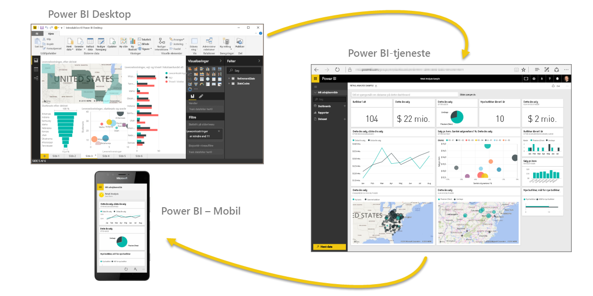

Lad os hurtigt opfriske det, vi gennemgik i første afsnit.

**Power BI** er en samling af softwaretjenester, apps og forbindelser, der arbejder sammen for gøre dataene til interaktive indsigter. Du kan bruge data fra enkle, grundlæggende kilder, f.eks. en Excel-projektmappe, eller trække data ind fra flere databaser og skybaserede kilder for at oprette komplekse datasæt og rapporter. Power BI kan være så enkel, som du ønsker, eller så klar til brug i virksomheden, som din komplekse, globale virksomhed kræver.

Power BI består af tre hovedelementer: **Power BI Desktop**, **Power BI-tjenesten** og **Power BI - Mobil**, som alle arbejder sammen, så du kan oprette, interagere med, dele og forbruge dine data, som du ønsker det.

Vi drøftede også de grundlæggende byggesten i Power Bi, som er:

* **Visualiseringer**: en visuel gengivelse af data. Nogle gange kalder vi dem også for visuelle elementer
* **Datasæt**: en samling af data, som Power BI bruger til at oprette visualiseringer
* **Rapporter**: en samling visuelle elementer fra et datasæt, der strækker sig over én eller flere sider
* **Dashboards**: en enkelt side med samling af visuelle elementer, bygget fra en rapport
* **Fliser**: enkelt visualisering, der er fundet i en rapport eller et dashboard

Herfra tog vi et blik på Power BI i en videorundvisning med vores guide, **Will Thompson**. Will gav os et hurtigt overblik over, hvordan du kan analysere og visualisere data med Power BI.

<!---
In **Power BI Desktop**, we connected to a basic Excel file, created visualizations, then published those visualizations to the service. Even if you use Power BI only with your Excel workbooks, you can gain amazing visual insights with those Excel workbooks, and both interact and share it in ways never before possible.
-->
I **Power BI-tjenesten** oprettede vi et dashboard med nogle få klik. Vi fortsatte med et indblik i Power BI-tjenesten og brugte en **Indholdspakke**; en færdig samling visuelle elementer og rapporter og oprettede forbindelse til en **softwaretjeneste** for at udfylde indholdspakken og gøre dataene levende.

Vi brugte også forespørgsler på naturligt sprog, der kaldes **Spørgsmål og svar**, til at stille spørgsmål fra vores svar, og lod Power BI oprette visuelle elementer baseret på disse spørgsmål. Endelig konfigurerede vi en **Tidsplan for opdatering** for vores data, så vi ved, at når vi går tilbage til Power BI-tjenesten, er disse data nye.

## Næste trin
**Tillykke!** Du har gennemført det første afsnit af kurset **Automatiseret læring** til Power BI. Du har nu et solidt vidensfundament til at gå videre til næste afsnit, **Hent data**, som er det næste skridt i det logiske arbejdsflow i Power BI.

Vi har nævnt dette før, men det er værd at gentage: Dette kursus opbygger din viden ved at følge det almindelige arbejdsflow i Power BI:

* Overfør data til **Power BI Desktop**, og opret en rapport.
* **Publicer** til Power BI-tjenesten, hvor du kan oprette nye visualiseringer eller oprette dashboards
* **Del** dine dashboards med andre, især personer, der er på farten
* Få vist og interager med delte dashboards og rapporter i **Power BI - Mobil**-apps

Du udfører måske ikke alt arbejdet selv; nogle personer får kun vist dashboards i tjenesten, der er oprettet af en anden bruger. Der er i orden, men da *du vil* gå gennem alle afsnit i dette kursus, vil du *forstå*, hvordan disse dashboards blev oprettet, og hvordan de er forbundet til dataene... og du kan også vælge at oprette et selv.

Vi ses i næste afsnit!

