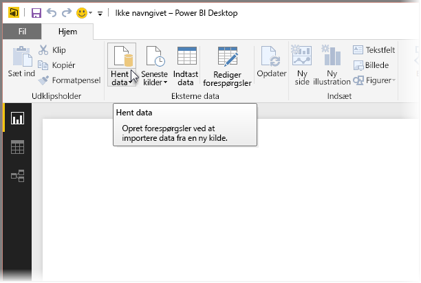
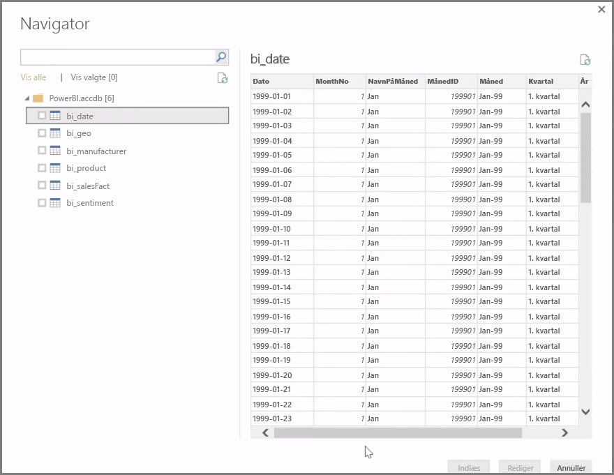
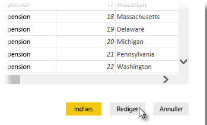

**Power BI Desktop** kan oprette forbindelse til en lang række datakilder, herunder databaser i det lokale miljø, Excel-projektmapper og cloudtjenester. I øjeblikket har over 59 forskellige cloudtjenester som f.eks. GitHub og Marketo specifikke connectors, og du kan oprette forbindelse til generiske datakilder via XML, CSV, tekst og ODBC. Power BI kan endda indsamle data i tabelformat direkte fra et websteds URL-adresse! Men lad os starte fra begyndelse med at åbne Power BI Desktop og oprette forbindelse til data.

Når du starter **Power BI Desktop** og flytter forbi startskærmen, kan du vælge Hent data fra båndet under fanen **Hjem**.

Der er månedlige opdateringer til Power BI Desktop, og med hver opdatering bliver siden med **nyheder om Power BI Desktop** opdateret med oplysninger om opdateringerne, links til bloggen og et downloadlink.

I Power BI Desktop findes der alle mulige forskellige datakilder. Vælg en datakilde for at oprette forbindelse. Afhængigt af dit valg bliver du bedt om at finde kilden på din computer eller dit netværk, eller du bliver bedt om at logge på en tjeneste for at godkende din anmodning.

Når du har oprettet forbindelse, er **navigatoren** det første vindue, du ser. Navigatoren viser tabellerne eller enhederne i datakilden, og når du klikker på en, får du vist indholdet. Du kan derefter importere de valgte tabeller eller enheder med det samme eller vælge **Rediger** for at transformere og rense dataene, før du importerer.

Når du har valgt de tabeller, som du vil indsætte i Power BI Desktop, kan du vælge at indlæse dem i Power BI Desktop ved at vælge knappen **Indlæs** i nederste højre hjørne af **navigatoren**. Du kan dog nogle gange have brug for at foretage ændringer af tabellerne, før du indlæser dem i Power BI Desktop. Du har måske kun brug for et undersæt af kunder eller vil filtrere dataene for salg kun i et bestemt land. Du kan i disse tilfælde vælge knappen Rediger og filtrere eller transformere disse data, før du overfører dem alle til Power BI Desktop.

Det vender vi tilbage til og redigerer vores data i det næste afsnit.

