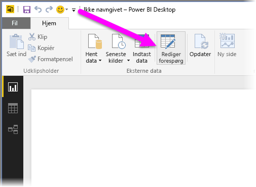
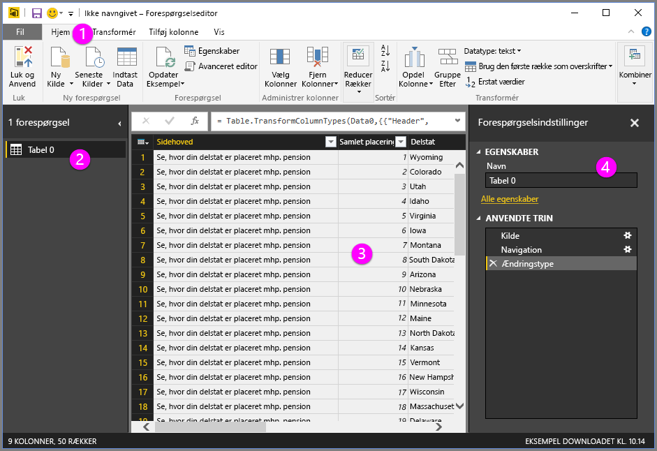
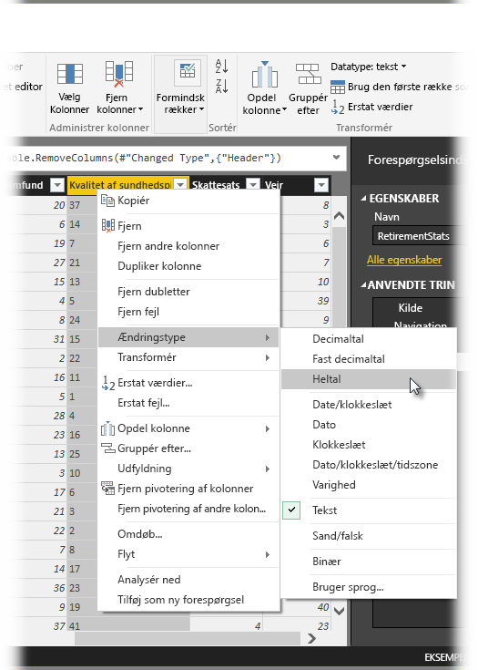
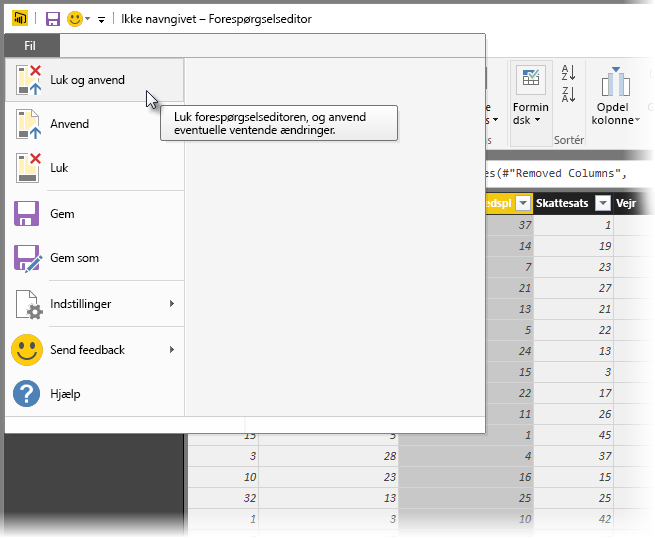
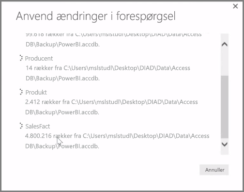

**Power BI Desktop** indeholder **Forespørgselseditoren**, som er et stærkt redskab til formning og omformning af data, så de er klar til dine modeller og visualiseringer. Når du vælger Rediger fra Navigator, starter forespørgselseditoren og udfyldes med tabellerne eller andre enheder, som du har valgt fra datakilden.

Du kan også starte **Forespørgselseditoren** direkte fra **Power BI Desktop** ved hjælp af knappen **Rediger forespørgsler** på båndet **Hjem**.

Når der er indlæst data i forespørgselseditoren, der er klar til, at du former dem, kan du se en håndfuld sektioner:

1. På båndet er mange knapper nu aktive for at kommunikere med dataene i forespørgslen
2. I venstre rude er forespørgslerne (én for hver tabel eller enhed) angivet og kan vælges, vises og udformes
3. I den midterste rude vises data fra den valgte forespørgsel. Disse data kan formes
4. Vinduet Forespørgselsindstillinger vises. Det angiver forespørgslens egenskaber og anvendte trin

I den midterste rude kan du højreklikke på en kolonne, hvorved der vises en række forskellige,tilgængelige transformationer, f.eks. fjernelse af kolonnen fra tabellen, kopiering af kolonnen under et nyt navn og erstatning af værdier. Fra denne menu kan du også opdele tekstkolonner i flere ved fælles afgrænsere.

Båndet **Forespørgselseditor** indeholder yderligere funktioner, f.eks. ændring af kolonnernes datatype, tilføjelse af videnskabelig notation eller udtrækning af elementer fra datoer, f.eks. ugedagen.

Når du anvender transformationer, vises hvert trin i listen **Anvendte trin** i ruden **Forespørgselsindstillinger** i højre side af **Forespørgselseditoren**. Du kan anvende denne liste til at fortryde eller gennemse specifikke ændringer eller ændre navnet på et trin. Markér **Luk og anvend** på fanen **Hjem** for at gemme dine transformationer.

Når du har valgt **Luk og anvend**, anvender forespørgselseditoren de ændringer i forespørgslen, du har lavet, på Power BI Desktop.

Der er alle mulige forskellige ting, du kan foretage, når du omformer data i **Forespørgselseditoren**, herunder avancerede transformationer. I næste afsnit vi ser på nogle af disse avancerede transformationer for at give dig et indblik i de næsten uendelige antal måder, du transformere dine data med **Forespørgselseditoren**.

