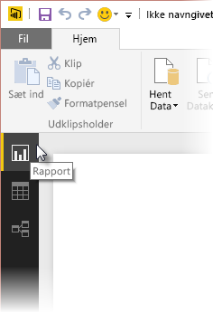
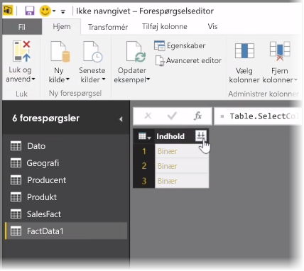
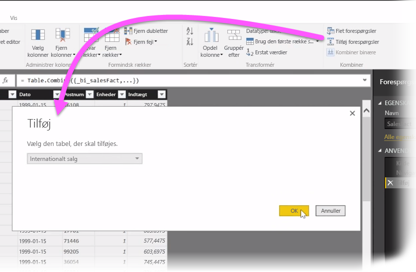
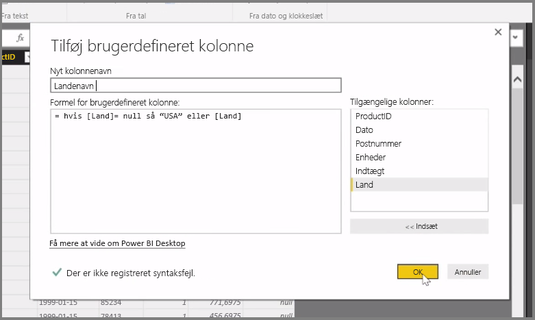

I denne artikel undersøger vi nogle avancerede dataimporterings- og -rensningsteknikker til **Power BI Desktop**. Når du har formet dine data i **Forespørgselseditoren** og lagt dem i **Power BI Desktop**, kan du se dem på forskellige måder. Der er tre visninger i Power BI Desktop: **Rapport**, **Data** og **Relationer**. Du kan se hver visning ved at vælge på dens ikon øverst til venstre på lærredet. I det følgende billede er visningen **Rapport** valgt. Den gule søjle ud for ikonet angiver, hvilken visning der er aktiv.

Hvis du vil ændre visningen, skal du blot vælge en af de andre to ikoner. Den gule søjle ud for ikonet angiver, hvilken visning der er aktiv.

Power BI Desktop kan til enhver tid under udformningsprocessen kombinere data fra flere kilder til en enkelt rapport. Hvis du vil føje flere datakilder til en eksisterende rapport, skal du vælge **Rediger forespørgsler** i båndet **Hjem** og derefter vælge **Ny kilde** i **Forespørgselseditor**.

Der er mange forskellige mulige datakilder, du kan bruge i **Power BI Desktop**, herunder Mapper. Når du opretter forbindelse til en mappe, kan du importere data fra flere filer på én gang, f.eks. en række Excel-filer eller CSV-filer. De filer, der er indeholdt i den valgte mappe, vises i **Forespørgselseditor** som binært indhold, og hvis du klikker på ikonet med dobbeltpil øverst i kolonnen **Indhold**, indlæses deres værdier.

Et af Power BIs mest nyttige værktøjer er dens *Filtre*. Hvis du f.eks. vælger rullepilen ved siden af en kolonne, åbnes en tjekliste til tekstfiltre, som du kan bruge til at fjerne værdier fra din model.

Du kan også flette og tilføje forespørgsler og slå flere tabeller (eller data fra forskellige filer i mapper) sammen til en enkelt tabel, der indeholder de ønskede data. Du kan bruge værktøjet **Tilføj forespørgsler** til at føje dataene fra en ny tabel til en eksisterende forespørgsel. Power BI Desktop forsøger at matche kolonnerne i dine forespørgsler, som du derefter kan justere efter behov i **Forespørgselseditoren**.

Endelig giver værktøjet **Tilføj brugerdefineret kolonne** avancerede brugere mulighed for at skrive forespørgselsudtryk fra bunden med det effektive M-sprog. Du kan tilføje en brugerdefineret kolonne, der er baseret på M-forespørgselssætninger, og få dine data på den måde, du ønsker dem.

