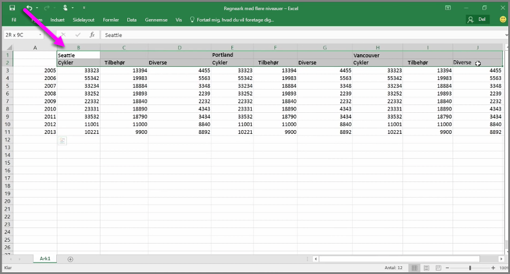
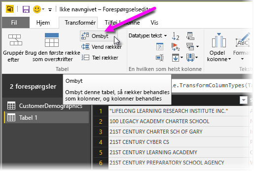
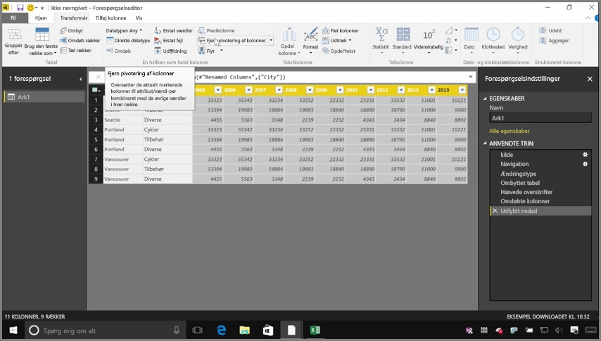
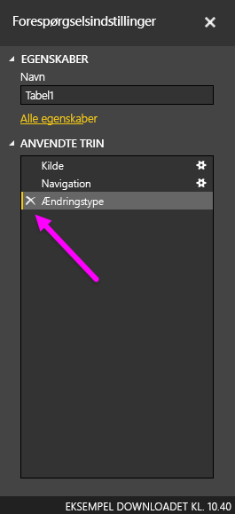
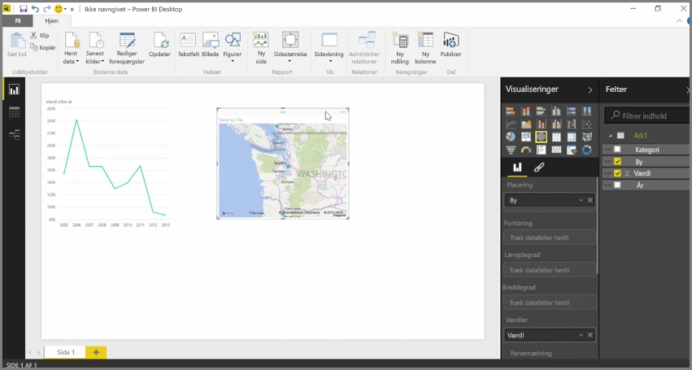

Selvom Power BI kan importere dine data fra næsten enhver kilde, så fungerer programmets visualiserings- og udformningsværktøjer bedst med kolonnedata. Nogle gange formateres dataene ikke i simple kolonner, hvilket ofte er tilfældet med Excel-regneark, hvor et tabellayout, der ser flot ud ved første øjekast, ikke nødvendigvis fungerer optimalt ved automatiserede forespørgsler. Det følgende regneark har f.eks. overskrifter, der strækker sig over flere kolonner.

Power BI har heldigvis værktøjer til hurtigt at omdanne tabeller med flere kolonner til datasæt, der kan bruges.

## Ombyt data
Du kan f.eks. bruge **Ombyt** i **Forespørgselseditoren** til at spejlvende data (omdanne kolonner til rækker, og rækker til kolonner), så du kan bryde data ned til formater, som kan manipuleres.

Når du har gjort det et par gange, som vist i videoen, begynder tabellen at ligne noget, som Power BI lettere kan arbejde med.

## Formatering af data
Du skal måske også formatere data, så Power BI kan kategorisere og identificere dataene korrekt, når de importeres.

Med en række transformationer, herunder *opgradering af rækker til overskrifter* for at bryde overskrifter ved hjælp af **Fyld** for at ændre *null*-værdier til de værdier, der findes over eller under en given kolonne, og **Normalisere kolonner**, kan du rense disse data til et datasæt, som du kan bruge i Power BI.

Med Power BI kan du eksperimentere med disse transformationer af data og finde ud af, hvilke typer der ændrer dataene til et givent kolonneformat, så Power BI kan arbejde med dem. Desuden skal du huske på, at alle handlingerne, du foretager, optages i afsnittet Anvendte trin i forespørgselseditoren, så hvis en transformation ikke virker som tilsigtet, skal du bare klikke på **x** ud for trinnet og fortryde det.

## Opret visuelle elementer
Når dine data er i et format, som Power BI kan bruge, ved at transformere og rense dataene, så kan du begynde at oprette visuelle elementer.

## Næste trin
**Tillykke!** Du har gennemført dette afsnit af kurset **Automatiseret læring** til Power BI. Du ved nu, hvordan du **får data** ind i Power BI Desktop, og hvordan du *former* eller *transformerer* de pågældende data, så du kan oprette overbevisende visuelle elementer.

Det næste trin i at lære, hvordan Power BI fungerer, og hvordan du får det til at fungere *for dig*, er at forstå, hvad der indgår i **udformning**. Som du har lært, er et **datasæt** en grundlæggende byggesten i Power BI, men nogle datasæt kan være komplekse og baseret på mange forskellige datakilder. Sommetider er du desuden nødt til at sætte dit eget specielle aftryk (eller *felt*) på det datasæt, du opretter.

Du kan få mere at vide om **udformning**, og meget mere, i næste afsnit. Vi ses!

