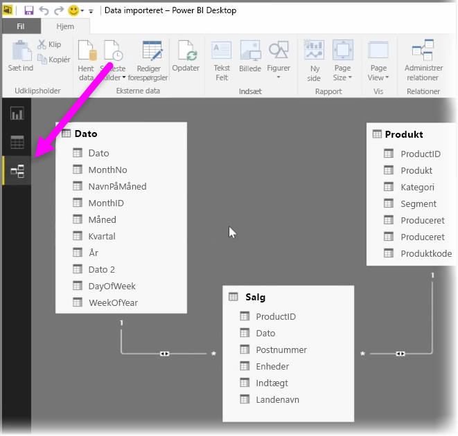
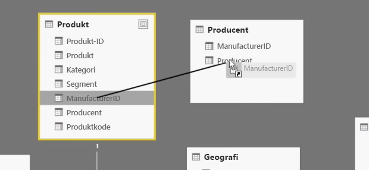
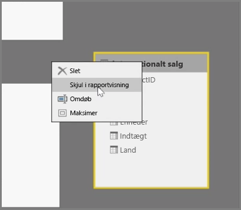
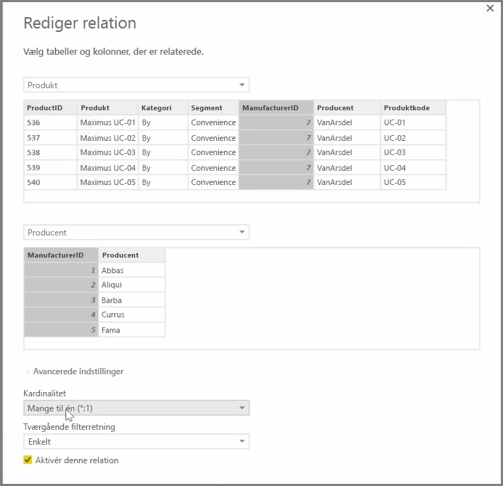

Med Power BI kan du visuelt angive relationen mellem tabeller eller elementer. Hvis du vil se en skematisk visning af dine data, skal du bruge **visningen Relation**, som du kan finde i venstre side af skærmen, ved siden af Rapportcanvas.

Fra visningen **Relation** kan du se en blok, der repræsenterer hver tabel og dens kolonner og linjer mellem dem for at repræsentere relationer.

Det er nemt at tilføje og fjerne relationer. Hvis du vil fjerne en relation, skal du højreklikke på den og vælge **Slet**. Hvis du vil oprette en relation, skal du trække og slippe de felter, der skal sammenkædes mellem tabellerne.

Hvis du vil skjule en tabel eller en enkelt kolonne fra din rapport, skal du højreklikke på den i visningen Relation og vælge **Skjul i rapportvisning**.

Hvis du ønsker et mere detaljeret overblik over dine datarelationer, skal du markere **Administrer relationer** på fanen **Hjem**. Herefter åbnes dialogboksen **Administrer relationer**, hvor du kan se dine relationer som en liste i stedet for et visuelt diagram. Her kan du vælge **Registrer automatisk** for at finde relationer i nye eller opdaterede data. Vælg **Rediger** i dialogboksen **Administrer relationer** for at redigere dine relationer manuelt. Her kan du også finde avancerede indstillinger for at angive *Kardinalitet* og *Tværgående filterretning* for dine relationer.

Dine indstillinger for Kardinalitet er *Mange til en* og *En til en*. *Mange til en* er relationstypen fakta til dimension, f.eks. en salgstabel med flere rækker pr. produkt, der sættes sammen med en tabel, der viser produkter i deres egen entydige række. *En til en* bruges ofte til at sammenkæde enkelte poster i referencetabeller.

Relationer angives som standard til tværgående filterretning i begge retninger. Krydsfiltrering i én retning begrænsede nogle af modelegenskaberne i en relation.

Angivelse af præcise forhold mellem dine data giver dig mulighed for at oprette komplekse beregninger på tværs af flere dataelementer.

