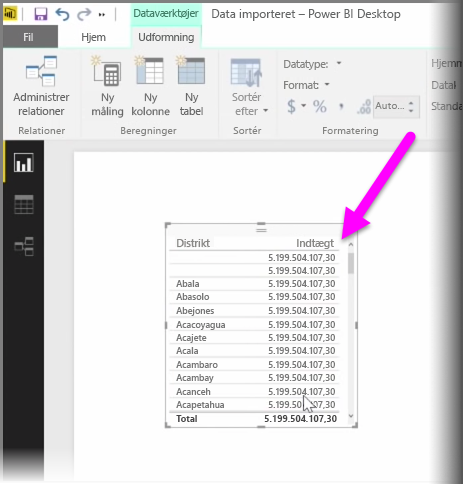
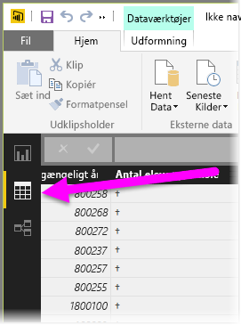
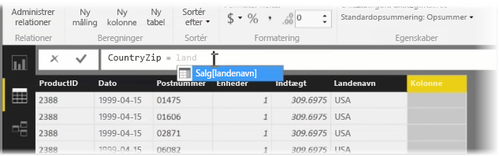
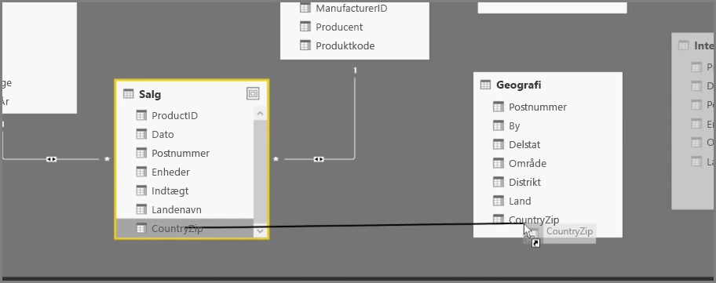
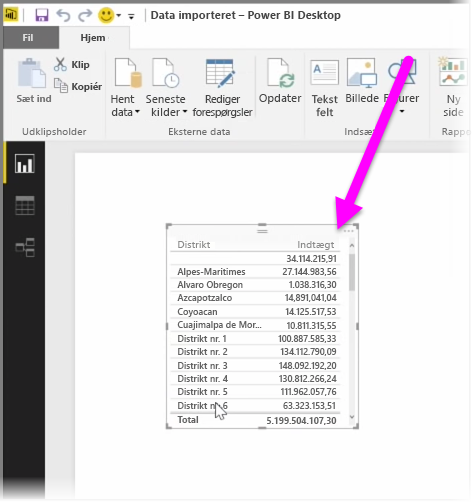

Oprettelse af beregnede kolonner er en nem måde at berige og forbedre dine data. En **beregnet kolonne** er en ny kolonne, som du opretter ved at definere en beregning, der transformerer eller kombinerer to eller flere elementer af eksisterende data. Du kan f.eks. oprette en ny kolonne ved at kombinere to kolonner til én.

En nyttig årsag til oprettelse af en beregnet kolonne er at oprette en relation mellem tabeller, når der ikke findes nogen entydige felter, der kan bruges til at oprette en relation. En manglende relation bliver synlig, når du opretter en enkel visuel tabel i Power BI Desktop, og du får den samme værdi for alle poster, selv om du ved, at de underliggende data er forskellige.

Hvis du vil oprette en relation med unikke felter i data, kan du f.eks. oprette en ny beregnet kolonne for "Telefonnummer" ved at kombinere værdierne fra kolonnerne "Områdekode" og "Lokalnummer", når disse værdier findes i dataene. Beregnede kolonner er velegnede til hurtig oprettelse af modeller og visualiseringer.

Hvis du vil oprette en beregnet kolonne, skal du gå til **Datavisning** i Power BI Desktop i venstre side af rapportcanvasset.

Vælg **Ny kolonne** fra fanen Udformning. Dette aktiverer formellinjen, hvor du kan angive beregninger ved hjælp af DAX-sprog (Data Analysis Expressions). DAX er et effektivt formelsprog, der også findes i Excel, og som gør det muligt for dig at opbygge stærke beregninger. Mens du skriver en formel, viser Power BI Desktop matchende formler eller dataelementer for at hjælpe og accelerere oprettelsen af formlen.

Power BI-formellinjen foreslår bestemte DAX-funktioner og relaterede datakolonner, når du angiver dit udtryk.

Når de beregnede kolonner er oprettet i hver tabel, kan de bruges som en entydig nøgle til at oprette en relation mellem disse. Hvis du går til visningen **Relation**, kan du derefter trække feltet fra én tabel til en anden for at oprette relationen.

Når du går tilbage til visningen **Rapport**, ser du nu en anden værdi for hvert område.

Der er også alle mulige andre ting, du kan gøre ved at oprette beregnede kolonner.

