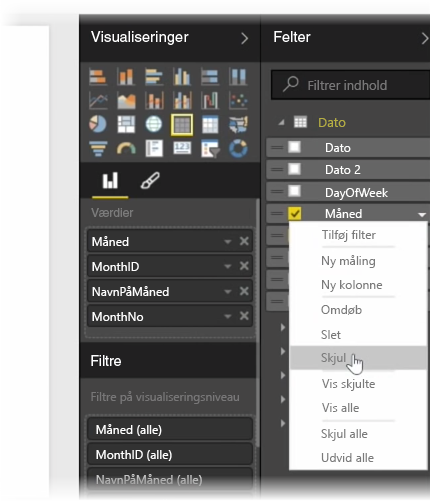
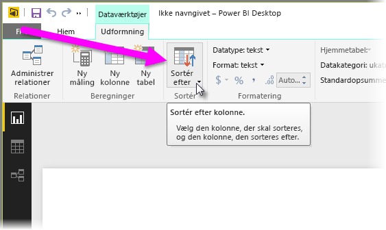
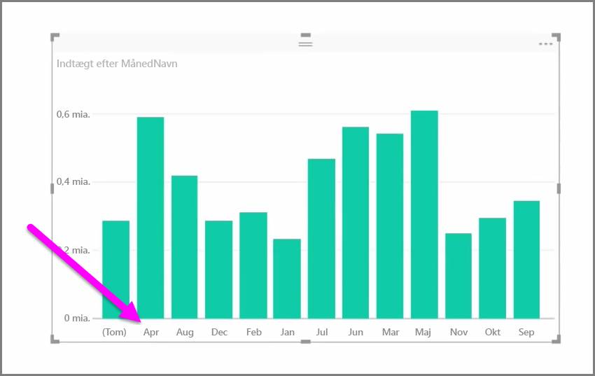
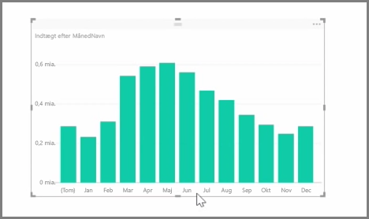

Importerede data indeholder ofte felter, som du faktisk ikke har brug for til opgaver med rapportering og visualisering, fordi det enten er ekstra oplysninger, eller fordi disse data allerede er tilgængelige i en anden kolonne. Power BI Desktop har værktøjer til at optimere dine data og gøre dem mere brugbare til rapporter og visuelle elementer og til at få vist dine delte rapporter.

## Skjul felter
Skjul en kolonne i ruden **Felter** i Power BI Desktop ved at højreklikke på den og vælge **Skjul**. Bemærk, at dine skjulte kolonner ikke slettes. Hvis du har brugt feltet i eksisterende visuelle elementer, findes disse data stadig i det pågældende visuelle element. Du kan også stadig bruge disse data i andre visualiseringer – det skjulte felt vises bare ikke i ruden **Felter**.

Hvis du får vist tabeller i visningen **Relationer**, er skjulte felter nedtonede. Deres data er stadig tilgængelige og stadig en del af modellen. De skjules blot fra visningen. Du kan altid se de skjulte felter ved at højreklikke på feltet og vælge **Vis**.

## Sorter visualiseringsdata efter et andet felt
Værktøjet **Sortér efter kolonne** findes i fanen **Modellering** og er meget brugbart til at sikre, at dine data vises i den korrekte rækkefølge.

Et almindeligt eksempel er, at data, der indeholder navnet på måneden, sorteres i alfabetisk rækkefølge som standard. Derfor vises "August" eksempelvis før "Februar".

I dette tilfælde kan problemet afhjælpes ved at markere feltet på listen med felter, vælge **Sortér efter kolonne** fra fanen **Modellering** og derefter vælge det felt, der skal sorteres efter. I tilfældet her sorteres månederne efter hensigten ved at vælge kategorisorteringen "MonthNo".

At indstille et felts datatype er en anden metode til at optimere dine oplysninger, så de håndteres korrekt. Skift datatypen fra rapportcanvasset ved at vælge kolonnen i ruden **Felter** og derefter bruge rullemenuen **Format** til at vælge en af formateringsindstillingerne. Hvis du har oprettet visuelle elementer, som viser dette felt, opdateres de automatisk.

