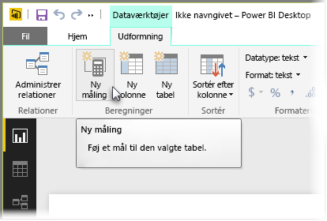
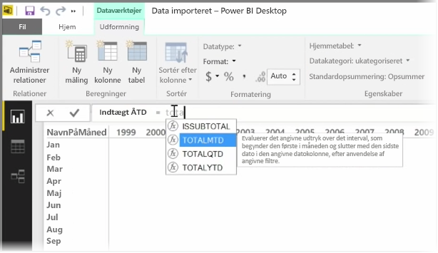
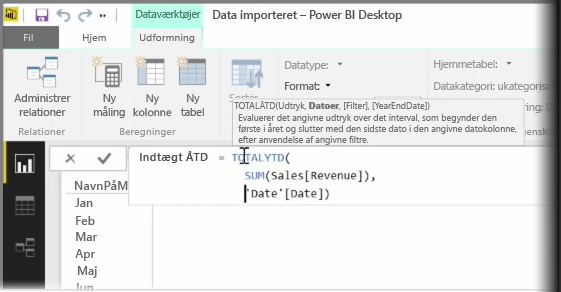
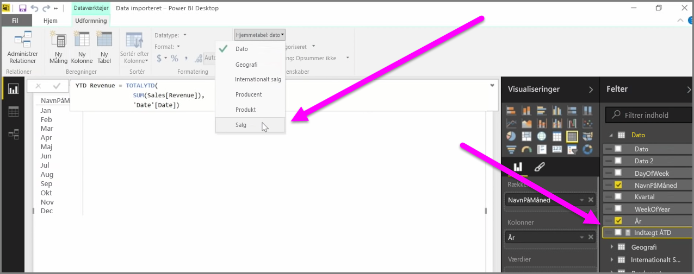

En *måling* er en beregning, der findes i din Power BI-datamodel. Hvis du vil oprette en måling, skal du i visningen **Rapport** markere **Ny måling** fra fanen **Udformning**.

En af de store fordele ved DAX-sproget (Data Analysis Expression) i Power BI er, at det har mange nyttige funktioner, især vedrørende tidsbaserede beregninger som *År til dato* eller *År for år*. Med DAX kan du definere en måling af tid én gang og derefter opdele den med lige så mange forskellige felter, som du ønsker fra din datamodel.

I Power BI kaldes en defineret beregning for en *måling*. For at oprette en *måling* skal du vælge **Ny måling** fra fanen **Startside**. Dette åbner formellinjen, hvor du kan angive det DAX-udtryk, der definerer din måling. Mens du skriver, foreslår Power BI relevante DAX-funktioner og datafelter, når du angiver beregningen, og du får også et værktøjstip, der forklarer nogle af syntaks- og funktionsparametrene.

Hvis din beregning er meget lang, kan du tilføje et ekstra linjeskift i Udtrykseditor ved at indtaste **ALT-Enter**.

Når du har oprettet en ny måling, vises den på en af tabellerne på ruden **Felter**, der ses i højre side af skærmen. Power BI indsætter den nye måling i den tabel, du aktuelt har markeret, og selv om det ikke betyder noget, hvor præcis målingen er i dine data, kan du let flytte den ved at markere målingen og bruge rullemenuen **Hjemmetabel**.

Du kan bruge en måling som alle andre kolonner i tabellen: Du kan bare trække og slippe den i rapportcanvas eller visualiseringsfelterne. Målinger kan også integreres problemfrit med udsnit, så du kan segmentere dine data på farten, hvilket betyder, at du kan definere en måling én gang og bruge den i mange forskellige visualiseringer.

DAX-funktionen **Beregn** er en meget praktisk funktion, der muliggør alle typer nyttige beregninger, hvilket især er praktisk til regnskabsaflæggelse og visuelle elementer.

