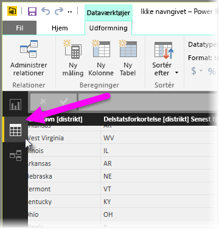
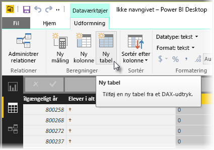
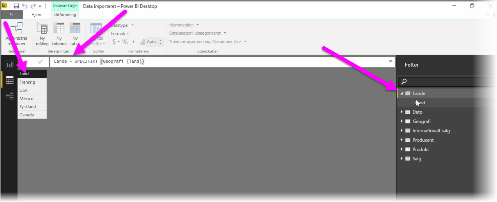

Beregnede tabeller er en funktion i DAX, som giver dig mulighed for at udtrykke en komplet række af nye modelleringsfunktioner. Hvis du f.eks. vil udføre forskellige typer joinforbindelser med Flet eller oprette nye tabeller med det samme baseret på resultatet af en funktionsformel, er beregnede tabeller måden at gøre det på.

Hvis du vil oprette en beregnet tabel, skal du gå til **Datavisning** i Power BI Desktop, som du kan aktivere fra venstre side af rapportcanvasset.

Vælg **Ny tabel** fra fanen Modellering for at åbne formellinjen.

Skriv navnet på den nye tabel til venstre for lighedstegnet, og den beregning, der skal bruges til at oprette tabellen, til højre. Når du er færdig med beregningen, vises den nye tabel i ruden Felter i modellen.

Når du har oprettet den, kan du kan bruge den beregnede tabel på samme måde som alle andre tabeller i relationer, formler og rapporter.

