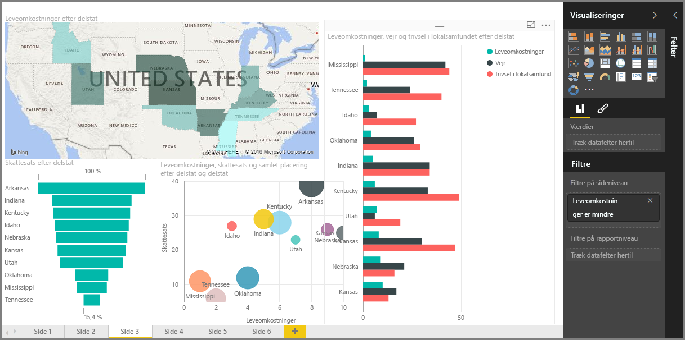

Velkommen til afsnittet **Visualiseringer** i kurset **Undervisning** til Power BI. Vær parat til en sjov, interessant og oplysende tur gennem de mange, mange visualiseringer, som Power BI tilbyder. Og det er ikke dem alle sammen – der kommer hele tiden flere visualiseringer til!

Visuelle elementer er selvfølgelig slutresultatet af et hvilken som helst business intelligence-forløb... vi vil tage data, præsentere dem på en overbevisende og detaljeret måde og *vise*, hvad der skiller sig ud. Og Power BI har alle mulige forskellige overbevisende visuelle elementer – og næsten ubegrænsede måder at tilpasse dem på – så det er et vigtigt afsnit!

Det kan se ud, som om der er masser af emner i dette afsnit, men bare rolig: Hvert emne er kort, fyldt med (du har gættet det) visuelle elementer og nemt at fordøje. Du vil sikkert komme hurtigt gennem dette afsnit og forestiller dig, hvordan du vil få disse visuelle elementer til at præsentere dine egne data.

Vi begynder med grundpillerne i visualiseringer – de simple visuelle elementer vi alle kender - og sørger for, at du har styr på det. Derefter bliver vi mere avancerede eller i det mindste lidt mindre almindelige og fylder din værktøjskasse til oprettelse af rapporter op.

God fornøjelse – der er masser at lære her!

## Introduktion til visuelle elementer i Power BI
Visualisering af data er en af de grundlæggende dele i Power BI – en fundamental byggeklods, som vi definerede den tidligere i dette kursus – og oprettelse af visuelle elementer er den nemmeste måde at finde og dele din indsigt på.

Power BI har en lang række visualiseringer, der er tilgængelige som standard, fra simple liggende søjlediagrammer over cirkeldiagrammer til kort og endnu flere esoteriske tilbud som vandfald, tragte, målere og meget mere. Power BI Desktop indeholder også omfattende værktøjer til sideformatering, f.eks. figurer og billeder, som er med til at gøre rapporten levende.

