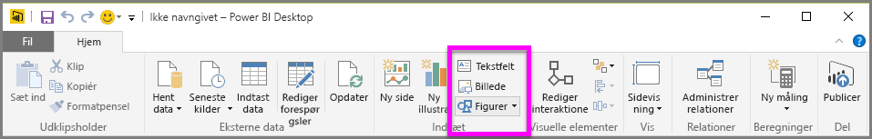
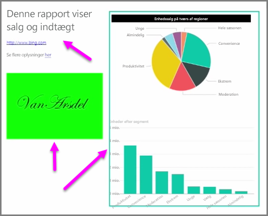

Sammen med databundne visuelle elementer kan du også tilføje statiske elementer som tekstfelter, billeder og figurer for at forbedre dine egne rapporters visuelle design. Du kan tilføje et visuelt element ved at vælge **Tekstfelt**, **Billede** eller **Former** fra fanen **Hjem**.

**Tekstfelter** er en smart måde at vise store fliser, tekster eller korte afsnit med oplysninger sammen med dine visualiseringer. Tekstfelter kan indeholde links, enten via en skriftlig URL-adresse eller ved at markere et ankerudtryk og vælge linksymbolet på tekstfeltets indstillingslinje. Du kan medtage URL-adresser i tekstfelter. Power BI registrerer automatisk linket og laver det til et hyperlink.

Hvis du vælger **Billede**, åbnes en filbrowser, hvor du kan vælge billedet fra din computer eller en anden netværksbaseret kilde. Som standard bevares højde-bredde-forholdet, hvis du tilpasser størrelsen på et billede i din rapport, men dette kan deaktiveres i de visuelle formateringsindstillinger.

Under **Former** er der fem forskellige muligheder, herunder rektangler og pile. Former kan være uigennemsigtige eller gennemsigtige med en farvet kant. (Sidstnævnte er nyttigt til oprettelse af kanter omkring grupper af visualiseringer).

