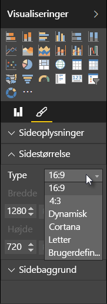

Med Power BI Desktop få du mulighed for at styre layout og formatering af dine rapportsider, f.eks. størrelse og retning.

Brug menuen **Sidevisning** fra fanen Hjem for at ændre den måde, dine rapportsider skalerer. De tilgængelige indstillinger omfatter **Tilpas til side** (standard), **Tilpas til bredde** og **Faktisk størrelse**.

Du kan også selv ændre sidestørrelsen. Som standard er rapportsider 16:9. Hvis du vil ændre sidestørrelsen, skal du sørge for, at ingen visuelle elementer er markeret. Vælg derefter penselikonet i ruden Visualiseringer, og vælg derefter **Sidestørrelse** for at udvide dette afsnit.

Indstillinger for sidestørrelse omfatter 4:3 (mere kvadratisk højde-bredde-forhold) og Dynamisk (siden strækkes for at udfylde den tilgængelige plads). Der er også en standardbogstavstørrelse for rapporter. Vær opmærksom på, at du måske skal tilpasse størrelsen på visuelle elementer, når du har ændret sidestørrelsen, for at sikre, at de er helt på lærredet.

Du kan også angive en brugerdefineret sidestørrelse, hvor du indstiller størrelsen efter tommer eller pixel, og du kan ændre baggrundsfarven for hele rapporten.

En anden mulighed er at vælge Cortana, som tilpasser størrelsen på rapporten, så den kan bruges som et resultat for søgninger med Cortana.

