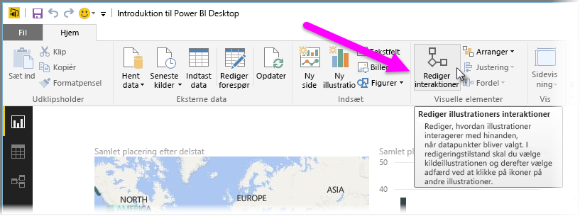
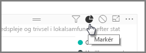
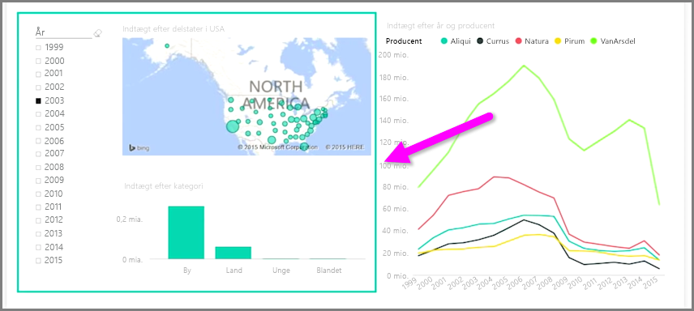

Når du har flere visualiseringer på samme rapportside, påvirker det alle visuelle elementer på denne side, hvis du markerer et bestemt segment ved at klikke på det eller ved at bruge et udsnitsværktøj. I nogle tilfælde har du dog kun brug for at foretage udsnit af bestemte visuelle elementer. Dette er især tilfældet, når du bruger elementer som f.eks punktdiagrammer, hvor det fjerner vigtige elementer, hvis du begrænser dataene til et bestemt segment. Heldigvis kan du med Power BI Desktop styre, hvordan interaktioner overføres mellem visuelle elementer.

Hvis du vil ændre interaktionen mellem dine visualiseringer, skal du markere **Rediger** fra afsnittet Visuelle elementer på båndet **Hjem** for at slå **Redigeringstilstand** til.

>[!NOTE]
>Ikonet **Rediger interaktioner** i Power BI Desktop er ændret, siden videoen blev registreret.
> 
> 

Når du herefter vælger et visuelt element på dit rapportcanvas, får du vist et lille uigennemsigtigt *filterikon* i øverste højre hjørne af hvert andet visuelle element, det påvirker. Hvis du vil udelade et visuelt element fra interaktionen, skal du klikke på symbolet *Ingen* i øverste højre hjørne i nærheden af *filterikonet*.

I nogle tilfælde kan du justere typen af filterinteraktion, der sker mellem visuelle elementer. Med **Redigeringstilstand** slået til kan du vælge det visuelle element, du bruger til at filtrere. Hvis du ændrer typen af interaktion på et andet visuelt element, vises et *cirkeldiagramikon* ud for filterikonet i øverste højre hjørne.

Klik på *cirkeldiagramikonet* for at fremhæve de segmenterede data. Ellers filtreres dataene. Som før kan du klikke på ikonet *Ingen* for at fjerne al interaktion.

Et nyttigt designtip er at tegne en gennemsigtig figur omkring visuelle elementer, der kommunikerer med hinanden, så det er tydeligt for brugeren, at de har en interaktiv relation.

