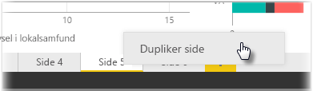

Individuelle sider i en rapport kan være meget komplekse med flere visualiseringer, der arbejder sammen på bestemte måder og har præcis formatering. Når du opretter en rapport, vil du muligvis gerne ind imellem bruge de samme visuelle elementer og layout til to forskellige emner på siden. Hvis du f.eks. netop har sammensat en rapportside om bruttoindtægt, ønsker du muligvis en næsten identisk side om nettoindtægt.

Det ville være svært at genskabe al dit arbejde, men med Power BI Desktop kan du nøjes med at kopiere en rapportside.

Højreklik på den fane, du vil kopiere, og vælg **Dupliker side**.

Du kan derefter omdøbe den nye sidefane efter behov, opdatere teksttitlen, hvis du har en, og derefter opdatere visuelle elementer med det nye felt, du vil spore.

