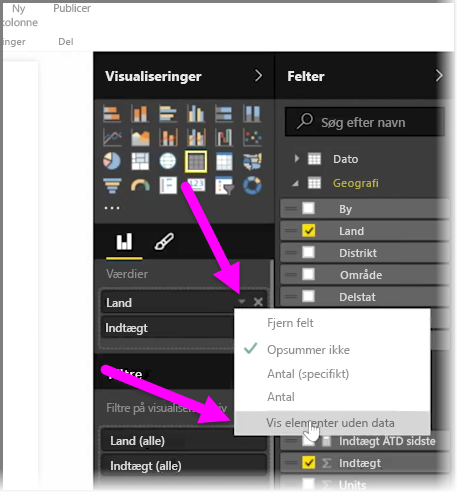
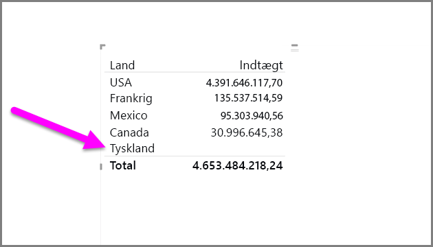
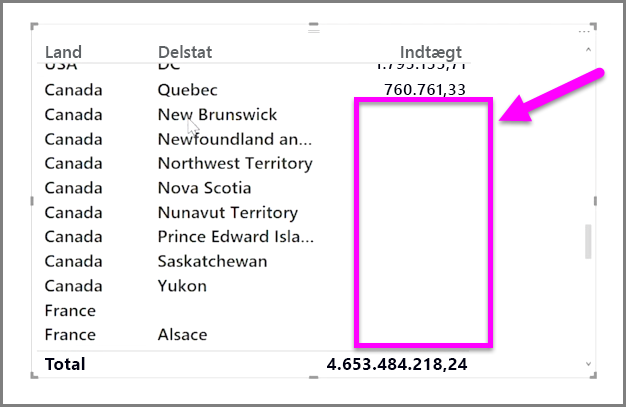

Som standard vises kolonneoverskrifterne kun i dine rapporter, hvis de indeholder data. Hvis du f.eks. viser indtægter efter land og ikke havde noget salg i Norge, ville Norge ikke blive vist nogen steder i din visualisering.

For at få vist tomme kategorier skal du klikke på pil ned i det felt, du vil ændre i ruden **Visualiseringer**, og markere **Vis elementer uden data**.

Der vises nu eventuelle tomme kolonner i det visuelle element med tomme værdier.

Når du har valgt **Vis elementer uden data** for et felt i ruden **Visualiseringer**, gælder det for alle felter, der vises i ruden Visualiseringer. Så hvis du tilføjer et andet felt, vil eventuelle elementer, der ikke indeholder data, også blive vist, uden at du skal tilbage til rullelisten.

