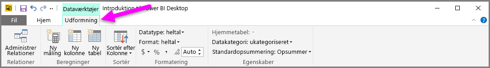
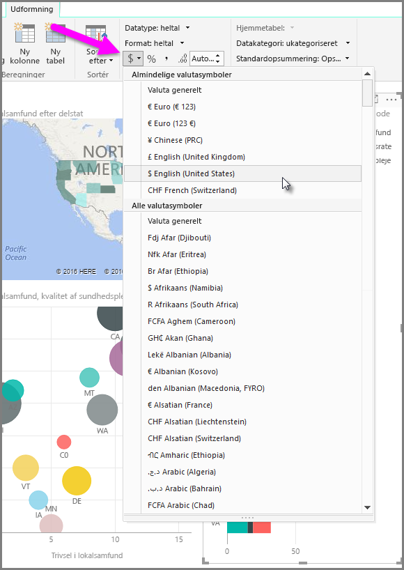
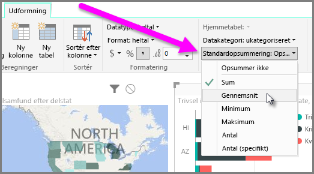
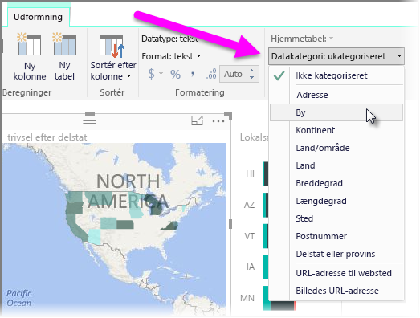

Power BI har egenskaber, du kan tildele til felter i din model, som kan være med til at rapportere og visualisere og præsentere data på måder, der giver større overblik. Som eksempel kan du nogle gange have brug for at beregne et gennemsnit af en liste over tal, men Power BI opsummerer listen automatisk. Med Power BI kan du justere, hvordan disse lister over tal opsummeres.

## Numerisk kontrol over opsummering
Lad os tage et eksempel og vise, hvordan du kan kontrollere den måde, som Power BI opsummerer numeriske datafelter på.

Vælg et visuelt element på dit rapportcanvas, og vælg derefter et felt i ruden **Felter**. Fanen **Modellering** vises på båndet og indeholder indstillinger til formatering af data og dataegenskaber.

Du kan vælge typen af det valutasymbol, der er brugt, ved at vælge rullelisten med valutasymboler, som vises på følgende billede.

Der er mange forskellige indstillinger til formatering af felter. Du kan for eksempel ændre formatet fra valuta til procentdel.

Du kan også ændre, hvordan Power BI opsummerer dataene. Vælg ikonet **Standardopsummering** for at ændre, hvordan et felt opsummeres, herunder visning af en sum, et antal eller et gennemsnit.

## Administrer og tydeliggør lokationsdataene
Du kan foretage tilsvarende ændringer, når lokaliteter afbildes på et kort. Vælg dit kort, og vælg derefter feltet i ruden **Felter**, som du bruger til værdien *Placering*. Vælg **Datakategori** under fanen **Modellering**, og vælg derefter den kategori, der repræsenterer lokationsdataene i rullemenuen. Vælg f.eks. delstat, region eller by.

