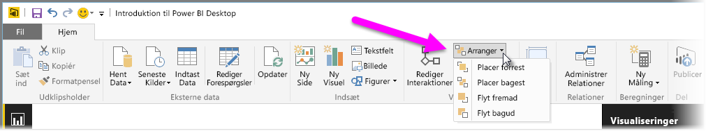
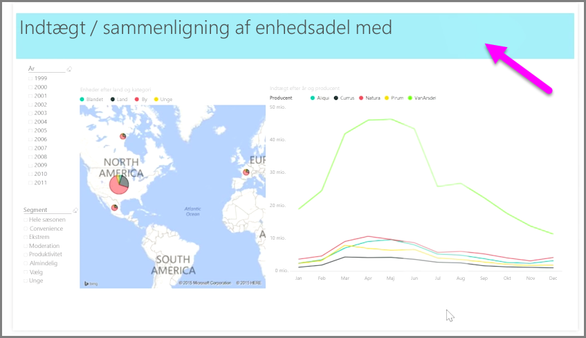

Når du har mange elementer i en rapport, kan du med Power BI administrere, hvordan de overlapper hinanden. Den måde, hvorpå elementer er lagdelt eller arrangeret oven på hinanden, kaldes ofte for z-rækkefølgen.

Hvis du vil administrere elementernes z-rækkefølge i en rapport, skal du markere et element og bruge knappen **Arranger** på fanen **Hjem** på båndet for at ændre dets z-rækkefølge.

Ved hjælp af indstillingerne i knapmenuen **Arranger** kan du vælge den ønskede rækkefølge for elementerne i rapporten. Du kan flytte et visuelt element et lag fremad eller tilbage, eller du kan sende det helt forrest eller bagest i rækkefølgen.

Knappen Arranger er særligt nyttig, når du bruger former som dekorative baggrunde eller kanter eller for at fremhæve bestemte sektioner på et enkelt diagram eller graf. Du kan også bruge den til at lave en baggrund, f.eks. anvendes følgende lyseblå rektangel som baggrund for en rapporttitel.

