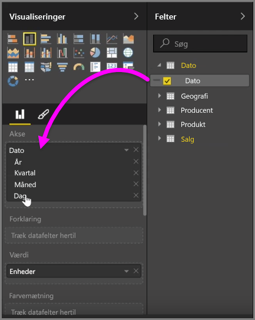
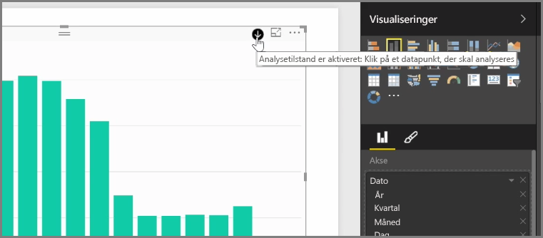
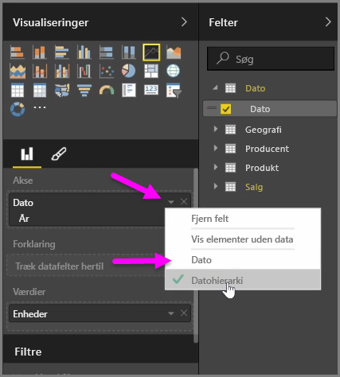
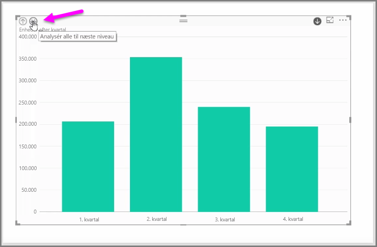

Når du tilføjer et *dato*felt til et visuelt element på feltbeholderen *Akse*, tilføjer Power BI automatisk et tidshierarki, der omfatter *År*, *Kvartal*, *Måned* og *Dag*. Herved gør Power BI det muligt, at dine visuelle elementer har tidsbaseret interaktion med dem, der ser dine rapporter, ved at lade brugerne analysere de forskellige tidsniveauer.

Med et hierarki på plads kan du starte analysen gennem tidshierarkiet. Hvis du f.eks. klikker på et år i diagrammet, analyseres der ned til det næste niveau i hierarkiet, i dette tilfælde *Kvartaler*, som derefter vises i det visuelle element.

I det hierarki, der oprettes automatisk, kan du også administrere på hvilket niveau, din delte rapport gør det muligt for personer at analysere. Hvis du vil gøre dette, skal du i ruden Visualiseringer blot klikke på X ved siden af det hierarki, som du vil fjerne. Det slettede niveau fjernes fra rapporten, og dette niveau vises ikke længere ved analyse.

Hvis du har brug for at hente dette niveau i hierarkiet tilbage, skal du blot fjerne feltet *Dato* og derefter tilføje det igen fra ruden **Felter**. Så oprettes hierarkiet igen automatisk.

Der kan være tidspunkter, hvor du ikke ønsker, at hierarkiet skal bruges på et visuelt element. Du kan styre det ved at klikke på pil ned ud for feltet *Dato* (når du har tilføjet det til et visuelt element) og vælge **Dato** i stedet for **Datohierarki**. Dette prompter Power BI til at vise rådatoværdierne i det visuelle element.

Du kan også udvide alle dataelementer, der i øjeblikket er synlige, på én gang i stedet for at vælge et enkelt kvartal eller et enkelt år. For at gøre dette skal du vælge ikonet *Analysér alt* øverst til venstre på det visuelle element, som er en dobbeltpil ned.

