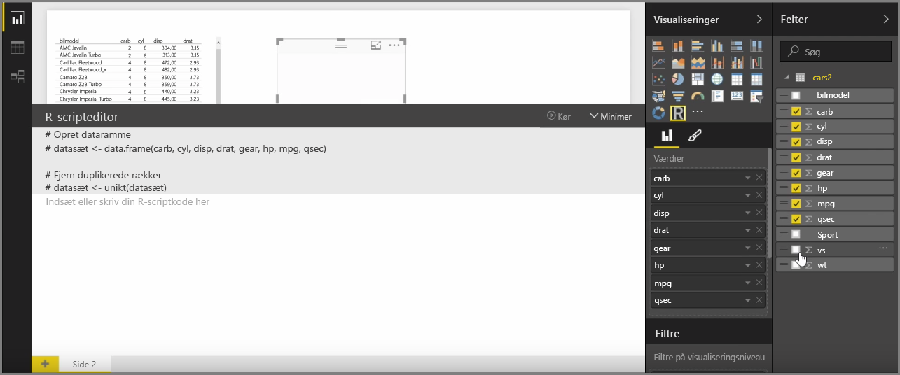
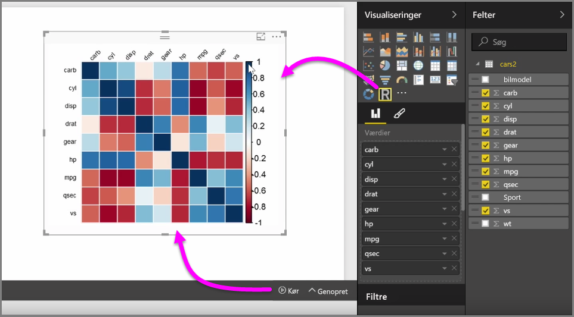
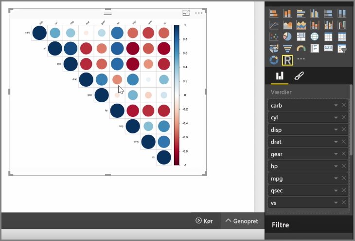

Du kan bruge Power BI Desktop til at udføre analytiske og statistiske analyser og oprette overbevisende visuelle elementer via integration med R. Du kan hoste disse R-visualiseringer inde fra Power BI Desktop-rapporten.

Når du vælger ikonet **R visual** i ruden **Visualiseringer**, så opretter Power BI en pladsholder på lærredet til at hoste det visuelle R-element og præsenterer dig derefter for en R-scripteditor, du kan bruge direkte på lærredet. Når du føjer felter til det visuelle R-element, så føjer Power BI Desktop dem til R-scripteditorens rude.

Nedenunder indholdet, som Power BI genererer i R-scripteditoren, kan du begynde at oprette dit R-script for at generere det visuelle element. Når scriptet er fuldført, skal du vælge **Kør**, hvorefter følgende sker:

1. Dataene, der føjes til det visuelle element (fra ruden **Felter**), sendes fra Power BI Desktop til den lokale installation af R
2. Scriptet, der oprettes i R-scripteditoren i Power BI Desktop, køres på den lokale installation af R
3. Derefter får Power BI Desktop et visuelt element retur fra R-installationen og viser det på lærredet

Det hele sker ganske hurtigt, og resultatet vises i **R visual**-visualiseringen på lærredet.

Du kan ændre det visuelle R-element ved at justere R-scriptet, og derefter vælge **Kør** igen. På det følgende billede har vi ændret det visuelle element til at vise cirkler i stedet for firkanter.

Og siden det visuelle R-element er identisk med alle andre visuelle elementer i Power BI Desktop, kan du interagere med det og desuden oprette forbindelser til andre visuelle elementer på lærredet. Når du interagerer med andre visuelle elementer på lærredet, via filtrering eller fremhævning, så reagerer det visuelle R-element præcist som alle andre visuelle Power BI-elementer, uden der er behov for at justere R-scriptet.

Det er en fantastisk måde at udnytte styrken i R på – direkte i Power BI Desktop.

## Næste trin
**Tillykke!** Du har nu gennemført afsnittet **Visualiseringer** ovenfor i kurset **Automatiseret læring** til Power BI. Du kan nu betragte dig selv som en velbevandret bruger af de mange visualiseringer i Power BI med erfaring i at redigere og tilpasse dem. Desuden er visualiseringer grundlæggende ens i Power BI Desktop og Power BI-tjenesten, så du kan bruge dine nye kundskaber i begge.

Du er nu klar til at bruge cloud-tjenesten til at synke ned i Power BI-tjenestens lyksaligheder, hvor du kan **Udforske data**. Som du ved, ser arbejdsprocessen nogenlunde således ud:

* Overfør data til **Power BI Desktop**, og opret en rapport.
* Udgiv til Power BI-tjenesten, hvor du kan oprette nye **visualiseringer** og oprette dashboards
* **Del** dine dashboards med andre, især personer, der er på farten
* Få vist og interager med delte dashboards og rapporter i **Power BI Mobile**-apps

Uanset om du opretter rapporter eller blot viser og interagerer med dem, så ved du nu, hvordan alle disse elegante visuelle elementer er oprettet, og hvordan de er forbundet til dataene. Nu skal vi se disse visuelle elementer i aktion.

Vi ses i næste afsnit!

