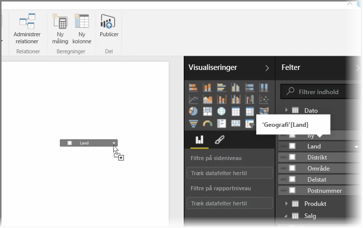
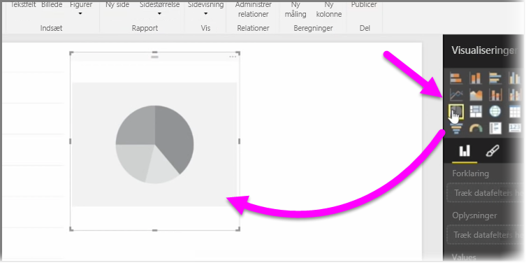
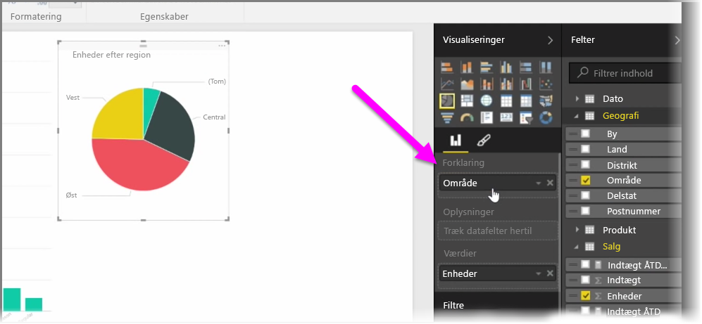
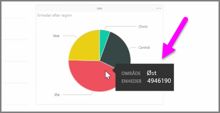
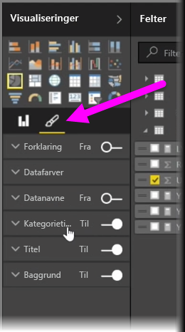

I denne artikel kan du få mere at vide om, hvordan du kan oprette nye liggende søjlediagrammer, cirkeldiagrammer og træstrukturer og tilpasse dem, så de passer til dine rapporter.

Der er to forskellige måder at oprette en ny visualisering i Power BI Desktop:

* Du kan trække feltnavne fra ruden **Felter** og slippe dem på rapportcanvasset. Som standard vises din visualisering som en tabel med data.
  
  
* Du kan også klikke på den type visualisering, du vil oprette, i ruden **Visualiseringer**. Med denne metode er det visuelle element som standard en tom pladsholder, der ligner den type visuelle element, du har valgt.
  
  

Når du har oprettet din graf, dit kort eller dit diagram, kan du begynde at trække datafelter til den nederste del af ruden **Visualisering** for at opbygge og organisere dit visuelle element. De tilgængelige felter skifter, afhængigt af hvilken type visuel effekt du har valgt. Når du trækker og slipper datafelter, opdaterer din visualisering automatisk for at afspejle ændringer.

Du kan tilpasse størrelsen for din visualisering ved at markere den og trække håndtagene ind eller ud. Du kan også flytte din visualisering et vilkårligt sted på lærredet ved at klikke på den og trække den. Hvis du vil konvertere mellem forskellige typer visualiseringer, skal du vælge det visuelle element, du vil ændre, og blot vælge et andet visuelt element fra ikonerne i ruden **Visualisering**. Power BI forsøger at konvertere dine markerede felter så tæt som muligt på den nye visuelle type.

Når du peger på dele af dine visualiseringer, får du et værktøjstip, der indeholder oplysninger om det segment, f.eks. navne og den samlede værdi.

Vælg **penselikonet** på ruden **Visualiseringer** for at foretage kosmetiske ændringer på dit visuelle element som f.eks. justering af baggrund, titeltekst og datafarver.

De tilgængelige indstillinger for kosmetiske ændringer i det visuelle element afhænger af den valgte type visuelle element.

