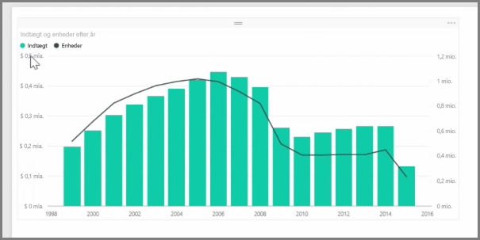
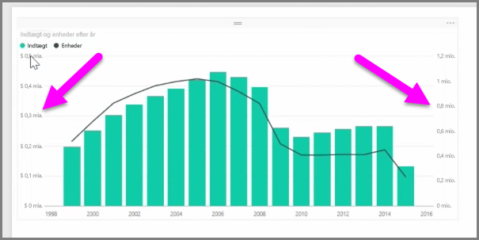
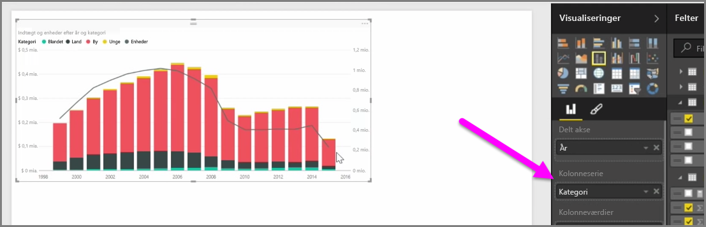

Når du ønsker at visualisere to målinger med meget forskellige skalaer, f.eks. indtægter og enheder, er et **kombinationsdiagram**, der viser en linje og en søjle med andre akseskalaer, nyttigt. Power BI understøtter som standard mange forskellige typer kombinationsdiagrammer, herunder de populære diagrammer, **Linjediagram** og **Stablet søjlediagram**.

Når du opretter et kombinationsdiagram, bliver du præsenteret for et felt til **Delt akse** (X-aksen) og derefter værdier til de to felter, i dette tilfælde en kolonne og en linje. De to forklaringer på Y-aksen vises på en af siderne på Visualiseringen.

Du kan også opdele hver kolonne efter kategori ved at trække en kategori til feltet Kolonneserie i ruden Visualiseringer. Når du gør dette, farves hver søjle proportionalt baseret på værdierne i hver kategori.

Kombinationsdiagrammer er en effektiv måde at visualisere flere målinger, der har meget forskellige skalaer i en enkelt visualisering.

